# FASTpass(R) SPKD -- System Architecture & Design Principles

**Version**: v2.37.0 | **Last Updated**: 2026-03-18
**Status**: Production Ready (Multi-DBMS: PostgreSQL + Oracle)

---

## Table of Contents

### Part 1: System Architecture
1. [System Overview](#system-overview)
2. [Technical Architecture Diagram](#technical-architecture-diagram)
3. [Microservices Architecture](#microservices-architecture)
4. [Data Layer Architecture](#data-layer-architecture)
5. [Frontend Architecture](#frontend-architecture)
6. [API Gateway Architecture](#api-gateway-architecture)
7. [Component Details](#component-details)
8. [Data Flow Diagrams](#data-flow-diagrams)
9. [Deployment Architecture](#deployment-architecture)
10. [Security Architecture](#security-architecture)
11. [Technology Stack Summary](#technology-stack-summary)
12. [Performance Metrics](#performance-metrics)
13. [Monitoring & Observability](#monitoring--observability)

### Part 2: Design Principles & Patterns
14. [Core Design Principles](#core-design-principles)
15. [DDD (Domain-Driven Design) Structure](#ddd-domain-driven-design-structure)
16. [ServiceContainer Pattern (Centralized DI)](#servicecontainer-pattern-centralized-di)
17. [main.cpp Minimization Pattern](#maincpp-minimization-pattern)
18. [Strategy Pattern](#strategy-pattern)
19. [Single Responsibility Principle (SRP)](#single-responsibility-principle-srp)
20. [Query Executor Pattern (Database Abstraction)](#query-executor-pattern-database-abstraction)
21. [Query Helpers Pattern](#query-helpers-pattern)
22. [Provider/Adapter Pattern (Validation Infrastructure)](#provideradapter-pattern-validation-infrastructure)
23. [Shared Libraries](#shared-libraries)
24. [Code Structure Rules](#code-structure-rules)
25. [Extension Guidelines](#extension-guidelines)
26. [Anti-Patterns](#anti-patterns)
27. [Code Review Checklist](#code-review-checklist)

### Appendix
28. [Future Enhancements](#future-enhancements)

---

# Part 1: System Architecture

---

## System Overview

ICAO Local PKD is a **microservices architecture**-based integrated platform for e-Passport certificate management and verification.

### Core Principles

- **Microservices**: 5 independently deployable services
- **Multi-DBMS**: PostgreSQL + Oracle runtime switching (DB_TYPE environment variable)
- **Data Consistency**: DB-LDAP dual storage with automatic synchronization (Reconciliation)
- **High Performance**: C++20 high-performance backend
- **Modern UI**: React 19 + TypeScript + Tailwind CSS 4
- **Security First**: JWT authentication, RBAC, OWASP security hardening
- **Shared Validation**: icao::validation shared library (86 unit tests)

### PKD and EAC PKI Role Separation

This system is specialized for **ICAO 9303 Passive Authentication (PA)** and is independent from the EU EAC (Extended Access Control) system.

| Category | This System (PKD) | EAC PKI (Separate) |
|------|----------------|----------------|
| **Purpose** | Chip data integrity verification (PA) | Protected biometric access (TA) |
| **Certificates** | CSCA -> DSC (X.509) | CVCA -> DV -> IS (CVC) |
| **Protected Data** | DG1(MRZ), DG2(Face) | DG3(Fingerprint), DG4(Iris) |
| **Distribution** | ICAO PKD Server (Public) | Bilateral agreement |
| **EU Passport** | **Required** (All countries) | Only for fingerprint/iris access |

EU passport processing uses PKD for PA (Stage 1), and optionally EAC TA (Stage 3) via separate EAC PKI.
No certificate sharing between the two systems; authentication flows are independent.
See [EAC_SERVICE_IMPLEMENTATION_PLAN.md](EAC_SERVICE_IMPLEMENTATION_PLAN.md) Section 1.4 for details.

---

## Technical Architecture Diagram

### System Overview (v2.37.0)

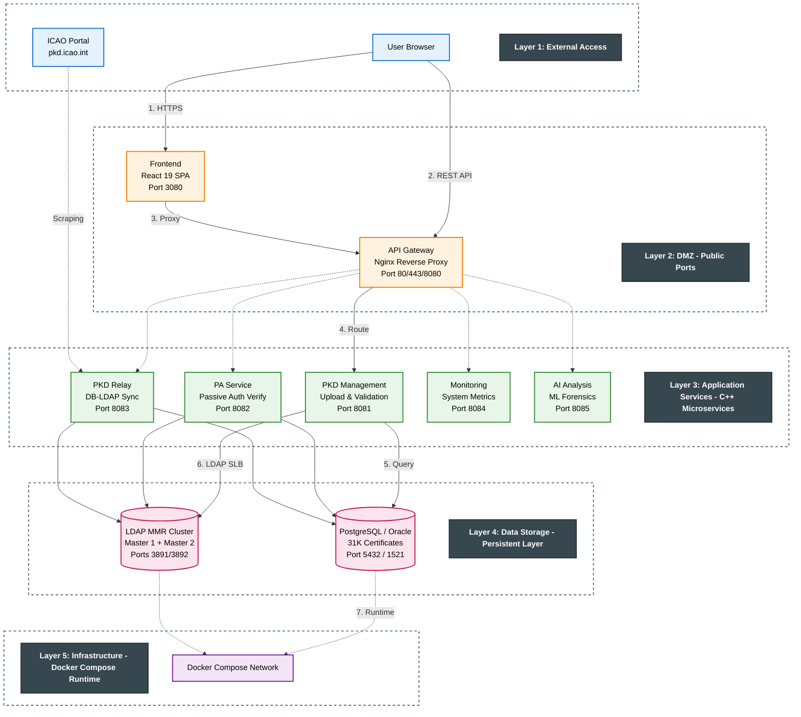

**Architecture Highlights**:

1. **5-Layer Hierarchy**: Clear layer separation for Separation of Concerns
2. **Minimal Coupling**: Each layer depends only on the layer directly below (Vertical Flow)
3. **Gateway Pattern**: API Gateway (nginx) provides a single entry point, App-level LDAP SLB
4. **Data Abstraction**: LDAP MMR cluster integrates 2 Master nodes
5. **Simplified Topology**: Minimized connection lines to reduce system complexity

### Layer Description

| Layer | Purpose | Components | Key Characteristics |
|-------|---------|------------|---------------------|
| **Layer 1: External** | External access and integration | User, ICAO Portal | Public Internet |
| **Layer 2: DMZ** | Public service zone | Frontend, API Gateway | Ports 3080, 80/443/8080 |
| **Layer 3: Application** | Business logic processing | PKD, PA, Relay, Monitoring (C++20), AI (Python) | Internal Network |
| **Layer 4: Data** | Data persistence | PostgreSQL/Oracle, LDAP MMR | Internal Storage + App-level SLB |
| **Layer 5: Infrastructure** | Container runtime | Docker Compose | Platform Layer |

### Data Flow Summary

**Request Flow** (Top -> Bottom):
```
User -> Frontend -> API Gateway -> Services (PKD/PA/Relay) -> Data (PostgreSQL/LDAP)
```

**Service Architecture**:
- **5 Microservices**: PKD Management (:8081), PA Service (:8082), PKD Relay (:8083), Monitoring (:8084), AI Analysis (:8085)
- **2 Data Stores**: PostgreSQL/Oracle (31,212 certificates), LDAP MMR Cluster (Master 1+2)
- **1 Gateway Node**: API Gateway (HTTP :80 / HTTPS :443), App-level LDAP SLB
- **1 Frontend**: React 19 SPA (29 pages)

---

## Microservices Architecture

### Service Layout

```
services/
+-- pkd-management/        # PKD Management Service (Port: 8081)
|   +-- File Upload & Processing (LDIF, Master List)
|   +-- Certificate Search & Export
|   +-- ICAO Auto Sync
|   +-- API Client Authentication (X-API-Key)
|
+-- pa-service/            # Passive Authentication Service (Port: 8082)
|   +-- SOD Verification
|   +-- DG1/DG2 Parsing
|   +-- CSCA LDAP Lookup
|
+-- pkd-relay-service/     # PKD Relay Service (Port: 8083)
|   +-- DB-LDAP Synchronization
|   +-- Auto Reconciliation
|   +-- Sync Status Monitoring
|
+-- monitoring-service/    # Monitoring Service (Port: 8084)
|   +-- System Resource Monitoring (CPU, Memory, Disk, Network)
|   +-- Service Health Checks (HTTP Probes)
|   +-- DB-Independent Architecture (no PostgreSQL/Oracle dependency)
|
+-- ai-analysis/           # AI Analysis Service (Port: 8085)
    +-- ML Anomaly Detection (Isolation Forest + LOF)
    +-- Forensic Risk Scoring
    +-- Pattern Analysis (Python/FastAPI)
```

### Service Communication

```
+----------------+
|   Frontend     | :3000
+-------+--------+
        |
        v
+----------------+
| API Gateway    | :8080 (Nginx)
+-------+--------+
        |
        +------------------+------------------+------------------+------------------+
        v                  v                  v                  v                  v
+----------------+   +----------------+   +----------------+   +----------------+   +----------------+
|     PKD        |   |      PA        |   |  PKD Relay     |   | Monitoring     |   |     AI         |
|  Management    |   |   Service      |   |   Service      |   |   Service      |   |  Analysis      |
|    :8081       |   |    :8082       |   |    :8083       |   |    :8084       |   |    :8085       |
+-------+--------+   +-------+--------+   +-------+--------+   +----------------+   +-------+--------+
        |                     |                     |                                         |
        +---------------------+---------------------+-----------------------------------------+
                              |
                              v
               +------------------------+
               |    PostgreSQL DB       |
               |    OpenLDAP Cluster    |
               +------------------------+
```

### 1. PKD Management Service (Port 8081)

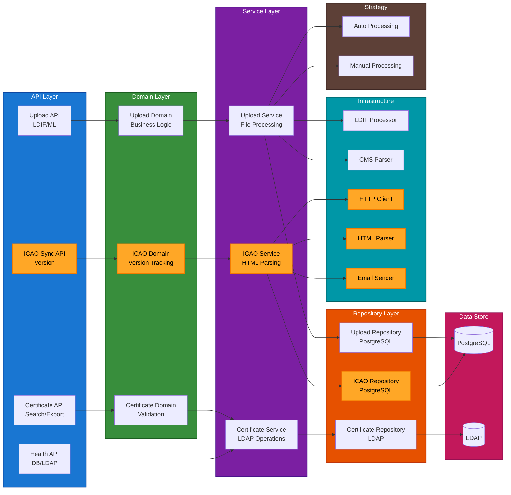

**Key Features**:
- Clean Architecture (6 Layers) with ServiceContainer (centralized DI, pimpl pattern)
- Handler Pattern: UploadHandler (10), UploadStatsHandler (11), CertificateHandler (12), AuthHandler, IcaoHandler, CsrHandler (7), MiscHandler
- Query Helpers (`common::db::`) -- database-agnostic utility functions across 16 repositories
- **CSR Management**: ICAO PKD CSR generation (RSA-2048 + SHA256withRSA), external CSR Import, ICAO-issued certificate registration
- **DSC Pending Approval**: DSC extracted from PA verification -> auto-registration -> admin approval workflow
- **PII Encryption**: AES-256-GCM authenticated encryption (Personal Information Protection Act Article 29 -- CSR private key, PII fields)
- ICAO Auto Sync with Daily Scheduler
- LDIF/Master List Parsing + Individual Certificate Upload (PEM/DER/P7B/DL/CRL)
- Trust Chain Validation (icao::validation shared library)
- Certificate Search & Export (DIT-structured ZIP)
- API Client Authentication (X-API-Key, SHA-256 hash, per-client Rate Limiting)
- JWT Authentication + RBAC (admin/user)
- DSC_NC Report, CRL Report, Certificate Quality Report, PA Lookup API
- Multi-DBMS (PostgreSQL + Oracle)

---

### 2. PA Service (Port 8082)

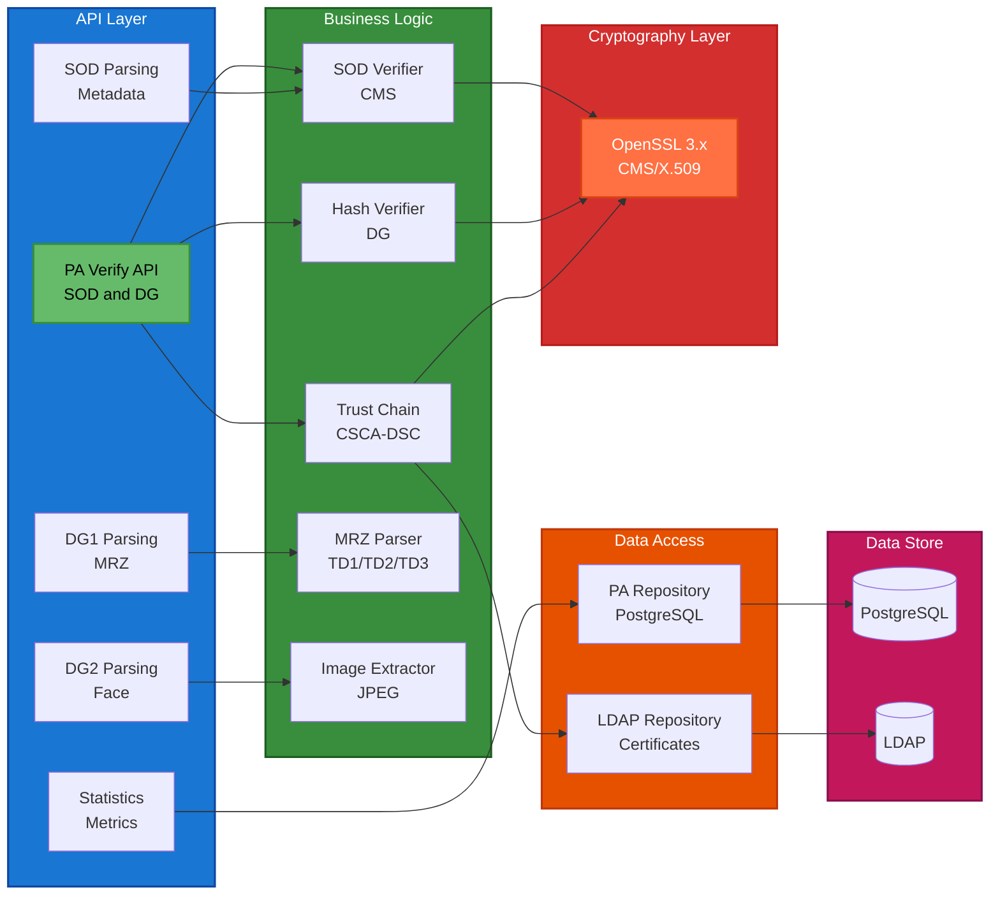

**Key Features**:
- ICAO 9303 PA Compliance (Part 10, 11, 12)
- SOD CMS Verification + DG Hash Validation
- Trust Chain Validation (icao::validation shared library)
- CRL Revocation Checking (RFC 5280)
- DSC Auto-Registration (PA_EXTRACTED source type)
- DSC Non-Conformant (nc-data) Support
- MRZ Parsing (TD1/TD2/TD3) + Face Image Extraction (JPEG2000 conversion)
- ServiceContainer (pImpl DI), Handler Pattern: PaHandler (9), HealthHandler (3), InfoHandler (4)
- Multi-DBMS (PostgreSQL + Oracle)

---

### 3. PKD Relay Service (Port 8083)

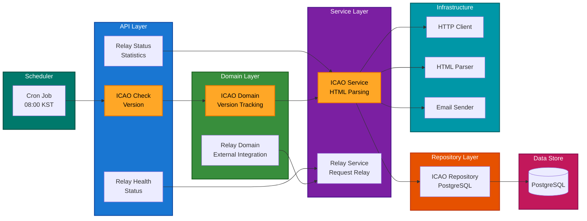

**Key Features**:
- ICAO PKD external integration (Version Detection)
- HTML Scraping (Table + Link Fallback)
- DB-LDAP Reconciliation (CSCA, DSC, CRL)
- Daily Auto Version Check Scheduler
- ServiceContainer (pImpl DI), Handler Pattern: SyncHandler (10), ReconciliationHandler (4), HealthHandler (1)
- SyncScheduler with callback-based DI
- Clean Architecture (4 Layers)
- Multi-DBMS (PostgreSQL + Oracle)

---

### 4. Monitoring Service (Port 8084)

**Key Features**:
- System Resource Monitoring (CPU, Memory, Disk, Network)
- Service Health Checks (HTTP Probes to all backend services)
- DB-Independent Architecture (no PostgreSQL/Oracle dependency)
- Handler Pattern: MonitoringHandler (3 endpoints + SystemMetricsCollector + ServiceHealthChecker)
- JSON Metrics API

---

## Data Layer Architecture

### PostgreSQL Database Schema

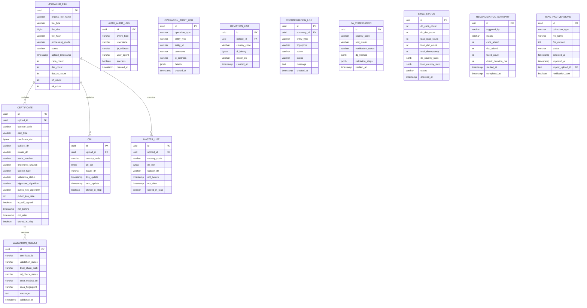

**Total Tables**: 20
- **Upload & Certificate**: uploaded_file, certificate, crl, master_list, deviation_list, duplicate_certificate, link_certificate
- **Validation**: validation_result
- **PA**: pa_verification, pending_dsc_registration
- **CSR**: csr_request (CSR + encrypted private key + issued certificate metadata)
- **Audit**: auth_audit_log, operation_audit_log
- **Sync**: sync_status, reconciliation_summary, reconciliation_log, revalidation_history
- **Reference**: code_master, users
- **API Client**: api_clients, api_client_usage_log, api_client_requests
- **AI**: ai_analysis_result
- **ICAO Sync**: icao_pkd_versions

---

### LDAP Directory Structure

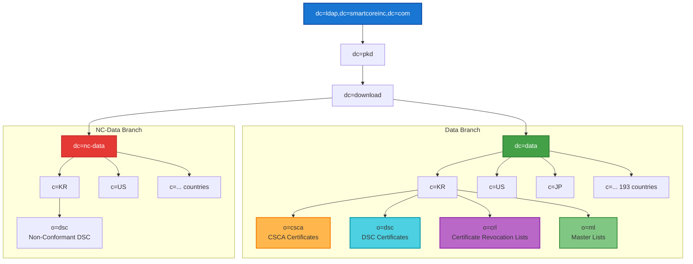

**LDAP Schema**:
- **objectClass**: pkdDownload, cRLDistributionPoint
- **Attributes**: userCertificate;binary, cACertificate;binary, certificateRevocationList;binary
- **Total Entries**: 31,212 (845 CSCA + 27 MLSC + 29,838 DSC + 502 DSC_NC + 69 CRL)

---

## Frontend Architecture

```mermaid
graph TD
    subgraph "React Application Structure"
        subgraph "Entry Point"
            Main[main.tsx<br/>React 19 Root]
            App[App.tsx<br/>Router and Layout]
        end

        subgraph "Layout Components"
            Sidebar[Sidebar.tsx<br/>Navigation Menu]
            Header[Header.tsx<br/>User Info and Theme]
        end

        subgraph "Page Components (29 Pages)"
            Dashboard[Dashboard.tsx<br/>System Overview]
            FileUpload[FileUpload.tsx<br/>File Upload]
            CertUpload[CertificateUpload.tsx<br/>Individual Certificate]
            CertSearch[CertificateSearch.tsx<br/>Certificate Search]
            DscNcReport[DscNcReport.tsx<br/>DSC_NC Report]
            UploadHistory[UploadHistory.tsx<br/>Upload History]
            UploadDetail[UploadDetail.tsx<br/>Upload Detail]
            UploadDashboard[UploadDashboard.tsx<br/>Statistics Dashboard]
            PAVerify[PAVerify.tsx<br/>PA Verification]
            PAHistory[PAHistory.tsx<br/>Verification History]
            PADetail[PADetail.tsx<br/>PA Detail]
            PADashboard[PADashboard.tsx<br/>PA Statistics]
            SyncDashboard[SyncDashboard.tsx<br/>Sync Status]
            IcaoStatus[IcaoStatus.tsx<br/>ICAO Version Status]
            SystemMonitoring[MonitoringDashboard.tsx<br/>System Monitoring]
            Login[Login.tsx<br/>JWT Authentication]
            UserMgmt[UserManagement.tsx<br/>User Management]
            AuditLog[AuditLog.tsx<br/>Auth Audit]
            OpAuditLog[OperationAuditLog.tsx<br/>Operation Audit]
            CsrMgmt[CsrManagement.tsx<br/>CSR Management]
            PendingDsc[PendingDscApproval.tsx<br/>DSC Registration Approval]
            ApiClientMgmt[ApiClientManagement.tsx<br/>API Client]
            ApiClientReq[ApiClientRequest.tsx<br/>API Access Request]
            AiAnalysis[AiAnalysisDashboard.tsx<br/>AI Analysis]
            CrlReport2[CrlReport.tsx<br/>CRL Report]
            TrustChain[TrustChainValidationReport.tsx<br/>Trust Chain Report]
            CertQuality[CertificateQualityReport.tsx<br/>Certificate Quality]
            EacDash[EacDashboard.tsx<br/>EAC Certificates]
            ProfilePage[Profile.tsx<br/>User Profile]
        end

        subgraph "Shared Components"
            Button[Button.tsx]
            Card[Card.tsx]
            Table[Table.tsx]
            Modal[Modal.tsx]
            Badge[Badge.tsx]
            Alert[Alert.tsx]
        end

        subgraph "Utils & Hooks"
            CountryCode[countryCode.ts<br/>ISO 3166 Converter]
            FlagUtils[Flag SVG Utils<br/>Flag Icons]
            APIClient[API Client<br/>Axios Wrapper]
        end

        subgraph "Styling"
            TailwindCSS[TailwindCSS 4<br/>Utility-first CSS]
            DarkMode[Dark Mode Support<br/>Theme Provider]
        end
    end

    Main --> App
    App --> Sidebar
    App --> Header
    App --> Dashboard
    App --> FileUpload
    App --> CertSearch
    App --> UploadHistory
    App --> UploadDashboard
    App --> PAVerify
    App --> PAHistory
    App --> PADashboard
    App --> SyncDashboard
    App --> IcaoStatus
    App --> SystemMonitoring

    Dashboard --> Card
    FileUpload --> Button
    CertSearch --> Table
    UploadHistory --> Modal
    PAVerify --> Alert
    IcaoStatus --> Badge

    CertSearch --> CountryCode
    IcaoStatus --> FlagUtils
    PAVerify --> APIClient

    App --> TailwindCSS
    App --> DarkMode

    style IcaoStatus fill:#FFD54F,stroke:#F57C00,stroke-width:3px
    style FlagUtils fill:#FFD54F,stroke:#F57C00,stroke-width:2px
```

**Build Stack**:
- **Bundler**: Vite 5
- **Language**: TypeScript 5
- **UI Framework**: React 19
- **Styling**: TailwindCSS 4
- **Icons**: Lucide React
- **HTTP Client**: Axios
- **State Management**: React Hooks (useState, useEffect)

---

## API Gateway Architecture

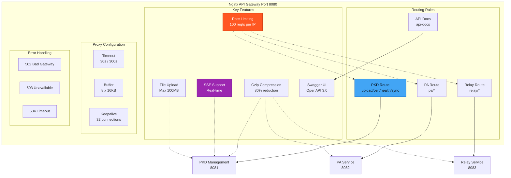

**Security Features**:
- Backend Service Isolation (Internal Network Only)
- Rate Limiting (DDoS Protection)
- Header Sanitization
- CORS Policy
- Request/Response Logging

---

## Component Details

### LDIF Processor

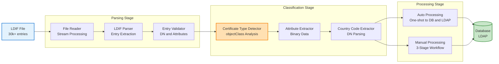

---

### ICAO Auto Sync Flow (v1.7.0)

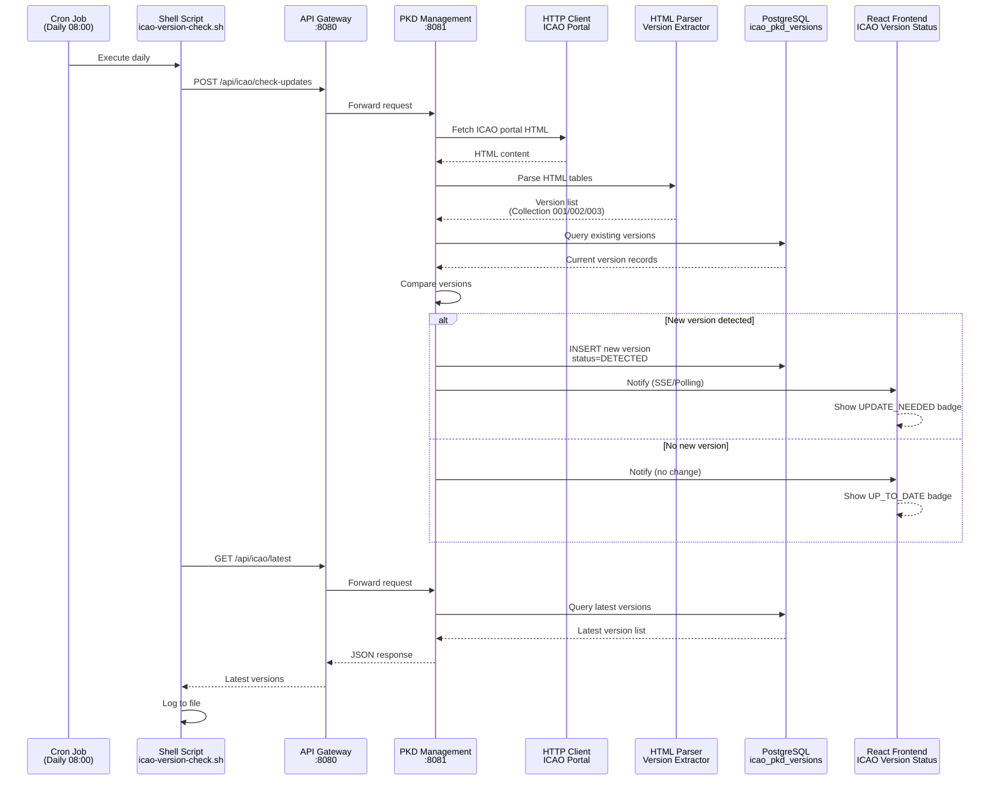

---

## Data Flow Diagrams

### Upload Flow (AUTO Mode)

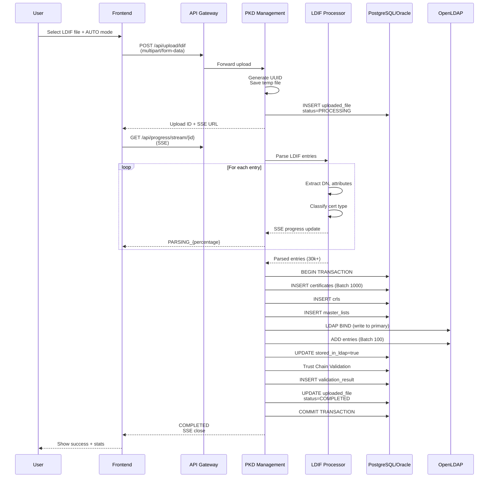

---

### PA Verification Flow

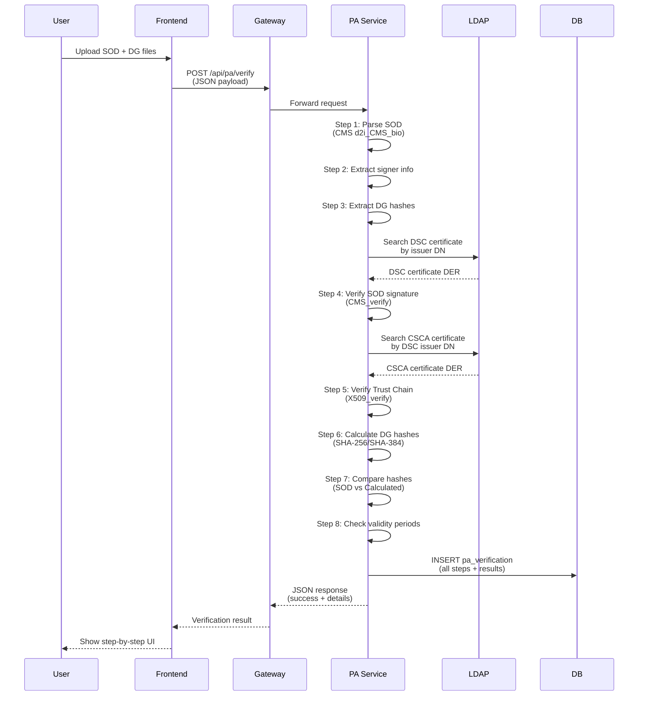

---

## Deployment Architecture

### Docker Compose Architecture

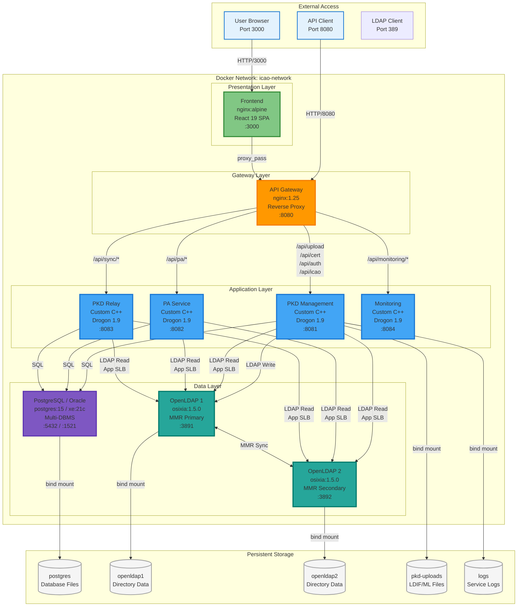

**Architecture Highlights**:

1. **Layered Design**: Clear 4-layer structure (Presentation -> Gateway -> Application -> Data)
2. **Gateway Pattern**: API Gateway (nginx) for service routing and reverse proxy
3. **App-Level SLB**: LDAP Software Load Balancing (in-service round-robin, HAProxy removed)
4. **Microservices**: 4 independent C++ services (PKD, PA, Relay, Monitoring)
5. **Multi-DBMS**: PostgreSQL 15 / Oracle XE 21c runtime switching (DB_TYPE)
6. **MMR Replication**: OpenLDAP Multi-Master replication for high availability
7. **Bind Mounts**: All data permanently stored on host filesystem

**Container Details**:

| Container | Image | CPU | Memory | Restart |
|-----------|-------|-----|--------|---------|
| frontend | nginx:alpine + React build | 0.5 | 256MB | always |
| api-gateway | nginx:1.25-alpine | 0.5 | 256MB | always |
| pkd-management | Custom C++ (Debian) | 2.0 | 2GB | always |
| pa-service | Custom C++ (Debian) | 2.0 | 2GB | always |
| pkd-relay | Custom C++ (Debian) | 1.0 | 1GB | always |
| monitoring | Custom C++ (Debian) | 0.5 | 256MB | always |
| postgres | postgres:15-alpine | 2.0 | 2GB | always |
| openldap1 | osixia/openldap:1.5.0 | 1.0 | 1GB | always |
| openldap2 | osixia/openldap:1.5.0 | 1.0 | 1GB | always |

**Total Resources**: 10 cores, 10.5GB RAM (PostgreSQL mode), +2GB for Oracle container

---

### Luckfox ARM64 Deployment

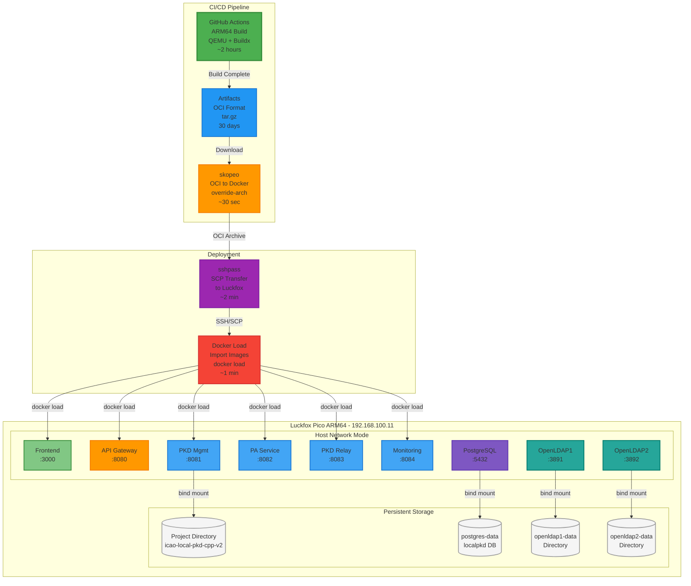

**Deployment Workflow**:

1. **GitHub Actions Build** (~2 hours)
   - Multi-stage Dockerfile with vcpkg caching
   - QEMU emulation for ARM64 cross-compilation
   - Output: OCI format images (tar.gz)

2. **Artifact Conversion** (~30 seconds)
   - `skopeo copy --override-arch arm64 oci-archive:... docker-archive:...`
   - OCI format -> Docker loadable format

3. **Transfer to Luckfox** (~2 minutes)
   - `sshpass -p "luckfox" scp image.tar luckfox@192.168.100.11:`
   - Non-interactive SSH authentication

4. **Load and Deploy** (~1 minute)
   - `docker load < image.tar`
   - `docker compose -f docker-compose-luckfox.yaml up -d`
   - Health check verification

**Key Differences from Development Environment**:

| Aspect | Development (AMD64) | Luckfox (ARM64) |
|--------|---------------------|-----------------|
| **Network Mode** | bridge (icao-network) | host (direct port mapping) |
| **PostgreSQL DB** | pkd | localpkd |
| **Build Method** | Local build or Docker | GitHub Actions only |
| **Deployment** | docker-compose.yaml | docker-compose-luckfox.yaml |
| **Image Format** | Docker native | OCI -> Docker conversion |

---

## Security Architecture

### Authentication & Authorization

```mermaid
graph TB
    subgraph "Security Layers (v2.37.0)"
        subgraph "Auth Layer"
            JWT["JWT Authentication<br/>HS256, 32+ byte secret"]
            RBAC["RBAC<br/>admin / user roles"]
            AuthMiddleware["Auth Middleware<br/>std::regex::optimize"]
            AuditLog["Dual Audit Logging<br/>auth_audit_log + operation_audit_log"]
        end

        subgraph "Network Layer"
            Firewall[Host Firewall<br/>iptables]
            Docker[Docker Network Isolation<br/>icao-network]
            NginxHeaders["nginx Security Headers<br/>X-Content-Type-Options<br/>X-Frame-Options<br/>Referrer-Policy"]
        end

        subgraph "Application Layer"
            RateLimit2[Rate Limiting<br/>100 req/s per IP]
            CORS[CORS Policy<br/>Same-Origin]
            CSP[Content Security Policy<br/>frame-ancestors self]
            NoSystemCall["Command Injection Prevention<br/>system()/popen() to Native C API"]
        end

        subgraph "Data Layer"
            DBAuth[DB Authentication<br/>PostgreSQL / Oracle]
            LDAPAuth["LDAP Bind<br/>cn=admin DN<br/>DN Escape (RFC 4514)"]
            PII["PII Encryption<br/>AES-256-GCM<br/>CSR Private Key/PII"]
            Encryption[TLS/SSL Support<br/>Production]
        end

        subgraph "Code Layer"
            Parameterized["Parameterized Queries<br/>100% parameterized SQL"]
            OrderByWhitelist["ORDER BY Whitelist<br/>SQL Injection Prevention"]
            Base64Validation["Base64 Input Validation<br/>isValidBase64() pre-check"]
            NullChecks["OpenSSL Null Checks<br/>24 allocation sites"]
            BufferOverread["SOD Parser Protection<br/>end pointer boundary"]
        end
    end

    JWT --> RBAC
    RBAC --> AuthMiddleware
    AuthMiddleware --> AuditLog

    Firewall --> Docker
    Docker --> NginxHeaders

    NginxHeaders --> RateLimit2
    RateLimit2 --> CORS
    CORS --> CSP
    CSP --> NoSystemCall

    NoSystemCall --> DBAuth
    NoSystemCall --> LDAPAuth
    DBAuth --> PII
    LDAPAuth --> PII
    PII --> Encryption

    Encryption --> Parameterized
    Parameterized --> OrderByWhitelist
    OrderByWhitelist --> Base64Validation
    Base64Validation --> NullChecks
    NullChecks --> BufferOverread

    style JWT fill:#F44336,stroke:#C62828,stroke-width:2px,color:#fff
    style PII fill:#FF9800,stroke:#F57C00,stroke-width:2px,color:#fff
    style Encryption fill:#4CAF50,stroke:#388E3C,stroke-width:2px,color:#fff
    style Parameterized fill:#2196F3,stroke:#1976D2,stroke-width:2px,color:#fff
    style NoSystemCall fill:#FF5722,stroke:#E64A19,stroke-width:2px,color:#fff
```

**Security Checklist (v2.37.0)**:
- JWT Authentication (HS256) + RBAC (admin/user)
- API Client Authentication (X-API-Key, SHA-256 hash, per-client Rate Limiting, IP/Endpoint restriction)
- Dual audit logging (auth_audit_log + operation_audit_log) with request context (user, IP, path, User-Agent)
- **PII Encryption (Personal Information Protection Act Article 29)**: AES-256-GCM authenticated encryption -- CSR private key, passport number, PII fields
- **CSR Private Key Security**: AES-256-GCM encrypted storage, private key excluded from API response, permanent destruction on deletion
- Backend services not exposed externally (API Gateway only)
- Rate limiting (DDoS protection, per-IP connection limit)
- 100% parameterized SQL queries (all services)
- ORDER BY whitelist validation
- LIKE query parameter escaping (`escapeSqlWildcards()`)
- Command injection eliminated -- `system()`/`popen()` -> Native C API
- XSS prevention (JSON serialization, CSP headers)
- CORS policy (configurable, dynamic origin map)
- nginx security headers (X-Content-Type-Options, X-Frame-Options, X-XSS-Protection, Referrer-Policy, HSTS)
- JWT_SECRET minimum length validation (32 bytes)
- LDAP DN escape utility (RFC 4514)
- Base64 input validation (pre-check before decode)
- SOD parser buffer overread protection (end pointer boundary)
- OpenSSL null pointer checks (24+ allocation sites)
- Frontend OWASP hardening (DEV-only console.error, credential guards, centralized JWT injection)
- Logout audit logging even with expired JWT (best-effort payload decoding)
- Credential externalization (.env)
- File upload validation (MIME type, path sanitization)

---

## Technology Stack Summary

### Backend

| Component | Technology | Version | Purpose |
|-----------|-----------|---------|---------|
| Language | C++20 | GCC 11+ | High performance |
| Framework | Drogon | 1.9+ | Async HTTP server |
| Database | PostgreSQL / Oracle | 15 / XE 21c | Multi-DBMS (runtime switching) |
| LDAP | OpenLDAP | 2.6+ | Certificate storage (MMR cluster) |
| Crypto | OpenSSL | 3.x | X.509, CMS, Hash |
| JSON | nlohmann/json | 3.11+ | JSON parsing |
| Logging | spdlog | 1.12+ | Structured logging |
| Testing | Google Test | 1.14+ | Unit testing (86 tests) |
| Build | CMake + vcpkg | 3.20+ | Dependency management |

### Frontend

| Component | Technology | Version | Purpose |
|-----------|-----------|---------|---------|
| Language | TypeScript | 5.x | Type safety |
| Framework | React | 19 | UI library |
| Bundler | Vite | 5.x | Fast dev server |
| Styling | TailwindCSS | 4.x | Utility-first CSS |
| State | Zustand | latest | State management |
| Data Fetching | TanStack Query | latest | Server state |
| Charts | ECharts + Recharts | latest | Data visualization |
| Icons | Lucide React | latest | SVG icons |
| HTTP Client | Axios | latest | API requests |

### Infrastructure

| Component | Technology | Version | Purpose |
|-----------|-----------|---------|---------|
| API Gateway | Nginx | 1.25+ | Reverse proxy, security headers |
| LDAP LB | App-level SLB | - | Software load balancing (in-app) |
| Container | Docker | 24+ | Containerization |
| Orchestration | Docker Compose | 2.x | Multi-container apps |
| CI/CD | GitHub Actions | - | ARM64 cross-compilation |
| Artifact Conversion | skopeo | latest | OCI -> Docker format |

---

## Performance Metrics

### Throughput

| Metric | Value | Conditions |
|--------|-------|------------|
| **Certificate Search** | 2,222 req/s | 10k requests, 100 concurrent |
| **PA Verification** | 416 req/s | 1k requests, 50 concurrent |
| **PA Lookup** | 5~20ms | Pre-computed validation result |
| **API Latency** | <100ms | Average response time |
| **Database Query** | 40ms | PostgreSQL DISTINCT query (95 countries) |
| **LDAP Search** | <200ms | App-level SLB (round-robin) |

### Scalability

| Component | Current | Max Tested | Notes |
|-----------|---------|------------|-------|
| **Certificates** | 31,212 | 100,000+ | PostgreSQL/Oracle + LDAP |
| **Concurrent Users** | 100 | 1,000+ | Nginx workers x connections |
| **Upload File Size** | 100MB | 200MB | Nginx client_max_body_size |
| **Batch Size** | 1,000 | 10,000 | DB insert batch |

---

## Monitoring & Observability

### Health Checks

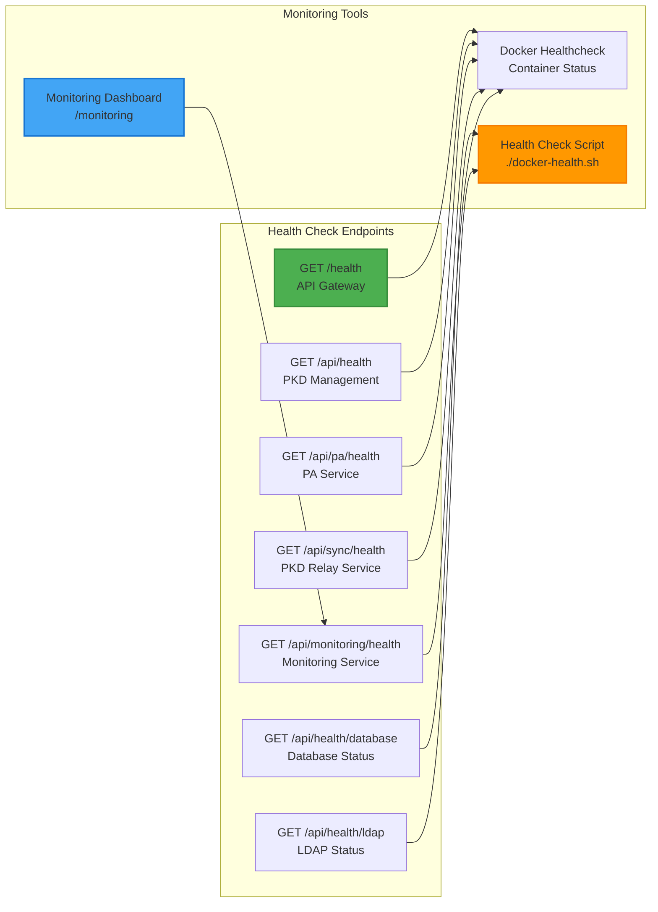

### Logging Strategy

| Component | Log Level | Destination | Retention |
|-----------|-----------|-------------|-----------|
| **PKD Management** | INFO | /var/log/pkd-management.log | 30 days |
| **PA Service** | INFO | /var/log/pa-service.log | 30 days |
| **PKD Relay Service** | INFO | /var/log/pkd-relay.log | 30 days |
| **Monitoring Service** | INFO | stdout (Docker logs) | 30 days |
| **Nginx Access** | COMBINED | /var/log/nginx/access.log | 30 days |
| **Nginx Error** | WARN | /var/log/nginx/error.log | 30 days |

---

# Part 2: Design Principles & Patterns

---

## Core Design Principles

### 1. Domain-Driven Design (DDD)
Domain-centric design for clear separation of business logic.

### 2. Microservice Architecture
System composed of independently deployable service units.

### 3. Strategy Pattern
Business logic separation based on file type and certificate type.

### 4. Single Responsibility Principle (SRP)
Each class and module has only one responsibility.

### 5. ServiceContainer + Pimpl Pattern (v2.12.0+)
Centralized DI container manages all dependencies. `struct Impl` pimpl pattern minimizes header dependencies.

### 6. Handler Extraction Pattern (v2.13.0+)
Minimize main.cpp and extract all HTTP handlers to independent classes.

---

## DDD (Domain-Driven Design) Structure

### PKD Management Service Layer Structure

```
services/pkd-management/src/
|
+-- infrastructure/               # Infrastructure Layer (v2.12.0+)
|   +-- service_container.h/.cpp  # ServiceContainer -- Centralized DI (pimpl pattern)
|   +-- app_config.h              # AppConfig -- Environment variable parsing
|   +-- http/http_client.h        # HTTP Client
|   +-- notification/email_sender.h
|
+-- handlers/                     # Handler Layer (v2.12.0~v2.13.0 extracted from main.cpp)
|   +-- upload_handler.h/.cpp     # Upload API (10 endpoints)
|   +-- upload_stats_handler.h/.cpp # Statistics/History API (11 endpoints)
|   +-- certificate_handler.h/.cpp  # Certificate API (20 endpoints)
|   +-- auth_handler.h/.cpp       # Auth API
|   +-- icao_handler.h/.cpp       # ICAO Sync API
|   +-- code_master_handler.h/.cpp  # Code Master API (6 endpoints)
|   +-- api_client_handler.h/.cpp   # API Client Management (7 endpoints)
|   +-- api_client_request_handler.h/.cpp # API Client Request (5 endpoints)
|   +-- csr_handler.h/.cpp        # CSR Management API (6 endpoints)
|   +-- misc_handler.h/.cpp       # Health, Audit, Validation, PA proxy, Info
|
+-- middleware/                   # Auth Middleware
|   +-- auth_middleware.h/.cpp    # JWT + API Key Auth
|
+-- repositories/                 # Repository Layer (16 repositories)
|   +-- upload_repository.h/.cpp
|   +-- certificate_repository.h/.cpp
|   +-- validation_repository.h/.cpp
|   +-- crl_repository.h/.cpp
|   +-- ldap_certificate_repository.h/.cpp
|   +-- code_master_repository.h/.cpp
|   +-- api_client_repository.h/.cpp
|   +-- pending_dsc_repository.h/.cpp
|   +-- csr_repository.h/.cpp
|   +-- ...
|
+-- services/                     # Service Layer
|   +-- upload_service.h/.cpp
|   +-- validation_service.h/.cpp
|   +-- certificate_service.h/.cpp
|   +-- icao_sync_service.h/.cpp
|   +-- ldap_storage_service.h/.cpp  # LDAP Storage (Certificates/CRL/ML)
|   +-- csr_service.h/.cpp
|
+-- adapters/                     # icao::validation Adapters
|   +-- db_csca_provider.cpp      # DB-based CSCA Provider
|   +-- db_crl_provider.cpp       # DB-based CRL Provider
|   +-- ldap_csca_provider.cpp    # LDAP-based CSCA Provider (PA Lookup)
|   +-- ldap_crl_provider.cpp     # LDAP-based CRL Provider (PA Lookup)
|
+-- auth/                         # Auth Module
|   +-- personal_info_crypto.h/.cpp  # PII Encryption (AES-256-GCM)
|   +-- password_hash.h/.cpp     # PBKDF2-HMAC-SHA256
|
+-- processing_strategy.h         # Strategy Pattern (AUTO)
+-- ldif_processor.h/.cpp         # LDIF Processor
+-- common/
|   +-- masterlist_processor.h    # Master List Processor
|   +-- progress_manager.h/.cpp   # SSE Progress Management
|
+-- main.cpp                      # Entry Point (minimized: ~430 lines, v2.13.0)
```

### DDD Layer Responsibilities

#### 1. Domain Layer
**Responsibility**: Business rules and core logic
- **Models**: Business entities (Certificate, ICAO Version, etc.)
- **Domain Services**: Domain logic (validation, computation, etc.)

```cpp
// domain/models/certificate.h
class Certificate {
private:
    std::string id;
    std::string subjectDn;
    std::string issuerDn;
    std::string country;
    CertificateType type;  // CSCA, DSC, DSC_NC, MLSC

public:
    // Business rule: Check self-signed
    bool isSelfSigned() const;

    // Business rule: Check Link Certificate
    bool isLinkCertificate() const;
};
```

#### 2. Repository Layer
**Responsibility**: Data persistence (DB, LDAP access)
- PostgreSQL data access
- LDAP data access
- Domain model <-> database conversion

```cpp
// repositories/ldap_certificate_repository.h
class LdapCertificateRepository {
public:
    // Query certificate from LDAP
    std::optional<Certificate> findByFingerprint(const std::string& fingerprint);

    // Save certificate to LDAP
    void save(const Certificate& cert);
};
```

#### 3. Application Service Layer
**Responsibility**: Use case orchestration (transactions, combining multiple domain services)
- Upload processing flow management
- Transaction boundary setting
- External API calls

```cpp
// services/upload_service.h
class UploadService {
public:
    // Use case: Process file upload
    UploadResult processFileUpload(
        const FileUploadRequest& request,
        ProcessingStrategy* strategy
    );
};
```

#### 4. Infrastructure Layer
**Responsibility**: External system integration (HTTP, filesystem, external API)
- ServiceContainer (centralized DI)
- Drogon HTTP handlers (handlers/)
- Filesystem access
- LDAP/PostgreSQL connection management

---

## ServiceContainer Pattern (Centralized DI)

### Design Principles (v2.12.0+)

ServiceContainer is a centralized container that owns all application dependencies and provides dependency injection.
Replaces 17 global `shared_ptr` variables from the original main.cpp with a single container instance.

### Pimpl Pattern

Only exposes `struct Impl` forward declaration in header to minimize compilation dependencies:

```cpp
// infrastructure/service_container.h
class ServiceContainer {
public:
    ServiceContainer();
    ~ServiceContainer();

    // Non-copyable, non-movable
    ServiceContainer(const ServiceContainer&) = delete;
    ServiceContainer& operator=(const ServiceContainer&) = delete;

    bool initialize(const AppConfig& config);
    void shutdown();

    // Non-owning pointer accessors (ownership held by Impl)
    common::IQueryExecutor* queryExecutor() const;
    repositories::CertificateRepository* certificateRepository() const;
    services::UploadService* uploadService() const;
    handlers::UploadHandler* uploadHandler() const;
    // ... other accessors

private:
    struct Impl;
    std::unique_ptr<Impl> impl_;
};
```

```cpp
// infrastructure/service_container.cpp
struct ServiceContainer::Impl {
    // Connection pools
    std::shared_ptr<common::IDbConnectionPool> dbPool;
    std::unique_ptr<common::IQueryExecutor> queryExecutor;
    std::shared_ptr<common::LdapConnectionPool> ldapPool;

    // Repositories (16)
    std::shared_ptr<repositories::UploadRepository> uploadRepository;
    std::shared_ptr<repositories::CertificateRepository> certificateRepository;
    // ...

    // Services (8)
    std::shared_ptr<services::UploadService> uploadService;
    // ...

    // Handlers (9)
    std::shared_ptr<handlers::UploadHandler> uploadHandler;
    // ...
};
```

### Initialization Order

Strict dependency-ordered initialization:

```
Phase 0: PII Encryption (Personal Information Protection Act)
Phase 1: LDAP Connection Pool
Phase 2: Certificate Service (LDAP-based search)
Phase 3: Database Connection Pool + Query Executor
Phase 4: Repositories (16, all depend on QueryExecutor)
Phase 4.5: LDAP Storage Service
Phase 5: ICAO Sync Module
Phase 6: Business Logic Services
Phase 7: Handlers (9)
Phase 8: Ensure Admin User
```

### Resource Release

`shutdown()` method releases all resources in reverse order (destructors called automatically):

```
Handlers -> Services -> LDAP Providers -> Repositories -> QueryExecutor -> LDAP Pool -> DB Pool
```

### ServiceContainer Adoption Across Services

| Service | ServiceContainer | Key Components |
|--------|:----------------:|-----------|
| PKD Management | O | 16 repos, 8 services, 9 handlers |
| PA Service | O | 4 repos, 2 parsers, 3 services |
| PKD Relay | O | 5 repos, 3 services, SyncScheduler |
| Monitoring | - | DB-independent (direct HTTP/system calls) |

---

## main.cpp Minimization Pattern

### Principles (v2.13.0+)

main.cpp is composed as a minimal orchestration layer only:

```
Load config -> Initialize ServiceContainer -> Register routes -> Run server
```

### Structure (PKD Management, ~430 lines)

```cpp
// main.cpp -- Minimized entry point
infrastructure::ServiceContainer* g_services = nullptr;

namespace {
    AppConfig appConfig;

    void initializeLogging() { /* spdlog setup */ }
    void printBanner() { /* banner output */ }
    Json::Value checkDatabase() { /* DB health check */ }
    Json::Value checkLdap() { /* LDAP health check */ }

    void registerRoutes() {
        auto& app = drogon::app();

        // Call each handler's registerRoutes()
        if (g_services && g_services->authHandler())
            g_services->authHandler()->registerRoutes(app);
        if (g_services && g_services->uploadHandler())
            g_services->uploadHandler()->registerRoutes(app);
        if (g_services && g_services->certificateHandler())
            g_services->certificateHandler()->registerRoutes(app);
        // ... other handlers

        // MiscHandler (health, audit, etc. -- not managed by ServiceContainer)
        static handlers::MiscHandler miscHandler(
            g_services->auditService(),
            g_services->validationService(),
            checkDatabase, checkLdap
        );
        miscHandler.registerRoutes(app);
    }
}

int main(int argc, char* argv[]) {
    printBanner();
    initializeLogging();
    appConfig = AppConfig::fromEnvironment();

    g_services = new infrastructure::ServiceContainer();
    if (!g_services->initialize(appConfig)) return 1;

    registerRoutes();
    drogon::app().run();

    delete g_services;
    return 0;
}
```

### Handler Extraction Pattern

All handlers provide a `registerRoutes(HttpAppFramework&)` method:

```cpp
// handlers/upload_handler.h
class UploadHandler {
public:
    UploadHandler(UploadService*, ValidationService*, ...);

    // Called from main.cpp
    void registerRoutes(drogon::HttpAppFramework& app);

private:
    void handleLdifUpload(const HttpRequestPtr&, ResponseCallback&&);
    void handleMasterListUpload(const HttpRequestPtr&, ResponseCallback&&);
    // ... 10 endpoints
};
```

### main.cpp Size Across Services

| Service | v2.11.0 | v2.13.0 | Reduction |
|--------|---------|---------|--------|
| PKD Management | 8,095 lines | ~430 lines | -94.7% |
| PA Service | 2,800 lines | ~281 lines | -90.0% |
| PKD Relay | 1,644 lines | ~457 lines | -72.2% |
| Monitoring | 586 lines | ~93 lines | -84.1% |

---

## Strategy Pattern

### 1. Processing Strategy - File Processing Mode

```cpp
// processing_strategy.h

// Abstract strategy interface
class ProcessingStrategy {
public:
    virtual void processLdifEntries(...) = 0;
    virtual void processMasterListContent(...) = 0;
};

// Concrete strategy: AUTO mode (v2.25.0+ MANUAL mode removed)
class AutoProcessingStrategy : public ProcessingStrategy {
    // One-shot processing: Parse -> Validate -> DB -> LDAP
};

// Factory Pattern
class ProcessingStrategyFactory {
    static std::unique_ptr<ProcessingStrategy> create(const std::string& mode);
};
```

**Usage Example**:
```cpp
// upload_handler.cpp
auto strategy = ProcessingStrategyFactory::create("AUTO");
strategy->processLdifEntries(uploadId, entries, conn, ld);
```

### 2. Certificate Type Strategy - Per-Type Validation

```cpp
// Per-certificate-type validation strategy separation

// CSCA validation strategy
ValidationResult validateCscaCertificate(X509* cert) {
    // CSCA validation logic (Self-signed, CA:TRUE, keyCertSign)
}

// DSC validation strategy
ValidationResult validateDscCertificate(X509* cert, PGconn* conn) {
    // DSC validation logic (Trust Chain, CRL check)
}

// Link Certificate validation strategy
bool isLinkCertificate(X509* cert) {
    // Link Certificate detection logic (CA:TRUE, keyCertSign, not self-signed)
}
```

### 3. File Type Strategy - Per-File-Type Processing

```cpp
// LDIF file processing
class LdifProcessor {
    ProcessingCounts process(const std::string& content);
};

// Master List file processing
class MasterListProcessor {
    MasterListStats process(const std::vector<uint8_t>& content);
};
```

---

## Single Responsibility Principle (SRP)

### Good Example: Responsibility Separation
```cpp
// 1. Only responsible for LDIF parsing
class LdifParser {
    std::vector<LdifEntry> parse(const std::string& content);
};

// 2. Only responsible for certificate validation
class CertificateValidator {
    ValidationResult validate(X509* cert);
};

// 3. Only responsible for LDAP storage
class LdapCertificateRepository {
    void save(const Certificate& cert);
};

// 4. Orchestration of overall flow
class UploadService {
    void processUpload() {
        auto entries = ldifParser.parse(content);      // Parsing
        auto result = validator.validate(cert);        // Validation
        repository.save(cert);                         // Storage
    }
};
```

### Bad Example: Mixed Responsibilities
```cpp
// One class performs parsing, validation, and storage (SRP violation)
class EverythingProcessor {
    void processEverything(const std::string& content) {
        // Parse
        auto entries = /* parse LDIF */;

        // Validate
        auto result = /* validate certificate */;

        // DB save
        /* save to PostgreSQL */;

        // LDAP save
        /* save to LDAP */;
    }
};
```

### Class Responsibility Definitions

| Class/Module | Single Responsibility |
|------------|---------|
| `LdifProcessor` | LDIF file parsing |
| `MasterListProcessor` | Master List CMS parsing |
| `AutoProcessingStrategy` | AUTO mode processing flow |
| `Certificate` (Domain Model) | Certificate domain rules |
| `LdapCertificateRepository` | LDAP data access |
| `CertificateValidator` | Certificate validation logic |
| `TrustChainBuilder` | Trust Chain construction |
| `CscaCache` | CSCA cache management |
| `ServiceContainer` | Dependency ownership and initialization |
| `UploadHandler` | Upload HTTP handler |
| `LdapStorageService` | LDAP write operations |

---

## Query Executor Pattern (Database Abstraction)

Database abstraction pattern for Multi-DBMS support (PostgreSQL + Oracle).

### IQueryExecutor Interface

```cpp
// shared/lib/database/i_query_executor.h
class IQueryExecutor {
public:
    virtual QueryResult executeQuery(const std::string& sql,
                                      const std::vector<std::string>& params) = 0;
    virtual int executeNonQuery(const std::string& sql,
                                 const std::vector<std::string>& params) = 0;
    virtual DatabaseType getDatabaseType() const = 0;

    // Batch mode (v2.26.1+)
    virtual void beginBatch() {}
    virtual void endBatch() {}
    virtual void savepoint(const std::string& name) {}
    virtual void rollbackToSavepoint(const std::string& name) {}
};
```

### Implementations
- **PostgreSqlQueryExecutor**: libpq-based (10-50x faster)
- **OracleQueryExecutor**: OCI Session Pool-based

### Runtime Selection
```cpp
// Factory Pattern selects at runtime based on DB_TYPE environment variable
auto executor = QueryExecutorFactory::create(DB_TYPE);  // "postgres" or "oracle"
```

All repositories execute SQL through `IQueryExecutor`, enabling database replacement.

---

## Query Helpers Pattern

### common::db:: Utility Functions

Helper functions abstracting SQL syntax differences between databases (v2.12.0+).

```cpp
// shared/lib/database/query_helpers.h
namespace common::db {
    // JSON -> integer safe conversion (Oracle returns all values as strings)
    int scalarToInt(const Json::Value& val, int defaultVal = 0);

    // DB-specific boolean literal ("TRUE"/"FALSE" vs "1"/"0")
    std::string boolLiteral(const std::string& dbType, bool value);

    // DB-specific pagination ("LIMIT $N OFFSET $M" vs "OFFSET $M ROWS FETCH NEXT $N ROWS ONLY")
    std::string paginationClause(const std::string& dbType, int limit, int offset);

    // DB-specific hex prefix ("\\x" vs empty string)
    std::string hexPrefix(const std::string& dbType);

    // DB-specific current timestamp ("NOW()" vs "SYSTIMESTAMP")
    std::string currentTimestamp(const std::string& dbType);

    // DB-specific case-insensitive condition ("ILIKE" vs "UPPER() LIKE UPPER()")
    std::string ilikeCond(const std::string& dbType, const std::string& column, const std::string& paramRef);

    // DB-specific LIMIT clause
    std::string limitClause(const std::string& dbType, int limit);

    // JSON boolean safe reading (Oracle NUMBER(1) -> bool)
    bool getBool(const Json::Value& row, const std::string& key, bool defaultVal = false);
}
```

### Usage Example

```cpp
// Remove DB branching in repositories
std::string dbType = queryExecutor_->getDatabaseType();

std::string sql = "SELECT * FROM certificate WHERE stored_in_ldap = " +
    common::db::boolLiteral(dbType, false) +
    " ORDER BY created_at " +
    common::db::paginationClause(dbType, limit, offset);
```

### Impact
- Eliminated 204 inline DB branches across 15 repositories in 3 services
- New repositories automatically get DB compatibility

---

## Provider/Adapter Pattern (Validation Infrastructure)

Pattern separating validation logic from data sources (DB vs LDAP).

### Provider Interface

```cpp
// shared/lib/icao-validation/include/icao/validation/providers.h
class ICscaProvider {
public:
    virtual std::vector<X509*> findAllCscasByIssuerDn(const std::string& issuerDn) = 0;
    virtual X509* findCscaByIssuerDn(const std::string& issuerDn,
                                      const std::string& countryCode = "") = 0;
};

class ICrlProvider {
public:
    virtual X509_CRL* findCrlByCountry(const std::string& countryCode) = 0;
};
```

### Adapter Implementations

| Service | CSCA Provider | CRL Provider |
|--------|--------------|-------------|
| PKD Management | `DbCscaProvider` -> CertificateRepository | `DbCrlProvider` -> CrlRepository |
| PKD Management (PA Lookup) | `LdapCscaProvider` -> LdapPool | `LdapCrlProvider` -> LdapPool |
| PA Service | `LdapCscaProvider` -> LdapCertificateRepository | `LdapCrlProvider` -> LdapCrlRepository |

Each service implements Adapters matching its own data access layer. The `icao::validation` library contains no infrastructure code.

---

## Shared Libraries

### Library Structure (shared/lib/)

Common ICAO certificate functionality extracted into shared libraries to eliminate code duplication across services.

| Library | Namespace | Responsibility |
|-----------|------------|------|
| `database` | `common::` / `common::db::` | DB connection pool, Query Executor (PostgreSQL + Oracle), Query Helpers |
| `ldap` | `common::` | Thread-safe LDAP connection pool (min=2, max=10) |
| `icao-validation` | `icao::validation::` | ICAO 9303 certificate validation (trust chain, CRL, extensions, algorithm) |
| `certificate-parser` | `icao::` | X.509 certificate parsing |
| `cvc-parser` | `icao::cvc::` | BSI TR-03110 CVC certificate parsing |
| `icao9303` | `icao::` | ICAO 9303 SOD/DG parser |
| `audit` | `icao::audit::` | Unified audit logging (operation_audit_log) |
| `config` | `icao::config::` | Configuration management |
| `exception` | `icao::` | Custom exception types |
| `logging` | `icao::logging::` | Structured logging (spdlog) |

### Shared Validation Library (icao::validation, v2.11.0+)

Pattern extracting ICAO 9303 certificate validation logic into a shared library.

#### Design Principles
- **Pure Function**: Uses only OpenSSL X509 API without infrastructure dependencies
- **Idempotent**: Same input -> same output (idempotency guaranteed)
- **Provider Pattern**: Data sources injected through interfaces

#### Module Structure

| Module | Responsibility |
|------|------|
| `cert_ops` | Pure X509 operations (fingerprint, validity, DN extraction, normalization) |
| `trust_chain_builder` | Multi-CSCA trust chain construction (key rollover support) |
| `crl_checker` | RFC 5280 CRL revocation checking |
| `extension_validator` | X.509 extension field validation (key usage, critical extensions) |
| `algorithm_compliance` | ICAO Doc 9303 Part 12 algorithm requirements |

#### Testing
86 unit tests (GTest). All modules include idempotency verification (50-100 iterations).

### Shared Database Library (icao::database)

#### Query Executor + Query Helpers
- `IQueryExecutor`: DB abstraction interface (PostgreSQL + Oracle)
- `QueryHelpers` (`common::db::`): SQL syntax difference abstraction utilities
- `handler_utils.h`: `sendJsonSuccess()`, `notFound()` response helpers

#### Connection Pooling
- `DbConnectionPool`: Thread-safe DB connection pool (RAII)
- `DbConnectionPoolFactory`: Environment variable-based pool creation

---

## Code Structure Rules

### 1. File Organization Rules

```
service-name/
+-- src/
|   +-- infrastructure/         # Infrastructure Layer (ServiceContainer, AppConfig)
|   |
|   +-- handlers/               # HTTP Handlers (registerRoutes pattern)
|   |
|   +-- middleware/              # Auth Middleware
|   |
|   +-- domain/                 # Domain Layer (Business core)
|   |   +-- models/             # Entities
|   |   +-- services/           # Domain services
|   |
|   +-- repositories/           # Data access (LDAP, PostgreSQL)
|   |
|   +-- services/               # Application services
|   |
|   +-- adapters/               # Provider adapters (icao::validation)
|   |
|   +-- auth/                   # Auth/encryption module
|   |
|   +-- common/                 # Utilities (common functions)
|   |
|   +-- {strategy_name}_strategy.h   # Strategy pattern
|   +-- {processor_name}_processor.h # Processor
|   |
|   +-- main.cpp               # Minimal entry point (~430 lines)
|
+-- tests/                     # Unit tests
```

### 2. Naming Conventions

#### Class Naming
- **Domain Model**: `Certificate`, `IcaoVersion` (nouns)
- **Repository**: `LdapCertificateRepository`, `CrlRepository`
- **Service**: `UploadService`, `CertificateService`
- **Handler**: `UploadHandler`, `CertificateHandler` (v2.12.0+)
- **Strategy**: `AutoProcessingStrategy`
- **Processor**: `LdifProcessor`, `MasterListProcessor`
- **Validator**: `CertificateValidator`, `TrustChainValidator`
- **Container**: `ServiceContainer` (DI container)

#### Function Naming
- **Domain rules**: `isSelfSigned()`, `isLinkCertificate()`
- **Repository**: `findByFingerprint()`, `save()`, `findAll()`
- **Service**: `processUpload()`, `validateCertificate()`
- **Handler**: `handleLdifUpload()`, `handleCertificateSearch()`
- **Route Registration**: `registerRoutes(HttpAppFramework&)`
- **Strategy**: `processLdifEntries()`, `processMasterListContent()`

### 3. Dependency Direction

```
+-------------------------------------------+
|     main.cpp (Minimal Orchestration)      |
|    config -> DI -> routes -> run          |
+-------------------+---------------------+
                    |
                    v
+-------------------------------------------+
|   ServiceContainer (DI + Handlers)        |
|     Owns all dependencies (pimpl)         |
+-------------------+---------------------+
                    |
                    v
+-------------------------------------------+
|      Application Service Layer            |
|     (UploadService, etc.)                 |
+-------------------+---------------------+
                    |
                    v
+-------------------------------------------+
|         Domain Layer                      |
|  (Certificate, CertificateValidator)      |
+-------------------+---------------------+
                    |
                    v
+-------------------------------------------+
|    Infrastructure Layer                   |
|  (LdapRepository, PostgresRepository)     |
+-------------------------------------------+
```

**Dependency Rules**:
- Domain Layer does not depend on other layers (Pure Business Logic)
- Application Service depends on Domain Layer
- Infrastructure depends on Domain Layer (Dependency Inversion)
- Handler depends on Service + Repository
- ServiceContainer owns all layers but minimizes header exposure via Pimpl
- main.cpp depends only on ServiceContainer

---

## Extension Guidelines

### 1. Adding a New File Type

```cpp
// 1. Create Processor (SRP)
class NewFileTypeProcessor {
    ProcessingResult process(const std::vector<uint8_t>& content);
};

// 2. Add method to Strategy
class ProcessingStrategy {
    virtual void processNewFileType(...) = 0;
};

// 3. Implement concrete strategy
class AutoProcessingStrategy {
    void processNewFileType(...) override;
};
```

### 2. Adding a New Certificate Type

```cpp
// 1. Extend CertificateType enum
enum class CertificateType {
    CSCA, DSC, DSC_NC, MLSC, NEW_TYPE  // Added
};

// 2. Add validation strategy (SRP)
ValidationResult validateNewTypeCertificate(X509* cert) {
    // NEW_TYPE validation logic
}

// 3. Add LDAP DN strategy
std::string buildLdapDnForNewType(const Certificate& cert) {
    // NEW_TYPE LDAP DN generation logic
}
```

### 3. Adding a New Handler (v2.12.0+ Pattern)

```cpp
// 1. Create handlers/new_handler.h/.cpp
class NewHandler {
public:
    NewHandler(SomeService*, SomeRepository*, IQueryExecutor*);
    void registerRoutes(drogon::HttpAppFramework& app);
private:
    void handleSomeEndpoint(const HttpRequestPtr&, ResponseCallback&&);
};

// 2. Add member to ServiceContainer's Impl
struct ServiceContainer::Impl {
    std::shared_ptr<handlers::NewHandler> newHandler;
};

// 3. Create in ServiceContainer::initialize()
impl_->newHandler = std::make_shared<handlers::NewHandler>(...);

// 4. Add accessor to ServiceContainer
handlers::NewHandler* newHandler() const;

// 5. Register in main.cpp's registerRoutes()
if (g_services && g_services->newHandler())
    g_services->newHandler()->registerRoutes(app);
```

### 4. Adding a New Microservice

```cpp
// 1. Create services/{new-service-name}/ directory
// 2. Apply DDD structure (infrastructure/, handlers/, repositories/, services/)
// 3. Apply ServiceContainer + AppConfig pattern
// 4. Apply main.cpp minimization pattern (~100-500 lines)
// 5. Create Dockerfile, CMakeLists.txt
// 6. Add service to docker-compose.yaml
// 7. Add routing to API Gateway (nginx.conf)
```

---

## Anti-Patterns

### God Class
```cpp
// BAD: All responsibilities concentrated in one class
class Everything {
    void parseFile();
    void validateCertificate();
    void saveToDatabase();
    void saveToLdap();
    void sendEmail();
    void logEverything();
};
```

### Fat main.cpp
```cpp
// BAD: All handler logic implemented directly in main.cpp (pre-v2.11.0 pattern)
int main() {
    app.registerHandler("/api/upload/ldif", [](req, callback) {
        // 500 lines of upload handler logic...
    });
    app.registerHandler("/api/certificates/search", [](req, callback) {
        // 300 lines of search logic...
    });
    // ... 8,095 lines
}
```

**Correct approach**: Extract to Handler classes + ServiceContainer DI

### Global Variables
```cpp
// BAD: 17 global shared_ptr variables (pre-v2.11.0 pattern)
std::shared_ptr<UploadRepository> g_uploadRepo;
std::shared_ptr<CertificateRepository> g_certRepo;
// ... 15 more
```

**Correct approach**: ServiceContainer owns all dependencies

### Anemic Domain Model
```cpp
// BAD: Domain model has only data, logic is in external service
class Certificate {
    std::string subjectDn;  // Only getter/setter
    std::string issuerDn;
};

class CertificateService {
    bool isSelfSigned(const Certificate& cert);  // Domain logic in service
};
```

**Correct approach**:
```cpp
// GOOD: Domain logic placed inside model
class Certificate {
private:
    std::string subjectDn;
    std::string issuerDn;

public:
    bool isSelfSigned() const {  // Domain logic inside model
        return subjectDn == issuerDn;
    }
};
```

### Tight Coupling
```cpp
// BAD: Direct dependency on concrete class
class UploadService {
    PostgresCertificateRepository repo;  // Depends on concrete class

    void save(Certificate cert) {
        repo.save(cert);  // Not replaceable
    }
};
```

**Correct approach**:
```cpp
// GOOD: Depend on interface/abstract class (Dependency Inversion)
class UploadService {
    CertificateRepository* repo;  // Depends on abstract interface

    UploadService(CertificateRepository* r) : repo(r) {}

    void save(Certificate cert) {
        repo->save(cert);  // Replaceable (LDAP/Postgres)
    }
};
```

### Inline DB Branching
```cpp
// BAD: Repeated DB-specific if/else in every repository (pre-v2.11.0 pattern)
if (dbType == "oracle") {
    sql += " OFFSET " + std::to_string(offset) + " ROWS FETCH NEXT " + std::to_string(limit) + " ROWS ONLY";
} else {
    sql += " LIMIT " + std::to_string(limit) + " OFFSET " + std::to_string(offset);
}
```

**Correct approach**:
```cpp
// GOOD: Use Query Helpers
sql += common::db::paginationClause(dbType, limit, offset);
```

---

## Code Review Checklist

Verify the following when writing new code:

### DDD Compliance
- [ ] Is domain logic located in the Domain Layer?
- [ ] Does the Repository handle only data access?
- [ ] Does the Application Service only orchestrate use cases?

### ServiceContainer Pattern Compliance
- [ ] Are new dependencies registered in ServiceContainer?
- [ ] Are ServiceContainer accessors used instead of global variables?
- [ ] Does initialization order follow dependency direction?

### Handler Extraction Compliance
- [ ] Is HTTP handler logic in Handler classes, not main.cpp?
- [ ] Does the Handler provide a `registerRoutes(HttpAppFramework&)` method?
- [ ] Does main.cpp perform only minimal orchestration?

### Strategy Pattern Compliance
- [ ] Are Processors separated by file type?
- [ ] Is validation logic separated by certificate type?
- [ ] Is mode-specific processing separated through ProcessingStrategy?

### SRP Compliance
- [ ] Does each class have only one responsibility?
- [ ] Does the class name clearly express its responsibility?
- [ ] Does each function do only one thing?

### Multi-DBMS Compliance
- [ ] Are Query Helpers (`common::db::`) used to eliminate DB branching?
- [ ] Is SQL executed through `IQueryExecutor`?
- [ ] Has it been tested on both Oracle/PostgreSQL?

### Microservice Compliance
- [ ] Does inter-service communication go through the API Gateway?
- [ ] Is each service independently deployable?
- [ ] Are databases separated per service (or clearly separated tables)?

### Dependency Direction
- [ ] Does the Domain Layer not depend on other layers?
- [ ] Does Infrastructure depend on Domain? (Dependency Inversion)
- [ ] Are there no circular references?

---

# Appendix

---

## Future Enhancements

### Completed (Previously Planned)

- JWT Authentication (v1.8.0)
- Role-Based Access Control -- RBAC admin/user (v1.9.0)
- Multi-DBMS Support -- PostgreSQL + Oracle (v2.6.0)
- Monitoring Service -- DB-independent system metrics (v2.7.1)
- OWASP Security Hardening -- Full audit (v2.10.5)
- ICAO 9303 Validation Library -- 86 unit tests (v2.10.6)

### Phase 1 (Planned)

- HTTPS/TLS Support (Let's Encrypt)
- Horizontal Scaling (Multiple instances)
- Redis Caching Layer

### Phase 2 (Research / In Progress)

- ICAO PKD LDAP V3 Direct Connection -- Certificate auto-synchronization (March 2026~ ICAO transition)
- ICAO PKD REST API Integration -- HTTP-based certificate download
- Kubernetes Deployment
- Prometheus + Grafana Monitoring

---

## Conclusion

FASTpass(R) SPKD v2.37.0 provides high performance, scalability, and security through **microservices architecture**, **Multi-DBMS**, **full ICAO 9303 compliance**, and **CSR-based PKD integration**.

**Key Strengths**:
- 5 independent microservices (PKD Management, PA, Relay, Monitoring, AI Analysis)
- Multi-DBMS support -- PostgreSQL 15 / Oracle XE 21c runtime switching
- **ICAO PKD CSR Management** -- RSA-2048 CSR generation/Import, issued certificate registration, public key matching verification
- **DSC Registration Approval Workflow** -- PA-extracted DSC auto-registration -> admin approval/rejection
- JWT Authentication + RBAC (12 permissions, including pa:stats) + API Key Authentication (X-API-Key) + Dual Audit Logging
- **PII Encryption** (AES-256-GCM) -- CSR private key, passport number, PII fields
- OWASP security hardening complete (Command Injection elimination, SQL Injection prevention)
- AI certificate forensic analysis (Isolation Forest + LOF, 10-category forensic risk scoring)
- icao::validation shared library (ICAO 9303 Part 12)
- DB-LDAP data consistency guaranteed (31,212 certificates, 100% synchronization)
- C++20 high-performance backend + React 19 modern frontend (29 pages)
- ARM64 CI/CD pipeline (GitHub Actions -> Luckfox deployment)
- Docker / Podman flexible deployment (local, Production RHEL 9, ARM64)

---

**Document Created**: 2026-03-18
**Author**: ICAO Local PKD Development Team
**Organization**: SMARTCORE Inc.

---

## References

- **[CLAUDE.md](../CLAUDE.md)** - Project overview and current version (v2.37.0)
- **[SECURITY_AUDIT_REPORT.md](SECURITY_AUDIT_REPORT.md)** - Security audit report
- **[DEVELOPMENT_GUIDE.md](DEVELOPMENT_GUIDE.md)** - Development guide
