# ICAO PKD Tier 1 Auto Sync Implementation Plan

**Version**: 1.0
**Date**: 2026-01-19
**Author**: Development Team
**Status**: Planning

---

## Executive Summary

This document outlines the implementation plan for **Tier 1: Manual Download with Notification Assistance** for ICAO PKD synchronization. This approach is fully compliant with ICAO Terms of Service, requires zero licensing costs, and can be implemented in **1-2 weeks** with minimal architectural changes.

**Key Benefits**:
- ✅ Fully compliant with ICAO PKD Terms of Service
- ✅ Zero cost ($0)
- ✅ Minimal development effort (1-2 weeks)
- ✅ Leverages existing upload infrastructure
- ✅ Reduces manual monitoring burden

---

## 1. System Overview

### Current State

**Manual Process**:
```
1. Administrator manually visits https://download.pkd.icao.int/
2. Checks for new LDIF file versions
3. Downloads files (accepts CAPTCHA and ToS)
4. Uploads via Frontend → POST /api/upload/ldif
5. System processes automatically (AUTO mode)
```

**Pain Points**:
- ❌ Administrator must remember to check ICAO portal
- ❌ No visibility into when updates are available
- ❌ Reactive rather than proactive approach
- ❌ Risk of missing important certificate updates

### Target State (Tier 1)

**Semi-Automated Process**:
```
[Automated] Daily check for new ICAO PKD versions
     ↓
[Automated] Parse public HTML page (no login required)
     ↓
[Automated] Compare with database (last downloaded version)
     ↓
[Notification] Email/Slack alert if new version detected
     ↓
[Manual] Administrator downloads from ICAO portal
     ↓
[Manual] Upload via existing /api/upload/ldif
     ↓
[Automated] Existing AUTO mode processes and imports
```

**Improvements**:
- ✅ Proactive notification when updates available
- ✅ Dashboard visibility of ICAO version status
- ✅ Version tracking history
- ✅ No manual monitoring required
- ✅ Reduced update latency

---

## 2. Architecture Design

### 2.1 Component Architecture

```
┌─────────────────────────────────────────────────────────────┐
│                    Frontend (React.js)                       │
│  ┌──────────────────┐  ┌─────────────────────────────────┐  │
│  │   Dashboard      │  │   Upload History                 │  │
│  │ - ICAO Status    │  │ - ICAO File Versions            │  │
│  │ - Check Updates  │  │ - Download Status               │  │
│  │   Button         │  │                                 │  │
│  └──────────────────┘  └─────────────────────────────────┘  │
└─────────────────────────────────────────────────────────────┘
                              │
                              ▼
┌─────────────────────────────────────────────────────────────┐
│                API Gateway (Nginx :8080)                     │
│  /api/icao/check-updates                                     │
│  /api/icao/versions                                          │
│  /api/icao/latest                                            │
└─────────────────────────────────────────────────────────────┘
                              │
                              ▼
┌─────────────────────────────────────────────────────────────┐
│            PKD Management Service (:8081)                    │
│  ┌──────────────────────────────────────────────────────┐   │
│  │  New Module: ICAO Version Checker                    │   │
│  │  - fetchIcaoPortalHtml()                             │   │
│  │  - parseVersionNumbers()                             │   │
│  │  - compareWithLocal()                                │   │
│  │  - sendNotification()                                │   │
│  └──────────────────────────────────────────────────────┘   │
└─────────────────────────────────────────────────────────────┘
                              │
                              ▼
┌─────────────────────────────────────────────────────────────┐
│                  PostgreSQL Database                         │
│  ┌──────────────────────────────────────────────────────┐   │
│  │  New Table: icao_pkd_versions                        │   │
│  │  - file_name, file_version, status, timestamps      │   │
│  └──────────────────────────────────────────────────────┘   │
└─────────────────────────────────────────────────────────────┘
                              │
                              ▼
┌─────────────────────────────────────────────────────────────┐
│              Notification System (New)                       │
│  - Email (SMTP)                                              │
│  - Slack Webhook (Optional)                                  │
│  - In-App Notification (Frontend)                            │
└─────────────────────────────────────────────────────────────┘
```

### 2.2 Data Flow

**Version Check Flow**:


**Manual Download Flow** (unchanged):

```mermaid
sequenceDiagram
    participant Admin as Administrator
    participant ICAO as ICAO Portal
    participant Frontend as React Frontend
    participant API as PKD Management API
    participant DB as PostgreSQL

    Admin->>ICAO: Manual login, CAPTCHA, download LDIF
    ICAO-->>Admin: LDIF file
    Admin->>Frontend: Upload LDIF
    Frontend->>API: POST /api/upload/ldif
    API->>DB: Update version status (DOWNLOADED → IMPORTED)
    API->>DB: Process certificates (existing logic)
    DB-->>API: Success
    API-->>Frontend: Upload complete
```


---

## 3. Database Schema

### 3.1 New Table: `icao_pkd_versions`

```sql
CREATE TABLE icao_pkd_versions (
    id SERIAL PRIMARY KEY,

    -- File identification
    collection_type VARCHAR(50) NOT NULL,  -- 'DSC_CRL' or 'MASTERLIST'
    file_name VARCHAR(255) NOT NULL UNIQUE,  -- 'icaopkd-001-dsccrl-005973.ldif'
    file_version INTEGER NOT NULL,  -- Extracted number: 5973

    -- Timestamps
    detected_at TIMESTAMP DEFAULT CURRENT_TIMESTAMP,  -- When we detected this version on ICAO
    downloaded_at TIMESTAMP,  -- When admin downloaded from ICAO
    imported_at TIMESTAMP,  -- When uploaded to our system

    -- Status tracking
    status VARCHAR(50) NOT NULL DEFAULT 'DETECTED',
    -- Values: 'DETECTED', 'NOTIFIED', 'DOWNLOADED', 'IMPORTED', 'FAILED'

    -- Metadata
    notification_sent BOOLEAN DEFAULT FALSE,
    notification_sent_at TIMESTAMP,
    import_upload_id INTEGER REFERENCES uploaded_file(id),  -- Link to existing upload
    certificate_count INTEGER,  -- From upload stats
    error_message TEXT,

    -- Indexes
    CONSTRAINT unique_file_name UNIQUE(file_name),
    CONSTRAINT unique_collection_version UNIQUE(collection_type, file_version)
);

-- Indexes for performance
CREATE INDEX idx_icao_versions_status ON icao_pkd_versions(status);
CREATE INDEX idx_icao_versions_detected_at ON icao_pkd_versions(detected_at DESC);
CREATE INDEX idx_icao_versions_collection ON icao_pkd_versions(collection_type);
```

### 3.2 Modify Existing Table: `uploaded_file`

```sql
-- Add columns to link uploads to ICAO versions
ALTER TABLE uploaded_file
ADD COLUMN icao_version_id INTEGER REFERENCES icao_pkd_versions(id),
ADD COLUMN is_icao_official BOOLEAN DEFAULT FALSE;

-- Index for reverse lookup
CREATE INDEX idx_uploaded_file_icao_version ON uploaded_file(icao_version_id);
```

### 3.3 Sample Data

```sql
-- Example: New version detected
INSERT INTO icao_pkd_versions (
    collection_type, file_name, file_version, status
) VALUES (
    'DSC_CRL', 'icaopkd-001-dsccrl-005974.ldif', 5974, 'DETECTED'
);

-- After notification sent
UPDATE icao_pkd_versions
SET status = 'NOTIFIED',
    notification_sent = TRUE,
    notification_sent_at = CURRENT_TIMESTAMP
WHERE file_version = 5974 AND collection_type = 'DSC_CRL';

-- After admin downloads and uploads
UPDATE icao_pkd_versions
SET status = 'DOWNLOADED',
    downloaded_at = CURRENT_TIMESTAMP
WHERE file_version = 5974 AND collection_type = 'DSC_CRL';

-- After import completes
UPDATE icao_pkd_versions
SET status = 'IMPORTED',
    imported_at = CURRENT_TIMESTAMP,
    import_upload_id = 123,
    certificate_count = 30500
WHERE file_version = 5974 AND collection_type = 'DSC_CRL';
```

---

## 4. Backend Implementation

### 4.1 New C++ Module: `IcaoVersionChecker`

**File**: `services/pkd-management/src/icao/version_checker.h`

```cpp
#ifndef ICAO_VERSION_CHECKER_H
#define ICAO_VERSION_CHECKER_H

#include <string>
#include <vector>
#include <memory>
#include <drogon/drogon.h>

namespace icao {

struct IcaoFileVersion {
    std::string collectionType;  // "DSC_CRL" or "MASTERLIST"
    std::string fileName;         // "icaopkd-001-dsccrl-005974.ldif"
    int fileVersion;              // 5974
    std::string detectedDate;     // From ICAO portal HTML
};

class VersionChecker {
public:
    VersionChecker(const std::string& dbConnInfo);
    ~VersionChecker();

    // Main API
    std::vector<IcaoFileVersion> checkForUpdates();

    // Get latest known versions
    std::vector<IcaoFileVersion> getLatestVersions();

    // Get version history
    std::vector<IcaoFileVersion> getVersionHistory(int limit = 10);

private:
    // HTTP fetching
    std::string fetchIcaoPortalHtml();

    // HTML parsing
    std::vector<IcaoFileVersion> parseVersionNumbers(const std::string& html);

    // Database operations
    std::vector<IcaoFileVersion> getLocalVersions();
    std::vector<IcaoFileVersion> compareVersions(
        const std::vector<IcaoFileVersion>& remoteVersions,
        const std::vector<IcaoFileVersion>& localVersions
    );
    void saveNewVersions(const std::vector<IcaoFileVersion>& newVersions);

    // Notification
    void sendNotification(const std::vector<IcaoFileVersion>& newVersions);

    std::string dbConnInfo_;
};

} // namespace icao

#endif // ICAO_VERSION_CHECKER_H
```

**File**: `services/pkd-management/src/icao/version_checker.cpp`

```cpp
#include "version_checker.h"
#include <drogon/HttpClient.h>
#include <regex>
#include <spdlog/spdlog.h>
#include <libpq-fe.h>

namespace icao {

VersionChecker::VersionChecker(const std::string& dbConnInfo)
    : dbConnInfo_(dbConnInfo) {}

VersionChecker::~VersionChecker() {}

std::vector<IcaoFileVersion> VersionChecker::checkForUpdates() {
    spdlog::info("[IcaoVersionChecker] Starting update check");

    // 1. Fetch ICAO portal HTML
    std::string html = fetchIcaoPortalHtml();
    if (html.empty()) {
        spdlog::error("[IcaoVersionChecker] Failed to fetch ICAO portal");
        return {};
    }

    // 2. Parse version numbers
    auto remoteVersions = parseVersionNumbers(html);
    spdlog::info("[IcaoVersionChecker] Found {} versions on ICAO portal",
                 remoteVersions.size());

    // 3. Get local versions from DB
    auto localVersions = getLocalVersions();
    spdlog::info("[IcaoVersionChecker] Found {} versions in local DB",
                 localVersions.size());

    // 4. Compare and find new versions
    auto newVersions = compareVersions(remoteVersions, localVersions);

    if (newVersions.empty()) {
        spdlog::info("[IcaoVersionChecker] No new versions detected");
        return {};
    }

    spdlog::info("[IcaoVersionChecker] Detected {} new versions",
                 newVersions.size());

    // 5. Save to database
    saveNewVersions(newVersions);

    // 6. Send notification
    sendNotification(newVersions);

    return newVersions;
}

std::string VersionChecker::fetchIcaoPortalHtml() {
    // Use Drogon HttpClient to fetch public page
    auto client = drogon::HttpClient::newHttpClient("https://pkddownloadsg.icao.int");

    auto req = drogon::HttpRequest::newHttpRequest();
    req->setPath("/");
    req->setMethod(drogon::Get);

    std::string htmlContent;

    client->sendRequest(req, [&htmlContent](drogon::ReqResult result,
                                             const drogon::HttpResponsePtr& response) {
        if (result == drogon::ReqResult::Ok && response) {
            htmlContent = std::string(response->body());
        }
    });

    // Wait for response (synchronous for simplicity)
    // In production, use async/promise pattern
    std::this_thread::sleep_for(std::chrono::seconds(5));

    return htmlContent;
}

std::vector<IcaoFileVersion> VersionChecker::parseVersionNumbers(const std::string& html) {
    std::vector<IcaoFileVersion> versions;

    // Regex patterns for ICAO LDIF file names
    std::regex dscCrlPattern(R"(icaopkd-001-dsccrl-(\d+)\.ldif)");
    std::regex masterListPattern(R"(icaopkd-002-ml-(\d+)\.ldif)");

    // Parse DSC/CRL files
    std::smatch match;
    std::string::const_iterator searchStart(html.cbegin());
    while (std::regex_search(searchStart, html.cend(), match, dscCrlPattern)) {
        IcaoFileVersion version;
        version.collectionType = "DSC_CRL";
        version.fileName = match.str(0);
        version.fileVersion = std::stoi(match.str(1));
        version.detectedDate = drogon::utils::getHttpFullDate(trantor::Date::now());
        versions.push_back(version);

        searchStart = match.suffix().first;
    }

    // Parse Master List files
    searchStart = html.cbegin();
    while (std::regex_search(searchStart, html.cend(), match, masterListPattern)) {
        IcaoFileVersion version;
        version.collectionType = "MASTERLIST";
        version.fileName = match.str(0);
        version.fileVersion = std::stoi(match.str(1));
        version.detectedDate = drogon::utils::getHttpFullDate(trantor::Date::now());
        versions.push_back(version);

        searchStart = match.suffix().first;
    }

    return versions;
}

std::vector<IcaoFileVersion> VersionChecker::getLocalVersions() {
    std::vector<IcaoFileVersion> versions;

    PGconn* conn = PQconnectdb(dbConnInfo_.c_str());
    if (PQstatus(conn) != CONNECTION_OK) {
        spdlog::error("[IcaoVersionChecker] DB connection failed: {}",
                      PQerrorMessage(conn));
        PQfinish(conn);
        return versions;
    }

    const char* query = "SELECT collection_type, file_name, file_version, detected_at "
                       "FROM icao_pkd_versions "
                       "ORDER BY file_version DESC";

    PGresult* res = PQexec(conn, query);

    if (PQresultStatus(res) == PGRES_TUPLES_OK) {
        int rows = PQntuples(res);
        for (int i = 0; i < rows; i++) {
            IcaoFileVersion version;
            version.collectionType = PQgetvalue(res, i, 0);
            version.fileName = PQgetvalue(res, i, 1);
            version.fileVersion = std::stoi(PQgetvalue(res, i, 2));
            version.detectedDate = PQgetvalue(res, i, 3);
            versions.push_back(version);
        }
    }

    PQclear(res);
    PQfinish(conn);

    return versions;
}

std::vector<IcaoFileVersion> VersionChecker::compareVersions(
    const std::vector<IcaoFileVersion>& remoteVersions,
    const std::vector<IcaoFileVersion>& localVersions) {

    std::vector<IcaoFileVersion> newVersions;

    for (const auto& remote : remoteVersions) {
        bool isNew = true;

        for (const auto& local : localVersions) {
            if (remote.collectionType == local.collectionType &&
                remote.fileVersion == local.fileVersion) {
                isNew = false;
                break;
            }
        }

        if (isNew) {
            newVersions.push_back(remote);
        }
    }

    return newVersions;
}

void VersionChecker::saveNewVersions(const std::vector<IcaoFileVersion>& newVersions) {
    PGconn* conn = PQconnectdb(dbConnInfo_.c_str());
    if (PQstatus(conn) != CONNECTION_OK) {
        spdlog::error("[IcaoVersionChecker] DB connection failed");
        PQfinish(conn);
        return;
    }

    for (const auto& version : newVersions) {
        std::string query =
            "INSERT INTO icao_pkd_versions "
            "(collection_type, file_name, file_version, status) "
            "VALUES ('" + version.collectionType + "', '" +
            version.fileName + "', " + std::to_string(version.fileVersion) +
            ", 'DETECTED') "
            "ON CONFLICT (file_name) DO NOTHING";

        PGresult* res = PQexec(conn, query.c_str());

        if (PQresultStatus(res) != PGRES_COMMAND_OK) {
            spdlog::error("[IcaoVersionChecker] Insert failed: {}",
                          PQerrorMessage(conn));
        } else {
            spdlog::info("[IcaoVersionChecker] Saved new version: {}",
                         version.fileName);
        }

        PQclear(res);
    }

    PQfinish(conn);
}

void VersionChecker::sendNotification(const std::vector<IcaoFileVersion>& newVersions) {
    // Build notification message
    std::string subject = "[ICAO PKD] New Certificate Updates Available";
    std::string body = "New ICAO PKD versions detected:\n\n";

    for (const auto& version : newVersions) {
        body += "- " + version.fileName + " (Version: " +
                std::to_string(version.fileVersion) + ")\n";
    }

    body += "\nPlease download from: https://download.pkd.icao.int/\n";
    body += "Then upload to Local PKD via: http://localhost:3000/upload\n";

    spdlog::info("[IcaoVersionChecker] Notification:\n{}", body);

    // TODO: Implement actual email sending
    // - SMTP client (libcurl, cpp-smtp, etc.)
    // - Configuration: smtp_server, smtp_port, from_email, to_email
    // - Consider using external service (SendGrid, Mailgun, etc.)

    // For now, just log
    spdlog::warn("[IcaoVersionChecker] Email sending not implemented yet");
}

} // namespace icao
```

### 4.2 API Endpoints

**File**: `services/pkd-management/src/main.cpp` (add to existing)

```cpp
#include "icao/version_checker.h"

// Global instance
std::unique_ptr<icao::VersionChecker> icaoVersionChecker;

// Initialize in main()
int main() {
    // ... existing initialization ...

    // Initialize ICAO Version Checker
    icaoVersionChecker = std::make_unique<icao::VersionChecker>(conninfo);

    // ... rest of initialization ...
}

// Endpoint 1: Manual check for updates
app.registerHandler(
    "/api/icao/check-updates",
    [](const HttpRequestPtr& req,
       std::function<void(const HttpResponsePtr&)>&& callback) {

        spdlog::info("[API] /api/icao/check-updates called");

        try {
            auto newVersions = icaoVersionChecker->checkForUpdates();

            Json::Value response;
            response["success"] = true;
            response["message"] = newVersions.empty()
                ? "No new versions detected"
                : "New versions found";
            response["new_version_count"] = static_cast<int>(newVersions.size());

            Json::Value versionsArray(Json::arrayValue);
            for (const auto& v : newVersions) {
                Json::Value versionObj;
                versionObj["collection_type"] = v.collectionType;
                versionObj["file_name"] = v.fileName;
                versionObj["file_version"] = v.fileVersion;
                versionObj["detected_date"] = v.detectedDate;
                versionsArray.append(versionObj);
            }
            response["new_versions"] = versionsArray;

            callback(HttpResponse::newHttpJsonResponse(response));

        } catch (const std::exception& e) {
            Json::Value error;
            error["success"] = false;
            error["message"] = std::string("Error: ") + e.what();
            callback(HttpResponse::newHttpJsonResponse(error));
        }
    },
    {Get}
);

// Endpoint 2: Get latest ICAO versions
app.registerHandler(
    "/api/icao/latest",
    [](const HttpRequestPtr& req,
       std::function<void(const HttpResponsePtr&)>&& callback) {

        try {
            auto versions = icaoVersionChecker->getLatestVersions();

            Json::Value response;
            response["success"] = true;

            Json::Value versionsArray(Json::arrayValue);
            for (const auto& v : versions) {
                Json::Value versionObj;
                versionObj["collection_type"] = v.collectionType;
                versionObj["file_name"] = v.fileName;
                versionObj["file_version"] = v.fileVersion;
                versionObj["detected_date"] = v.detectedDate;
                versionsArray.append(versionObj);
            }
            response["versions"] = versionsArray;

            callback(HttpResponse::newHttpJsonResponse(response));

        } catch (const std::exception& e) {
            Json::Value error;
            error["success"] = false;
            error["message"] = std::string("Error: ") + e.what();
            callback(HttpResponse::newHttpJsonResponse(error));
        }
    },
    {Get}
);

// Endpoint 3: Get version history
app.registerHandler(
    "/api/icao/history?limit={limit}",
    [](const HttpRequestPtr& req,
       std::function<void(const HttpResponsePtr&)>&& callback,
       int limit) {

        if (limit <= 0) limit = 10;
        if (limit > 100) limit = 100;

        try {
            auto versions = icaoVersionChecker->getVersionHistory(limit);

            Json::Value response;
            response["success"] = true;
            response["limit"] = limit;
            response["count"] = static_cast<int>(versions.size());

            Json::Value versionsArray(Json::arrayValue);
            for (const auto& v : versions) {
                Json::Value versionObj;
                versionObj["collection_type"] = v.collectionType;
                versionObj["file_name"] = v.fileName;
                versionObj["file_version"] = v.fileVersion;
                versionObj["detected_date"] = v.detectedDate;
                versionsArray.append(versionObj);
            }
            response["versions"] = versionsArray;

            callback(HttpResponse::newHttpJsonResponse(response));

        } catch (const std::exception& e) {
            Json::Value error;
            error["success"] = false;
            error["message"] = std::string("Error: ") + e.what();
            callback(HttpResponse::newHttpJsonResponse(error));
        }
    },
    {Get}
);
```

### 4.3 Scheduled Task (Cron Job)

**File**: `scripts/icao-version-check.sh`

```bash
#!/bin/bash

# ICAO PKD Version Check Script
# Runs daily via cron to check for new ICAO PKD versions

API_ENDPOINT="http://localhost:8080/api/icao/check-updates"
LOG_FILE="/var/log/icao-pkd/version-check.log"

echo "[$(date)] Starting ICAO PKD version check..." >> "$LOG_FILE"

# Call API
response=$(curl -s -X GET "$API_ENDPOINT")

# Log response
echo "[$(date)] Response: $response" >> "$LOG_FILE"

# Check if new versions found
new_count=$(echo "$response" | jq -r '.new_version_count // 0')

if [ "$new_count" -gt 0 ]; then
    echo "[$(date)] ⚠️  $new_count new versions detected!" >> "$LOG_FILE"

    # Optional: Send additional notification via webhook
    # slack_webhook="https://hooks.slack.com/services/YOUR/WEBHOOK/URL"
    # curl -X POST "$slack_webhook" -H 'Content-Type: application/json' \
    #      -d "{\"text\":\"🔔 $new_count new ICAO PKD versions available\"}"
else
    echo "[$(date)] ✓ No new versions. System up to date." >> "$LOG_FILE"
fi

echo "[$(date)] Version check completed." >> "$LOG_FILE"
echo "---" >> "$LOG_FILE"
```

**Crontab Entry**:
```bash
# Daily check at 8:00 AM
0 8 * * * /home/pkd/icao-local-pkd/scripts/icao-version-check.sh
```

---

## 5. Frontend Implementation

### 5.1 Dashboard Widget

**File**: `frontend/src/pages/Dashboard.tsx` (add new section)

```typescript
import { useState, useEffect } from 'react';
import { RefreshCw, Download, AlertCircle } from 'lucide-react';

interface IcaoVersion {
  collection_type: string;
  file_name: string;
  file_version: number;
  detected_date: string;
}

function IcaoStatusCard() {
  const [checking, setChecking] = useState(false);
  const [latestVersions, setLatestVersions] = useState<IcaoVersion[]>([]);
  const [newVersions, setNewVersions] = useState<IcaoVersion[]>([]);

  useEffect(() => {
    fetchLatestVersions();
  }, []);

  const fetchLatestVersions = async () => {
    try {
      const response = await fetch('/api/icao/latest');
      const data = await response.json();
      if (data.success) {
        setLatestVersions(data.versions);
      }
    } catch (error) {
      console.error('Error fetching ICAO versions:', error);
    }
  };

  const checkForUpdates = async () => {
    setChecking(true);
    try {
      const response = await fetch('/api/icao/check-updates');
      const data = await response.json();

      if (data.success) {
        setNewVersions(data.new_versions || []);

        if (data.new_version_count > 0) {
          alert(`🔔 ${data.new_version_count} new ICAO PKD versions available!`);
        } else {
          alert('✓ No new versions. System up to date.');
        }

        // Refresh latest versions
        await fetchLatestVersions();
      }
    } catch (error) {
      console.error('Error checking updates:', error);
      alert('Error checking for updates');
    } finally {
      setChecking(false);
    }
  };

  return (
    <div className="bg-white rounded-lg shadow p-6">
      <div className="flex items-center justify-between mb-4">
        <h3 className="text-lg font-semibold">ICAO PKD Status</h3>
        <button
          onClick={checkForUpdates}
          disabled={checking}
          className="flex items-center gap-2 px-4 py-2 bg-blue-600 text-white rounded-lg hover:bg-blue-700 disabled:opacity-50"
        >
          <RefreshCw className={`h-4 w-4 ${checking ? 'animate-spin' : ''}`} />
          {checking ? 'Checking...' : 'Check for Updates'}
        </button>
      </div>

      {/* New Versions Alert */}
      {newVersions.length > 0 && (
        <div className="mb-4 p-4 bg-yellow-50 border border-yellow-200 rounded-lg">
          <div className="flex items-center gap-2 text-yellow-800 mb-2">
            <AlertCircle className="h-5 w-5" />
            <span className="font-semibold">New Versions Available</span>
          </div>
          <ul className="text-sm text-yellow-700 space-y-1">
            {newVersions.map((v, idx) => (
              <li key={idx}>• {v.file_name} (v{v.file_version})</li>
            ))}
          </ul>
          <a
            href="https://download.pkd.icao.int/"
            target="_blank"
            rel="noopener noreferrer"
            className="mt-3 inline-flex items-center gap-2 text-blue-600 hover:text-blue-800"
          >
            <Download className="h-4 w-4" />
            Download from ICAO Portal
          </a>
        </div>
      )}

      {/* Current Versions */}
      <div className="space-y-3">
        <h4 className="text-sm font-medium text-gray-700">Latest Detected Versions</h4>
        {latestVersions.length === 0 ? (
          <p className="text-sm text-gray-500">No versions detected yet. Click "Check for Updates".</p>
        ) : (
          <div className="space-y-2">
            {latestVersions.map((v, idx) => (
              <div key={idx} className="flex items-center justify-between p-3 bg-gray-50 rounded">
                <div>
                  <div className="text-sm font-medium">{v.collection_type}</div>
                  <div className="text-xs text-gray-500">{v.file_name}</div>
                </div>
                <div className="text-right">
                  <div className="text-sm font-semibold text-blue-600">v{v.file_version}</div>
                  <div className="text-xs text-gray-500">
                    {new Date(v.detected_date).toLocaleDateString()}
                  </div>
                </div>
              </div>
            ))}
          </div>
        )}
      </div>
    </div>
  );
}

export default IcaoStatusCard;
```

### 5.2 Upload History Enhancement

**File**: `frontend/src/pages/UploadHistory.tsx` (add ICAO version column)

```typescript
// Add new column to table
<th className="px-6 py-3 text-left text-xs font-medium text-gray-500 uppercase">
  ICAO Version
</th>

// In table row
<td className="px-6 py-4 whitespace-nowrap">
  {upload.icao_version_id ? (
    <span className="inline-flex items-center px-2.5 py-0.5 rounded-full text-xs font-medium bg-blue-100 text-blue-800">
      Official v{upload.icao_file_version}
    </span>
  ) : (
    <span className="text-gray-400 text-sm">Manual</span>
  )}
</td>
```

---

## 6. Configuration

### 6.1 Environment Variables

**File**: `docker/docker-compose.yaml` (add to pkd-management service)

```yaml
services:
  pkd-management:
    environment:
      # Existing variables...

      # ICAO Version Checker
      ICAO_CHECK_ENABLED: "true"
      ICAO_PORTAL_URL: "https://pkddownloadsg.icao.int/"
      ICAO_CHECK_INTERVAL: "86400"  # 24 hours in seconds

      # Email Notifications
      SMTP_HOST: "smtp.gmail.com"
      SMTP_PORT: "587"
      SMTP_USER: "your-email@example.com"
      SMTP_PASSWORD: "your-app-password"
      NOTIFICATION_EMAIL: "admin@yourorg.com"
```

### 6.2 Application Config

**File**: `services/pkd-management/config.json` (add section)

```json
{
  "app": {
    // existing config...
  },
  "icao_sync": {
    "enabled": true,
    "portal_url": "https://pkddownloadsg.icao.int/",
    "check_interval_hours": 24,
    "auto_notify": true,
    "notification": {
      "email": {
        "enabled": true,
        "smtp_host": "smtp.gmail.com",
        "smtp_port": 587,
        "smtp_use_tls": true,
        "from": "icao-pkd@yourorg.com",
        "to": ["admin@yourorg.com", "ops@yourorg.com"]
      },
      "slack": {
        "enabled": false,
        "webhook_url": "https://hooks.slack.com/services/YOUR/WEBHOOK"
      }
    }
  }
}
```

---

## 7. Testing Plan

### 7.1 Unit Tests

**Test Cases**:

1. **HTML Parsing**:
   - ✅ Parse valid ICAO portal HTML
   - ✅ Extract DSC/CRL file names
   - ✅ Extract Master List file names
   - ✅ Handle missing version numbers
   - ✅ Handle malformed HTML

2. **Version Comparison**:
   - ✅ Detect new versions
   - ✅ Ignore existing versions
   - ✅ Handle empty local database
   - ✅ Handle multiple new versions

3. **Database Operations**:
   - ✅ Insert new versions
   - ✅ Handle duplicate inserts (ON CONFLICT)
   - ✅ Query latest versions
   - ✅ Update status transitions

### 7.2 Integration Tests

**Test Scenarios**:

1. **End-to-End Check Flow**:
   ```bash
   # Test API endpoint
   curl http://localhost:8080/api/icao/check-updates

   # Expected: JSON response with new versions
   ```

2. **Manual Download + Link**:
   - Check for updates (new version detected)
   - Download LDIF from ICAO manually
   - Upload via frontend
   - Verify `icao_version_id` link created

3. **Notification System**:
   - Mock new version in database
   - Trigger notification
   - Verify email sent

### 7.3 User Acceptance Testing

**UAT Checklist**:

- [ ] Administrator receives email when new ICAO version available
- [ ] Dashboard shows ICAO status card correctly
- [ ] "Check for Updates" button works
- [ ] Upload History shows ICAO version linkage
- [ ] Cron job runs daily without errors
- [ ] System handles no new versions gracefully

---

## 8. Deployment Plan

### Phase 1: Database Migration (Day 1)

```bash
# 1. Create new table
psql -U pkd -d pkd -f migrations/create_icao_versions_table.sql

# 2. Alter uploaded_file table
psql -U pkd -d pkd -f migrations/alter_uploaded_file_icao_link.sql

# 3. Verify schema
psql -U pkd -d pkd -c "\d icao_pkd_versions"
```

### Phase 2: Backend Deployment (Days 2-3)

```bash
# 1. Build new pkd-management image
cd services/pkd-management
docker build -t icao-local-management:v1.7.0-ICAO-SYNC .

# 2. Update docker-compose.yaml
# - Update image tag
# - Add environment variables

# 3. Deploy
docker-compose up -d pkd-management

# 4. Verify logs
docker logs icao-pkd-management --tail 50
```

### Phase 3: Frontend Deployment (Day 4)

```bash
# 1. Build frontend with new components
cd frontend
npm run build

# 2. Build Docker image
docker build -t icao-frontend:v1.7.0-ICAO-SYNC .

# 3. Deploy
docker-compose up -d frontend

# 4. Test in browser
open http://localhost:3000
```

### Phase 4: Cron Job Setup (Day 5)

```bash
# 1. Create cron job script
cp scripts/icao-version-check.sh /home/pkd/

# 2. Set permissions
chmod +x /home/pkd/icao-version-check.sh

# 3. Add to crontab
crontab -e
# Add: 0 8 * * * /home/pkd/icao-version-check.sh

# 4. Test manually
/home/pkd/icao-version-check.sh
```

### Phase 5: Monitoring (Days 6-7)

```bash
# 1. Monitor logs
tail -f /var/log/icao-pkd/version-check.log

# 2. Check database
psql -U pkd -d pkd -c "SELECT * FROM icao_pkd_versions ORDER BY detected_at DESC LIMIT 5;"

# 3. Verify notifications
# (Check email inbox for test notifications)
```

---

## 9. Success Metrics

### Key Performance Indicators

| Metric | Target | Measurement |
|--------|--------|-------------|
| **Detection Latency** | < 24 hours | Time from ICAO publish to detection |
| **Notification Delivery** | 100% | Emails successfully sent |
| **False Positives** | 0% | Incorrect "new version" alerts |
| **Uptime** | 99.9% | Cron job success rate |
| **Admin Satisfaction** | 5/5 | Survey after 1 month |

### Monitoring Dashboard

**Metrics to Track**:
- Total versions detected
- Pending downloads (DETECTED status)
- Completed imports (IMPORTED status)
- Average time: DETECTED → IMPORTED
- Failed imports (FAILED status)

---

## 10. Risk Management

### Identified Risks

| Risk | Likelihood | Impact | Mitigation |
|------|------------|--------|------------|
| **ICAO portal HTML changes** | Medium | High | Robust regex, version comparison fallback |
| **Network connectivity failure** | Low | Medium | Retry logic, log errors |
| **Email delivery failure** | Low | Medium | Log notifications, check logs manually |
| **Database migration issues** | Low | High | Test on staging, backup before migration |
| **Cron job not running** | Low | Medium | Monitoring alerts, health check endpoint |

### Rollback Plan

If deployment fails:

```bash
# 1. Rollback database migrations
psql -U pkd -d pkd -f migrations/rollback_icao_versions.sql

# 2. Revert to previous Docker images
docker-compose down
docker-compose -f docker-compose-v1.6.2.yaml up -d

# 3. Remove cron job
crontab -e
# (Delete ICAO check entry)
```

---

## 11. Future Enhancements (Post Tier 1)

### Enhancement 1: Automatic Download (Tier 2)

**If legal approval obtained**:
- Selenium/Puppeteer integration
- CAPTCHA solving service
- Automated upload after download

### Enhancement 2: ICAO PKD Membership (Tier 3)

**If budget approved**:
- LDAP synchronization module
- Version-based incremental downloads
- Two-way sync (upload national certificates)

### Enhancement 3: Advanced Analytics

- Certificate update trends
- Country participation tracking
- Update frequency heatmap
- Predictive notifications

---

## 12. Documentation Deliverables

### Technical Documentation

- [x] This implementation plan
- [ ] API specification (OpenAPI)
- [ ] Database schema documentation
- [ ] Deployment runbook
- [ ] Troubleshooting guide

### User Documentation

- [ ] Administrator guide (how to use)
- [ ] FAQ document
- [ ] Email notification examples
- [ ] Dashboard widget usage

### Operational Documentation

- [ ] Cron job configuration guide
- [ ] Monitoring and alerting setup
- [ ] Backup and recovery procedures
- [ ] Performance tuning guide

---

## 13. Timeline and Resources

### Estimated Timeline

| Phase | Duration | Dependencies |
|-------|----------|--------------|
| **Planning & Design** | 2 days | None |
| **Database Migration** | 1 day | Planning complete |
| **Backend Development** | 3 days | Database ready |
| **Frontend Development** | 2 days | Backend API ready |
| **Testing** | 2 days | All components ready |
| **Deployment** | 1 day | Testing passed |
| **Documentation** | 1 day | Deployment complete |
| **Total** | **12 days** (~2 weeks) | |

### Required Resources

**Development Team**:
- 1x Backend Developer (C++, Drogon, PostgreSQL)
- 1x Frontend Developer (React, TypeScript)
- 1x DevOps Engineer (Docker, Nginx, Cron)

**Infrastructure**:
- Development environment
- Staging environment (recommended)
- Production environment

**External Services**:
- SMTP server (or email service)
- (Optional) Slack workspace

---

## 14. Approval and Sign-off

### Stakeholder Approval

- [ ] **Project Manager**: Implementation plan approved
- [ ] **Technical Lead**: Architecture design approved
- [ ] **Legal Team**: Terms of Service compliance confirmed
- [ ] **Operations Team**: Deployment plan approved
- [ ] **Budget Owner**: Resource allocation approved

### Go/No-Go Decision

**Criteria for Go**:
- ✅ All stakeholders approved
- ✅ Resources allocated
- ✅ Technical design validated
- ✅ Legal compliance confirmed

**Decision**: _____________
**Date**: _____________
**Signed by**: _____________

---

## Appendix A: Sample Notification Email

```
Subject: [ICAO PKD] New Certificate Updates Available (2 versions)

Dear Administrator,

The ICAO PKD monitoring system has detected new certificate updates:

NEW VERSIONS DETECTED:
- icaopkd-001-dsccrl-005974.ldif (Version 5974)
  Type: Document Signing Certificates & CRLs
  Detected: 2026-01-19 08:00:00 UTC

- icaopkd-002-ml-000217.ldif (Version 217)
  Type: CSCA Master Lists
  Detected: 2026-01-19 08:00:00 UTC

ACTION REQUIRED:
1. Download the new files from: https://download.pkd.icao.int/
2. Upload to Local PKD system: http://localhost:3000/upload
3. Verify import completion in Upload History

DASHBOARD:
View current status: http://localhost:3000/

---
This is an automated notification from ICAO Local PKD v1.7.0
For support, contact: support@yourorg.com
```

---

## Appendix B: SQL Migration Files

**File**: `migrations/001_create_icao_versions_table.sql`

```sql
-- ICAO PKD Versions Tracking Table
CREATE TABLE IF NOT EXISTS icao_pkd_versions (
    id SERIAL PRIMARY KEY,
    collection_type VARCHAR(50) NOT NULL,
    file_name VARCHAR(255) NOT NULL UNIQUE,
    file_version INTEGER NOT NULL,
    detected_at TIMESTAMP DEFAULT CURRENT_TIMESTAMP,
    downloaded_at TIMESTAMP,
    imported_at TIMESTAMP,
    status VARCHAR(50) NOT NULL DEFAULT 'DETECTED',
    notification_sent BOOLEAN DEFAULT FALSE,
    notification_sent_at TIMESTAMP,
    import_upload_id INTEGER REFERENCES uploaded_file(id),
    certificate_count INTEGER,
    error_message TEXT,
    CONSTRAINT unique_file_name UNIQUE(file_name),
    CONSTRAINT unique_collection_version UNIQUE(collection_type, file_version)
);

CREATE INDEX idx_icao_versions_status ON icao_pkd_versions(status);
CREATE INDEX idx_icao_versions_detected_at ON icao_pkd_versions(detected_at DESC);
CREATE INDEX idx_icao_versions_collection ON icao_pkd_versions(collection_type);

COMMENT ON TABLE icao_pkd_versions IS 'Tracks ICAO PKD file versions detected from public portal';
COMMENT ON COLUMN icao_pkd_versions.status IS 'DETECTED, NOTIFIED, DOWNLOADED, IMPORTED, FAILED';
```

**File**: `migrations/002_alter_uploaded_file_icao_link.sql`

```sql
-- Link uploaded files to ICAO versions
ALTER TABLE uploaded_file
ADD COLUMN IF NOT EXISTS icao_version_id INTEGER REFERENCES icao_pkd_versions(id),
ADD COLUMN IF NOT EXISTS is_icao_official BOOLEAN DEFAULT FALSE;

CREATE INDEX IF NOT EXISTS idx_uploaded_file_icao_version ON uploaded_file(icao_version_id);

COMMENT ON COLUMN uploaded_file.icao_version_id IS 'Link to ICAO PKD version if official file';
COMMENT ON COLUMN uploaded_file.is_icao_official IS 'True if file downloaded from ICAO portal';
```

**File**: `migrations/rollback_icao_versions.sql`

```sql
-- Rollback ICAO version tracking
ALTER TABLE uploaded_file DROP COLUMN IF EXISTS icao_version_id;
ALTER TABLE uploaded_file DROP COLUMN IF EXISTS is_icao_official;

DROP INDEX IF EXISTS idx_uploaded_file_icao_version;

DROP TABLE IF EXISTS icao_pkd_versions CASCADE;
```

---

## Appendix C: API Examples

### Check for Updates

```bash
# Request
curl -X GET http://localhost:8080/api/icao/check-updates

# Response (new versions found)
{
  "success": true,
  "message": "New versions found",
  "new_version_count": 2,
  "new_versions": [
    {
      "collection_type": "DSC_CRL",
      "file_name": "icaopkd-001-dsccrl-005974.ldif",
      "file_version": 5974,
      "detected_date": "2026-01-19T08:00:00Z"
    },
    {
      "collection_type": "MASTERLIST",
      "file_name": "icaopkd-002-ml-000217.ldif",
      "file_version": 217,
      "detected_date": "2026-01-19T08:00:00Z"
    }
  ]
}

# Response (no new versions)
{
  "success": true,
  "message": "No new versions detected",
  "new_version_count": 0,
  "new_versions": []
}
```

### Get Latest Versions

```bash
# Request
curl -X GET http://localhost:8080/api/icao/latest

# Response
{
  "success": true,
  "versions": [
    {
      "collection_type": "DSC_CRL",
      "file_name": "icaopkd-001-dsccrl-005973.ldif",
      "file_version": 5973,
      "detected_date": "2026-01-18T08:00:00Z"
    },
    {
      "collection_type": "MASTERLIST",
      "file_name": "icaopkd-002-ml-000216.ldif",
      "file_version": 216,
      "detected_date": "2026-01-18T08:00:00Z"
    }
  ]
}
```

### Get Version History

```bash
# Request
curl -X GET "http://localhost:8080/api/icao/history?limit=5"

# Response
{
  "success": true,
  "limit": 5,
  "count": 5,
  "versions": [
    {
      "collection_type": "DSC_CRL",
      "file_name": "icaopkd-001-dsccrl-005973.ldif",
      "file_version": 5973,
      "detected_date": "2026-01-18T08:00:00Z"
    },
    // ... 4 more versions
  ]
}
```

---

**End of Document**

**Next Steps**: Review and approval by stakeholders → Begin Phase 1 implementation
