<!-- _class: lead -->

# **ICAO Local PKD**
## Microservices Architecture & Implementation

**Version 1.6.2** | Production Ready
**Date**: 2026-01-16

**SmartCore Inc.**

---

<!-- _class: lead -->

# 📊 Project Overview

**C++ REST API 기반 ICAO Local PKD 관리 및**
**Passive Authentication 검증 시스템**

---

# 🎯 Core Features

| Module | Status |
|--------|--------|
| PKD Upload & Management | ✅ Complete |
| Certificate Validation | ✅ Complete |
| LDAP Integration (MMR) | ✅ Complete |
| Passive Authentication | ✅ Complete |
| DB-LDAP Sync | ✅ Complete |
| Auto Reconcile | ✅ Complete |
| Certificate Search & Export | ✅ Complete |
| React.js Frontend | ✅ Complete |

---

# 💻 Technology Stack

| Category | Technology |
|----------|------------|
| **Language** | C++20 |
| **Web Framework** | Drogon 1.9+ |
| **Database** | PostgreSQL 15 + libpq |
| **LDAP** | OpenLDAP C API |
| **Crypto** | OpenSSL 3.x |
| **JSON** | nlohmann/json |
| **Frontend** | React 19 + TypeScript + Vite |
| **Build** | CMake 3.20+ / vcpkg |

---

<!-- _class: lead -->

# 🏗️ System Architecture

---

# Architecture Evolution

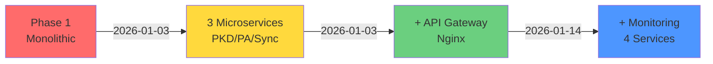

**Timeline**: Monolithic → Microservices → Gateway → Monitoring

---

# Current Architecture (v1.6.2)

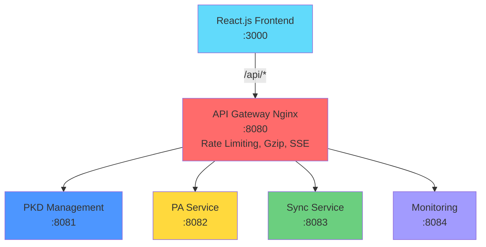

---

# Service Responsibilities

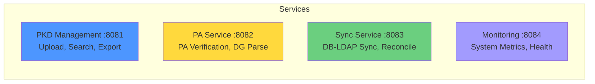

---

# Data Layer Architecture

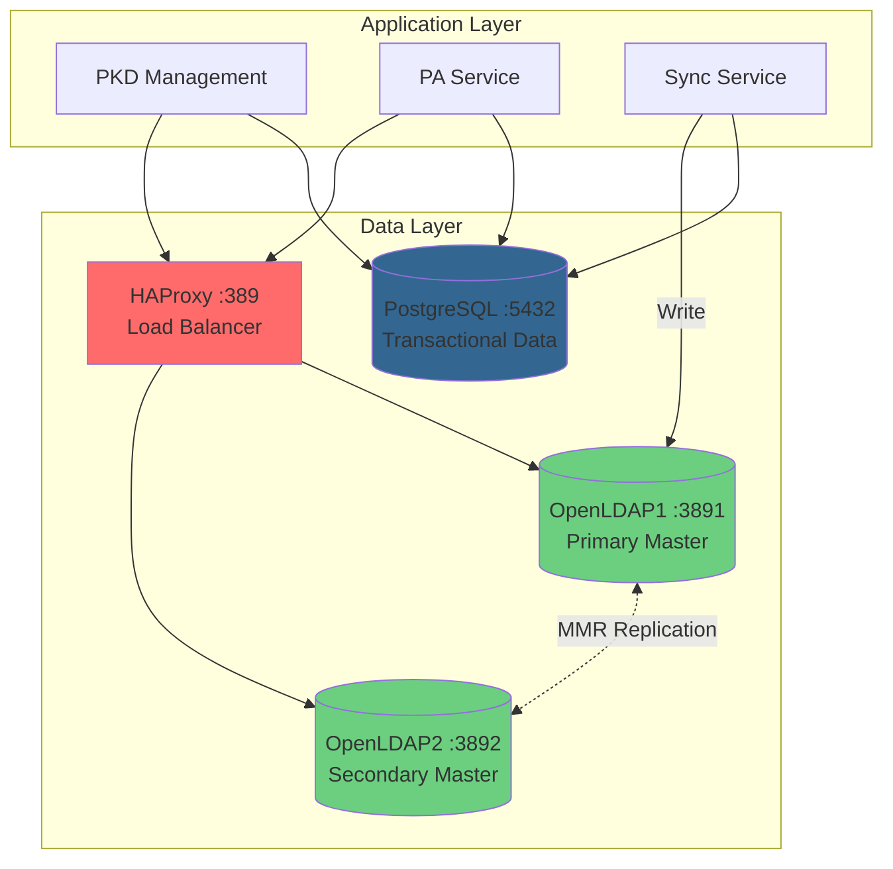

---

<!-- _class: lead -->

# 1️⃣ PKD Management Service
## Port 8081

---

# PKD Management: Clean Architecture

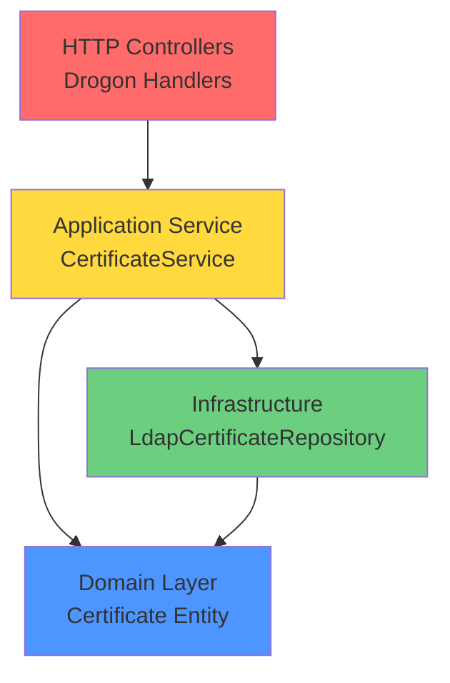

**SOLID Principles**: SRP, OCP, LSP, ISP, DIP ✅

---

# Design Patterns: Strategy Pattern

```mermaid
graph TD
    Client[Upload Controller]
    Factory[ProcessingStrategyFactory]
    Strategy[ProcessingStrategy Interface]
    Auto[AutoProcessingStrategy<br/>One-shot: Parse→DB→LDAP]
    Manual[ManualProcessingStrategy<br/>3-Stage: Parse→Validate→LDAP]

    Client --> Factory
    Factory --> Strategy
    Strategy --> Auto
    Strategy --> Manual

    style Client fill:#61dafb
    style Factory fill:#ffd93d
    style Strategy fill:#4d96ff
    style Auto fill:#6bcf7f
    style Manual fill:#a29bfe
```

---

# MANUAL Mode: 3-Stage Processing

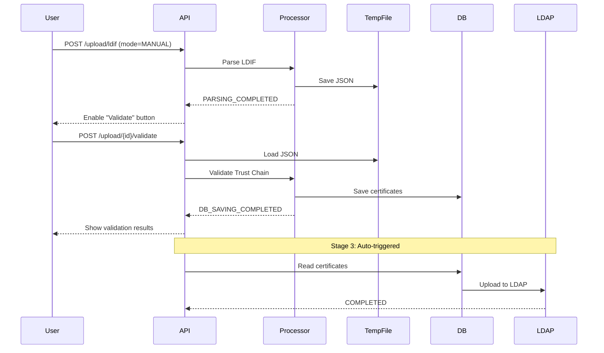

---

# Trust Chain Validation Flow

```mermaid
flowchart TD
    Start([DSC Certificate])
    Extract[Extract issuer_dn]
    Lookup[Lookup CSCA<br/>by subject_dn]
    Found{CSCA<br/>Found?}
    Verify[X509_verify<br/>DSC signature]
    Valid{Signature<br/>Valid?}
    CheckDate[Check validity period]
    DateOK{Date<br/>Valid?}
    Success([✅ VALID])
    Fail([❌ INVALID])

    Start --> Extract
    Extract --> Lookup
    Lookup --> Found
    Found -->|Yes| Verify
    Found -->|No| Fail
    Verify --> Valid
    Valid -->|Yes| CheckDate
    Valid -->|No| Fail
    CheckDate --> DateOK
    DateOK -->|Yes| Success
    DateOK -->|No| Fail

    style Start fill:#61dafb
    style Success fill:#6bcf7f
    style Fail fill:#ff6b6b
```

---

# Countries API Optimization (v1.6.2)

```mermaid
graph LR
    subgraph "Before v1.6.2"
        LDAP1[LDAP Full Scan<br/>79 seconds<br/>30,226 certs]
    end

    subgraph "After v1.6.2"
        PG[PostgreSQL DISTINCT<br/>40ms<br/>99.9% faster ⚡]
    end

    LDAP1 -.Optimized.-> PG

    style LDAP1 fill:#ff6b6b
    style PG fill:#6bcf7f
```

**SQL Query**:
```sql
SELECT DISTINCT country_code
FROM certificate
ORDER BY country_code;
```

**Improvement**: 1,975x faster! 🚀

---

# Database Schema: certificate

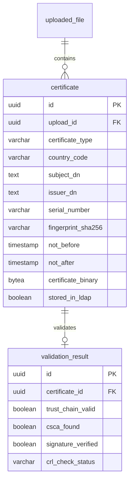

---

<!-- _class: lead -->

# 2️⃣ PA Service
## Passive Authentication (ICAO 9303)
## Port 8082

---

# ICAO 9303 PA: 8-Step Verification

```mermaid
flowchart TD
    Start([SOD + MRZ + DG1 + DG2])
    S1[Step 1: SOD Signature<br/>Verify with DSC]
    S2[Step 2: Trust Chain<br/>CSCA → DSC]
    S3[Step 3: DSC Validity<br/>Check dates]
    S4[Step 4: Key Usage<br/>X.509 extensions]
    S5[Step 5: SOD Hash<br/>Embedded hashes]
    S6[Step 6: DG Hash<br/>Compute & compare]
    S7[Step 7: CRL Check<br/>Revocation status]
    S8[Step 8: Final Verdict]
    Valid([✅ VALID])
    Invalid([❌ INVALID])

    Start --> S1 --> S2 --> S3 --> S4 --> S5 --> S6 --> S7 --> S8
    S8 -->|All Pass| Valid
    S8 -->|Any Fail| Invalid

    style Start fill:#61dafb
    style S8 fill:#ffd93d
    style Valid fill:#6bcf7f
    style Invalid fill:#ff6b6b
```

---

# PA Verification Architecture

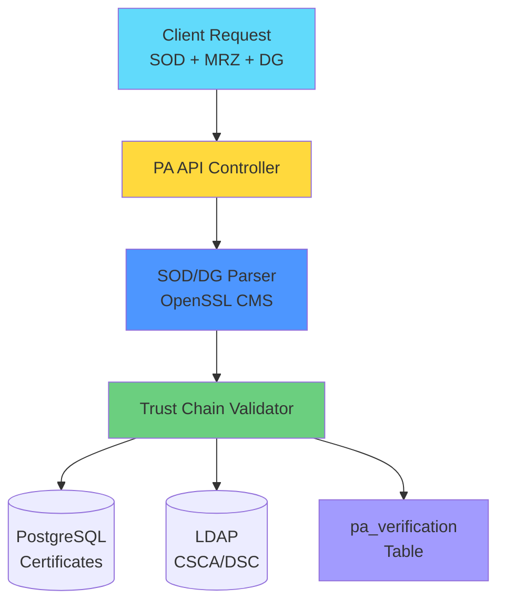

---

<!-- _class: lead -->

# 3️⃣ Sync Service
## DB-LDAP Synchronization
## Port 8083

---

# Auto Reconcile Workflow

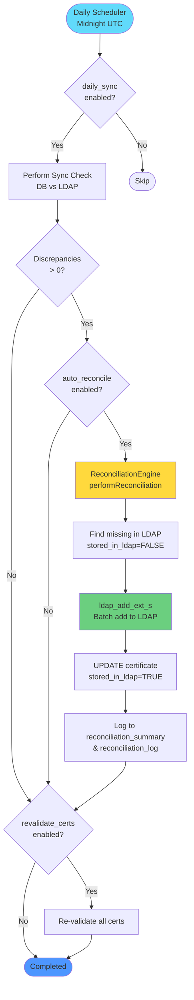

---

# Reconciliation Engine Architecture

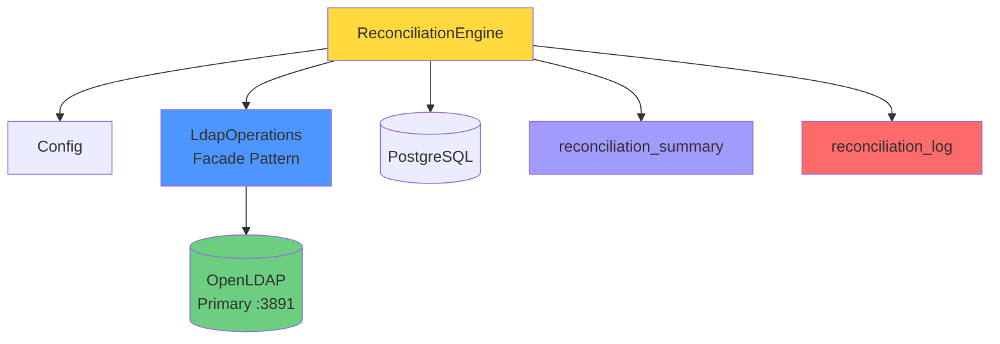

**Patterns**: Facade, Strategy, Template Method

---

# Database Schema: Reconciliation

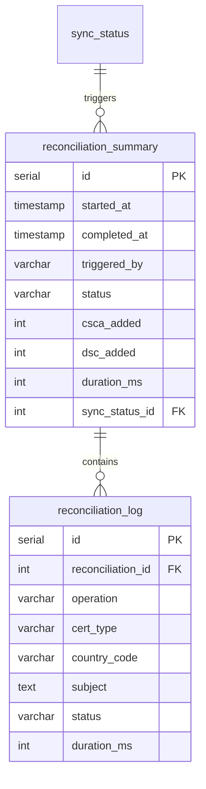

---

<!-- _class: lead -->

# 4️⃣ Monitoring Service
## System Metrics & Health Check
## Port 8084

---

# System Metrics Collection

```mermaid
graph LR
    subgraph Metrics Sources
        ProcStat[/proc/stat<br/>CPU Usage]
        ProcLoad[/proc/loadavg<br/>Load Average]
        ProcMem[/proc/meminfo<br/>Memory]
        Statvfs[statvfs<br/>Disk]
        ProcNet[/proc/net/dev<br/>Network]
    end

    subgraph Monitoring Service
        Collector[MetricsCollector]
    end

    subgraph Database
        MetricsDB[(system_metrics<br/>Table)]
    end

    ProcStat --> Collector
    ProcLoad --> Collector
    ProcMem --> Collector
    Statvfs --> Collector
    ProcNet --> Collector
    Collector --> MetricsDB

    style Collector fill:#a29bfe
    style MetricsDB fill:#336791
```

---

# Service Health Checking

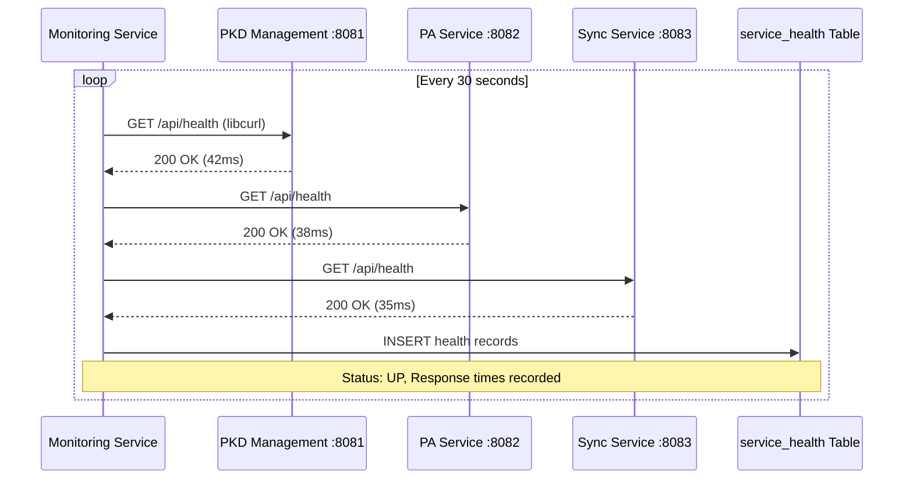

---

<!-- _class: lead -->

# 5️⃣ Frontend
## React 19 + TypeScript + Vite
## Port 3000

---

# Frontend Architecture

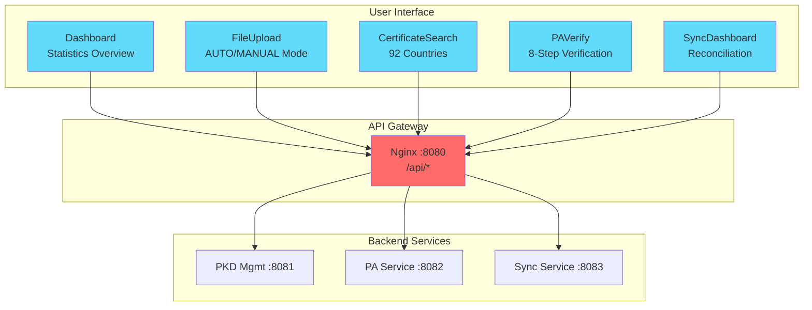

---

# Certificate Search Flow

```mermaid
sequenceDiagram
    participant User
    participant UI as CertificateSearch UI
    participant API as API Gateway
    participant PKD as PKD Management
    participant LDAP as LDAP Repository

    User->>UI: Select country (🇺🇸 US)
    UI->>API: GET /api/certificates/countries
    API->>PKD: Forward request
    PKD-->>API: 92 countries (40ms)
    API-->>UI: Country list

    User->>UI: Click "Search"
    UI->>API: GET /api/certificates/search?country=US
    API->>PKD: Forward request
    PKD->>LDAP: LDAP search (c=US,...)
    LDAP-->>PKD: 1,834 certificates
    PKD-->>API: JSON response
    API-->>UI: Display results

    User->>UI: Click "Export ZIP"
    UI->>API: GET /api/certificates/export/country?country=US
    API->>PKD: Forward request
    PKD->>LDAP: Fetch all DNs + binaries
    PKD-->>API: ZIP file (23MB)
    API-->>UI: Download ZIP
```

---

# Frontend Technology Stack

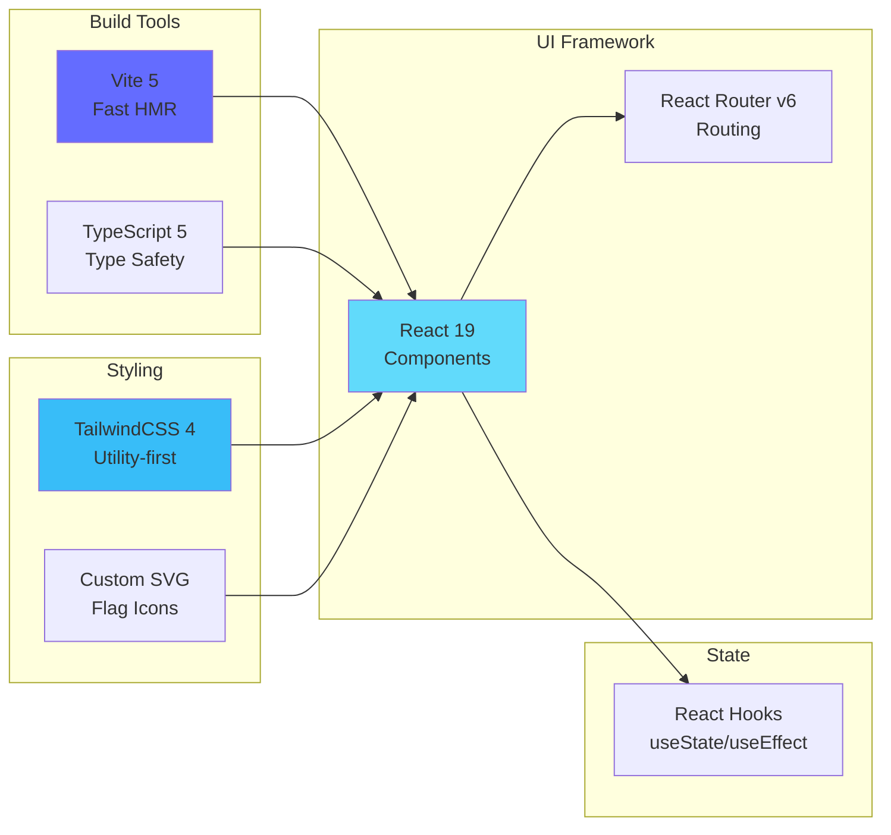

---

<!-- _class: lead -->

# 6️⃣ API Gateway
## Nginx-based Unified Entry Point
## Port 8080

---

# API Gateway Routing

```mermaid
graph TD
    Client[Client Request]
    Gateway[API Gateway<br/>Nginx :8080]

    subgraph Routing Rules
        PKDRoute[/api/upload/*<br/>/api/certificates/*]
        PARoute[/api/pa/*]
        SyncRoute[/api/sync/*]
        MonRoute[/api/monitoring/*]
        DocsRoute[/api-docs/*]
    end

    subgraph Backend Services
        PKD[PKD Management :8081]
        PA[PA Service :8082]
        Sync[Sync Service :8083]
        Mon[Monitoring :8084]
        Swagger[Swagger UI :8080]
    end

    Client --> Gateway
    Gateway --> PKDRoute --> PKD
    Gateway --> PARoute --> PA
    Gateway --> SyncRoute --> Sync
    Gateway --> MonRoute --> Mon
    Gateway --> DocsRoute --> Swagger

    style Gateway fill:#ff6b6b
    style PKD fill:#4d96ff
    style PA fill:#ffd93d
    style Sync fill:#6bcf7f
    style Mon fill:#a29bfe
```

---

# API Gateway Features

```mermaid
graph LR
    subgraph Security
        RateLimit[Rate Limiting<br/>100 req/s per IP]
        CORS[CORS Headers<br/>X-Frame-Options]
    end

    subgraph Performance
        Keepalive[Upstream Keepalive<br/>32 connections]
        Gzip[Gzip Compression<br/>JSON/JS/CSS]
    end

    subgraph Reliability
        SSE[SSE Support<br/>1-hour timeout]
        Upload[Large Upload<br/>100MB limit]
        ErrorJSON[JSON Error Pages<br/>502/503/504]
    end

    style RateLimit fill:#ff6b6b
    style Keepalive fill:#6bcf7f
    style SSE fill:#4d96ff
```

---

<!-- _class: lead -->

# 🔄 External Integrations

---

# PostgreSQL Integration

```mermaid
graph TD
    subgraph Application Layer
        PKD[PKD Management]
        PA[PA Service]
        Sync[Sync Service]
    end

    subgraph Database Layer
        PG[(PostgreSQL :5432<br/>localpkd)]
    end

    subgraph Tables
        Cert[certificate<br/>30,637 rows]
        Valid[validation_result<br/>Trust Chain]
        PAVerif[pa_verification<br/>PA History]
        SyncStatus[sync_status<br/>DB-LDAP Comparison]
        Reconcile[reconciliation_summary<br/>Auto Reconcile]
    end

    PKD -->|libpq| PG
    PA -->|libpq| PG
    Sync -->|libpq| PG

    PG --> Cert
    PG --> Valid
    PG --> PAVerif
    PG --> SyncStatus
    PG --> Reconcile

    style PG fill:#336791
    style Cert fill:#4d96ff
```

**Library**: libpq (C API)
**Critical**: Use standard quotes for BYTEA, NOT `E''`

---

# OpenLDAP MMR Cluster

```mermaid
graph TD
    subgraph Application Layer
        ReadOps[Read Operations<br/>Search, Export]
        WriteOps[Write Operations<br/>Upload, Reconcile]
    end

    subgraph Load Balancer
        HAProxy[HAProxy :389<br/>Load Balancer]
    end

    subgraph LDAP Cluster
        LDAP1[(OpenLDAP1 :3891<br/>Primary Master)]
        LDAP2[(OpenLDAP2 :3892<br/>Secondary Master)]
    end

    ReadOps --> HAProxy
    WriteOps -->|Direct| LDAP1

    HAProxy --> LDAP1
    HAProxy --> LDAP2

    LDAP1 <-.MMR Replication.-> LDAP2

    style HAProxy fill:#ff6b6b
    style LDAP1 fill:#6bcf7f
    style LDAP2 fill:#6bcf7f
```

**Strategy**: Read via HAProxy (HA), Write via Primary (Consistency)

---

# LDAP DIT Structure (ICAO PKD)

```mermaid
graph TD
    Root[dc=ldap,dc=smartcoreinc,dc=com]
    PKD[dc=pkd]
    Download[dc=download]
    Data[dc=data]
    NCData[dc=nc-data]

    Country1[c=US]
    Country2[c=KR]

    CSCA[o=csca<br/>CSCA Certificates]
    DSC[o=dsc<br/>DSC Certificates]
    CRL[o=crl<br/>CRLs]
    ML[o=ml<br/>Master Lists]

    DSCNC[o=dsc<br/>DSC_NC Non-Conformant]

    Root --> PKD
    PKD --> Download
    Download --> Data
    Download --> NCData

    Data --> Country1
    Data --> Country2

    Country1 --> CSCA
    Country1 --> DSC
    Country1 --> CRL
    Country1 --> ML

    NCData --> DSCNC

    style Root fill:#61dafb
    style CSCA fill:#6bcf7f
    style DSC fill:#4d96ff
    style CRL fill:#ffd93d
    style DSCNC fill:#ff6b6b
```

---

# OpenSSL 3.x Operations

```mermaid
graph LR
    subgraph X.509 Parsing
        DER[DER Binary]
        X509[X509 Structure]
        Subject[Subject DN]
        Issuer[Issuer DN]
        Dates[Validity Dates]
    end

    subgraph Verification
        DSC[DSC Certificate]
        CSCA[CSCA Public Key]
        Verify[X509_verify]
        Result{Valid?}
    end

    subgraph CMS Parsing
        ML[Master List]
        CMS[CMS_ContentInfo]
        Signer[SignerInfo]
        Certs[Certificates]
    end

    DER --> X509
    X509 --> Subject
    X509 --> Issuer
    X509 --> Dates

    DSC --> Verify
    CSCA --> Verify
    Verify --> Result

    ML --> CMS
    CMS --> Signer
    CMS --> Certs

    style Verify fill:#ffd93d
    style Result fill:#6bcf7f
```

**Library**: OpenSSL 3.x (libssl, libcrypto)

---

<!-- _class: lead -->

# 🎯 Special Features & Optimizations

---

# Feature 1: Countries API Evolution

```mermaid
graph TD
    V1[v1.6.0<br/>LDAP Full Scan<br/>79 seconds ❌]
    V2[v1.6.1<br/>LDAP Index<br/>227ms ⚠️]
    V3[v1.6.2<br/>PostgreSQL DISTINCT<br/>40ms ✅]

    V1 -.Attempt 1.-> V2
    V2 -.Optimization.-> V3

    subgraph Performance Comparison
        direction LR
        Before[Before: 79,000ms]
        After[After: 40ms]
        Improvement[1,975x Faster! 🚀]
    end

    V3 --> Before
    V3 --> After
    After --> Improvement

    style V1 fill:#ff6b6b
    style V2 fill:#ffd93d
    style V3 fill:#6bcf7f
    style Improvement fill:#4d96ff
```

---

# Feature 2: SSE Progress Streaming

```mermaid
sequenceDiagram
    participant User
    participant Frontend
    participant Gateway
    participant Backend
    participant SSE as SSE Stream

    User->>Frontend: Upload LDIF file
    Frontend->>Gateway: POST /api/upload/ldif
    Gateway->>Backend: Forward request
    Backend-->>Gateway: HTTP 202 Accepted
    Gateway-->>Frontend: uploadId

    Frontend->>Gateway: GET /api/progress/stream/{id}
    Gateway->>Backend: Forward (SSE)
    Backend->>SSE: Open EventSource

    loop Real-time Updates
        Backend->>SSE: PARSING (20%)
        SSE-->>Frontend: Update UI
        Backend->>SSE: DB_SAVING (60%)
        SSE-->>Frontend: Update UI
        Backend->>SSE: LDAP_UPLOADING (90%)
        SSE-->>Frontend: Update UI
        Backend->>SSE: COMPLETED (100%)
        SSE-->>Frontend: Enable next action
    end

    SSE->>Frontend: Close connection
```

---

# Feature 3: Certificate Export ZIP

```mermaid
flowchart TD
    Request[User Request<br/>Export Country ZIP]
    GetDNs[Get DNs by Country<br/>LDAP Search]
    FetchBinary[Fetch Binary Data<br/>For each DN]
    CreateTemp[Create Temp File<br/>/tmp/icao-export-XXXXXX]
    CreateZIP[Create ZIP Archive<br/>zip_open]
    AddCerts[Add Certificates<br/>Heap Memory malloc]
    CloseZIP[Close ZIP<br/>zip_close]
    ReadZIP[Read ZIP to Memory]
    DeleteTemp[Delete Temp File<br/>unlink]
    SendZIP[Send ZIP to Client]

    Request --> GetDNs
    GetDNs --> FetchBinary
    FetchBinary --> CreateTemp
    CreateTemp --> CreateZIP
    CreateZIP --> AddCerts
    AddCerts --> CloseZIP
    CloseZIP --> ReadZIP
    ReadZIP --> DeleteTemp
    DeleteTemp --> SendZIP

    style Request fill:#61dafb
    style CreateTemp fill:#ffd93d
    style AddCerts fill:#6bcf7f
    style SendZIP fill:#4d96ff
```

**Fix (v1.6.1)**: Temporary file approach prevents stack overflow

---

# Feature 4: Duplicate File Detection

```mermaid
flowchart TD
    Upload[User Uploads File]
    ComputeHash[Compute SHA-256 Hash]
    CheckDB{Hash exists<br/>in DB?}
    Duplicate[HTTP 409 Conflict<br/>Return existing upload info]
    Process[Continue Processing]

    Upload --> ComputeHash
    ComputeHash --> CheckDB
    CheckDB -->|Yes| Duplicate
    CheckDB -->|No| Process

    style Upload fill:#61dafb
    style CheckDB fill:#ffd93d
    style Duplicate fill:#ff6b6b
    style Process fill:#6bcf7f
```

**Benefit**: Prevents reprocessing identical files

---

<!-- _class: lead -->

# 🚀 Deployment & CI/CD

---

# Docker Services Architecture

```mermaid
graph TD
    subgraph External Access
        Browser[Web Browser :3000]
        APIClient[API Client :8080]
    end

    subgraph Application Layer
        Frontend[Frontend<br/>React :3000]
        Gateway[API Gateway<br/>Nginx :8080]
        PKD[PKD Mgmt :8081]
        PA[PA Service :8082]
        Sync[Sync Service :8083]
        Mon[Monitoring :8084]
    end

    subgraph Data Layer
        Postgres[(PostgreSQL :5432)]
        LDAP1[(OpenLDAP1 :3891)]
        LDAP2[(OpenLDAP2 :3892)]
        HAProxy[HAProxy :389]
    end

    Browser --> Frontend
    APIClient --> Gateway
    Frontend --> Gateway
    Gateway --> PKD
    Gateway --> PA
    Gateway --> Sync
    Gateway --> Mon

    PKD --> Postgres
    PA --> Postgres
    Sync --> Postgres

    PKD --> HAProxy
    PA --> HAProxy
    Sync --> LDAP1

    HAProxy --> LDAP1
    HAProxy --> LDAP2
    LDAP1 <-.MMR.-> LDAP2

    style Frontend fill:#61dafb
    style Gateway fill:#ff6b6b
    style Postgres fill:#336791
    style HAProxy fill:#ffd93d
```

---

# GitHub Actions CI/CD Pipeline

```mermaid
flowchart LR
    subgraph Developer
        Code[Code Changes]
        Commit[Git Commit]
        Push[Git Push]
    end

    subgraph GitHub Actions
        Trigger[Workflow Trigger]
        Build[Multi-stage Build<br/>vcpkg cache]
        Test[Run Tests]
        Artifact[Save Artifacts<br/>OCI format]
    end

    subgraph Deployment
        Download[Download Artifacts]
        Convert[OCI → Docker<br/>skopeo]
        Deploy[Deploy to Luckfox<br/>sshpass + scp]
        Start[Start Containers]
    end

    Code --> Commit
    Commit --> Push
    Push --> Trigger
    Trigger --> Build
    Build --> Test
    Test --> Artifact

    Artifact -.Manual.-> Download
    Download --> Convert
    Convert --> Deploy
    Deploy --> Start

    style Build fill:#6bcf7f
    style Artifact fill:#4d96ff
    style Deploy fill:#ffd93d
```

**Build Time**: 10-15 min (90% improvement via caching)

---

# Multi-stage Dockerfile Strategy

```mermaid
graph LR
    subgraph Build Stages
        S1[Stage 1<br/>vcpkg-base<br/>System Dependencies]
        S2[Stage 2<br/>vcpkg-deps<br/>Package Dependencies]
        S3[Stage 3<br/>builder<br/>Application Code]
        S4[Stage 4<br/>runtime<br/>Production Image]
    end

    subgraph Cache Strategy
        C1[Rarely Changes<br/>Cache: Weeks]
        C2[vcpkg.json only<br/>Cache: Days]
        C3[Source Code<br/>Cache: Hours]
        C4[Binary Only<br/>No Build]
    end

    S1 --> C1
    S2 --> C2
    S3 --> C3
    S4 --> C4

    S1 --> S2
    S2 --> S3
    S3 --> S4

    style S1 fill:#ff6b6b
    style S2 fill:#ffd93d
    style S3 fill:#6bcf7f
    style S4 fill:#4d96ff
```

**Result**: 130 min → 10-15 min (source changes)

---

# Luckfox ARM64 Deployment

```mermaid
sequenceDiagram
    participant Dev as Developer
    participant GH as GitHub Actions
    participant Script as Deploy Script
    participant Luckfox as Luckfox ARM64

    Dev->>GH: git push
    GH->>GH: Build ARM64 images (10-15min)
    GH->>GH: Save artifacts (OCI format)

    Dev->>Script: ./deploy-from-github-artifacts.sh
    Script->>GH: Download artifacts
    Script->>Script: OCI → Docker (skopeo)
    Script->>Luckfox: scp image.tar (sshpass)

    Luckfox->>Luckfox: docker load
    Luckfox->>Luckfox: Stop old container
    Luckfox->>Luckfox: Remove old image
    Luckfox->>Luckfox: Start new container

    Luckfox-->>Script: Health check OK
    Script-->>Dev: Deployment successful ✅
```

---

<!-- _class: lead -->

# 📊 Statistics & Metrics

---

# Current Production Statistics

```mermaid
graph TD
    subgraph Certificates
        Total[Total: 30,637]
        CSCA[CSCA: 525]
        DSC[DSC: 29,610]
        DSCNC[DSC_NC: 502]
    end

    subgraph Validation
        Valid[Valid: 5,868<br/>19.8%]
        Invalid[Invalid: 24,244]
        NotFound[CSCA Not Found: 6,299]
    end

    subgraph Geography
        Countries[Countries: 92]
        TopCountry[Top: EU - 3,245 certs]
    end

    Total --> CSCA
    Total --> DSC
    Total --> DSCNC

    DSC --> Valid
    DSC --> Invalid
    DSC --> NotFound

    style Total fill:#61dafb
    style Valid fill:#6bcf7f
    style Invalid fill:#ff6b6b
    style Countries fill:#ffd93d
```

---

# Performance Benchmarks

```mermaid
graph LR
    subgraph API Response Times
        Countries[Countries API<br/>40ms]
        CertSearch[Certificate Search<br/><200ms]
        SingleExport[Single Export<br/><100ms]
        ZIPExport[Country ZIP<br/>~2s]
    end

    subgraph Processing Times
        TrustChain[Trust Chain<br/>~50ms/cert]
        PAVerify[PA Verification<br/>100-300ms]
        SyncCheck[Sync Check<br/>1-2s]
        Reconcile[Reconcile 100 certs<br/>5-10s]
    end

    style Countries fill:#6bcf7f
    style CertSearch fill:#6bcf7f
    style PAVerify fill:#ffd93d
```

---

# System Resource Usage

```mermaid
pie title CPU Usage Distribution
    "PKD Management" : 30
    "PA Service" : 25
    "Sync Service" : 20
    "Monitoring" : 10
    "Frontend/Gateway" : 15
```

```mermaid
pie title Memory Allocation (8GB Total)
    "PKD Management" : 800
    "PA Service" : 600
    "PostgreSQL" : 1200
    "LDAP Cluster" : 400
    "Other Services" : 500
```

**Typical Load**: CPU 15-25%, Memory 2.5GB/8GB, Disk 45GB/100GB

---

<!-- _class: lead -->

# 🎓 Key Learnings & Best Practices

---

# Critical Lessons Learned

```mermaid
timeline
    title Critical Bug Fixes & Optimizations
    2026-01-01 : PostgreSQL Bytea Storage<br/>E'' → Standard quotes<br/>Trust Chain 0% → 19.8%
    2026-01-10 : Docker Build Cache<br/>Multi-stage optimization<br/>130min → 10-15min
    2026-01-14 : LDAP Auto-Reconnect<br/>ldap_whoami test<br/>500 errors eliminated
    2026-01-15 : Certificate Export Crash<br/>Temporary file approach<br/>Stable ZIP export
    2026-01-15 : Countries API Optimization<br/>LDAP → PostgreSQL<br/>79s → 40ms (1,975x)
```

---

# Design Patterns Applied

```mermaid
mindmap
  root((Design Patterns))
    Architectural
      Clean Architecture
      Microservices
      API Gateway
    Creational
      Factory Pattern
      Singleton Pattern
    Structural
      Repository Pattern
      Facade Pattern
      Adapter Pattern
    Behavioral
      Strategy Pattern
      Template Method
      Observer Pattern SSE
```

**Total**: 10+ design patterns applied across the system

---

# SOLID Principles Implementation

```mermaid
graph TD
    subgraph SOLID
        SRP[Single Responsibility<br/>Each class, one purpose]
        OCP[Open/Closed<br/>Extend without modify]
        LSP[Liskov Substitution<br/>Subtypes replaceable]
        ISP[Interface Segregation<br/>Client-specific interfaces]
        DIP[Dependency Inversion<br/>Depend on abstractions]
    end

    subgraph Examples
        E1[CertificateService<br/>One responsibility]
        E2[ProcessingStrategy<br/>Extensible]
        E3[Auto/Manual Strategy<br/>Interchangeable]
        E4[ICertificateRepository<br/>Minimal interface]
        E5[Repository injection<br/>Constructor DI]
    end

    SRP --> E1
    OCP --> E2
    LSP --> E3
    ISP --> E4
    DIP --> E5

    style SRP fill:#ff6b6b
    style OCP fill:#ffd93d
    style LSP fill:#6bcf7f
    style ISP fill:#4d96ff
    style DIP fill:#a29bfe
```

---

# Security Best Practices

```mermaid
graph LR
    subgraph Authentication
        LDAP[LDAP Authenticated Bind<br/>Not anonymous]
        Env[Environment Variables<br/>Secure credentials]
    end

    subgraph API Security
        RateLimit[Rate Limiting<br/>100 req/s]
        CORS[CORS Headers<br/>X-Frame-Options]
        ParamQuery[Parameterized Queries<br/>SQL Injection prevention]
    end

    subgraph Validation
        TrustChain[Trust Chain<br/>CSCA → DSC]
        CRL[CRL Revocation Check]
        Dates[Validity Period Check]
    end

    style LDAP fill:#6bcf7f
    style RateLimit fill:#ff6b6b
    style TrustChain fill:#4d96ff
```

---

<!-- _class: lead -->

# 🔮 Future Enhancements

---

# Potential Future Features

```mermaid
mindmap
  root((Future Enhancements))
    Advanced Analytics
      Full-text Search
      Certificate Expiration Dashboard
      Trend Analysis
      Compliance Reports
    Enhanced Monitoring
      Prometheus Metrics
      Grafana Dashboards
      Alert Notifications
      Performance Profiling
    Security
      OAuth2 JWT
      RBAC
      API Key Management
      Audit Log Export
    Scalability
      Kubernetes Deployment
      Horizontal Scaling
      Redis Caching
      PostgreSQL Read Replicas
    Additional ICAO
      Active Authentication AA
      Chip Authentication CA
      Extended Access Control EAC
      Terminal Authentication TA
    Integration
      REST API for External
      Webhook Notifications
      Batch Import Export API
      Mobile SDK
```

---

<!-- _class: lead -->

# 📚 Documentation & Resources

---

# Project Documentation

| Document | Description |
|----------|-------------|
| **CLAUDE.md** | 프로젝트 전체 가이드 (v1.6.2) |
| **PA_API_GUIDE.md** | 외부 클라이언트 PA API 가이드 |
| **AUTO_RECONCILE_DESIGN.md** | Auto Reconcile 설계 문서 (2,230+ lines) |
| **DEPLOYMENT_PROCESS.md** | 배포 프로세스 완전 가이드 |
| **LUCKFOX_DEPLOYMENT.md** | Luckfox ARM64 배포 가이드 |
| **DOCKER_BUILD_CACHE.md** | 빌드 캐시 트러블슈팅 |
| **FRONTEND_BUILD_GUIDE.md** | Frontend 빌드 워크플로우 |
| **CERTIFICATE_SEARCH_STATUS.md** | Certificate Search 이슈 해결 |
| **LDAP_QUERY_GUIDE.md** | LDAP 조회 가이드 |

---

# Technical Standards

```mermaid
graph LR
    subgraph ICAO Standards
        Doc9303_11[ICAO Doc 9303-11<br/>Security Mechanisms]
        Doc9303_12[ICAO Doc 9303-12<br/>PKI for MRTDs]
    end

    subgraph IETF RFCs
        RFC5280[RFC 5280<br/>X.509 PKI]
        RFC5652[RFC 5652<br/>CMS SignedData]
        RFC4511[RFC 4511<br/>LDAP Protocol]
    end

    subgraph API Standards
        OpenAPI[OpenAPI 3.0<br/>API Specifications]
    end

    style Doc9303_11 fill:#4d96ff
    style RFC5280 fill:#6bcf7f
    style OpenAPI fill:#ffd93d
```

---

# Access URLs

| Service | URL |
|---------|-----|
| **Frontend** | http://localhost:3000 |
| **API Gateway** | http://localhost:8080/api |
| **Swagger UI (PKD)** | http://localhost:8080/api/docs |
| **Swagger UI (PA)** | http://localhost:8080/api/pa/docs |
| **Swagger UI (Sync)** | http://localhost:8080/api/sync/docs |
| **HAProxy Stats** | http://localhost:8404 |
| **PostgreSQL** | localhost:5432 (pkd/pkd123) |
| **LDAP (HAProxy)** | ldap://localhost:389 |

---

<!-- _class: lead -->

# 🎉 Summary

---

# Project Achievements

```mermaid
mindmap
  root((ICAO Local PKD<br/>v1.6.2))
    Architecture
      4 Microservices
      API Gateway
      Clean Architecture
      SOLID Principles
    Compliance
      ICAO 9303 PA
      Trust Chain Validation
      Master List Processing
    Performance
      99.9% Countries API
      90% Build Time
      Real-time SSE
    Production Ready
      Auto Reconcile
      MANUAL 3-Stage
      Cert Search Export
      System Monitoring
    Infrastructure
      OpenLDAP MMR
      PostgreSQL Indexed
      Docker Deployment
      GitHub Actions CI/CD
    Developer Experience
      9+ Documentation
      OpenAPI 3.0 Specs
      Automated Scripts
      Type-safe Frontend
```

---

# Key Metrics Summary

| Metric | Value |
|--------|-------|
| **Total Lines of Code** | ~15,000+ (Backend C++) |
| **API Endpoints** | 40+ |
| **Database Tables** | 15+ |
| **Design Patterns** | 10+ |
| **Supported Countries** | 92 |
| **Certificates Managed** | 30,637 |
| **Deployment Time** | 10-15 min (CI/CD) |
| **Response Time** | <200ms (avg) |
| **Build Improvement** | 90% (130min → 10-15min) |
| **Countries API** | 99.9% (79s → 40ms) |

---

<!-- _class: lead -->

# 🙏 Thank You

## Questions?

**ICAO Local PKD v1.6.2**

Production Ready | Enterprise Grade | ICAO 9303 Compliant

---

<!-- _class: lead -->

# Contact Information

**Project**: ICAO Local PKD v1.6.2
**Organization**: SmartCore Inc.
**Repository**: GitHub (private)

**Key Technologies**:
C++20 | Drogon | PostgreSQL | OpenLDAP | React 19 | OpenSSL 3.x

**Documentation**: `/docs` directory
**Quick Start**: `./docker-start.sh`

---

<!-- _class: lead -->

# End of Presentation

**Thank you for your attention!**

🚀 **Enterprise-grade Microservices Architecture**
🔐 **ICAO 9303 Compliant Passive Authentication**
⚡ **High Performance & Scalability**

---
