# ICAO Local PKD - Software Architecture

**Version**: 2.12.0
**Last Updated**: 2026-02-17
**Status**: Production Ready (Multi-DBMS: PostgreSQL + Oracle)

---

## Table of Contents

1. [System Overview](#system-overview)
2. [High-Level Architecture](#high-level-architecture)
3. [Microservices Architecture](#microservices-architecture)
4. [Data Layer Architecture](#data-layer-architecture)
5. [Frontend Architecture](#frontend-architecture)
6. [API Gateway Architecture](#api-gateway-architecture)
7. [Component Details](#component-details)
8. [Data Flow Diagrams](#data-flow-diagrams)
9. [Deployment Architecture](#deployment-architecture)
10. [Security Architecture](#security-architecture)

---

## System Overview

ICAO Local PKD는 **마이크로서비스 아키텍처** 기반의 전자여권 인증서 관리 및 검증 통합 플랫폼입니다.

### Core Principles

- **Microservices**: 독립적으로 배포 가능한 4개 서비스 분리
- **Multi-DBMS**: PostgreSQL + Oracle 런타임 전환 (DB_TYPE 환경변수)
- **Data Consistency**: DB-LDAP 이중 저장 및 자동 동기화 (Reconciliation)
- **High Performance**: C++20 기반 고성능 백엔드
- **Modern UI**: React 19 + TypeScript + Tailwind CSS 4
- **Security First**: JWT 인증, RBAC, OWASP 보안 강화
- **Shared Validation**: icao::validation 공유 라이브러리 (86 단위 테스트)

---

## Technical Architecture Diagram

### System Overview (v2.12.0)

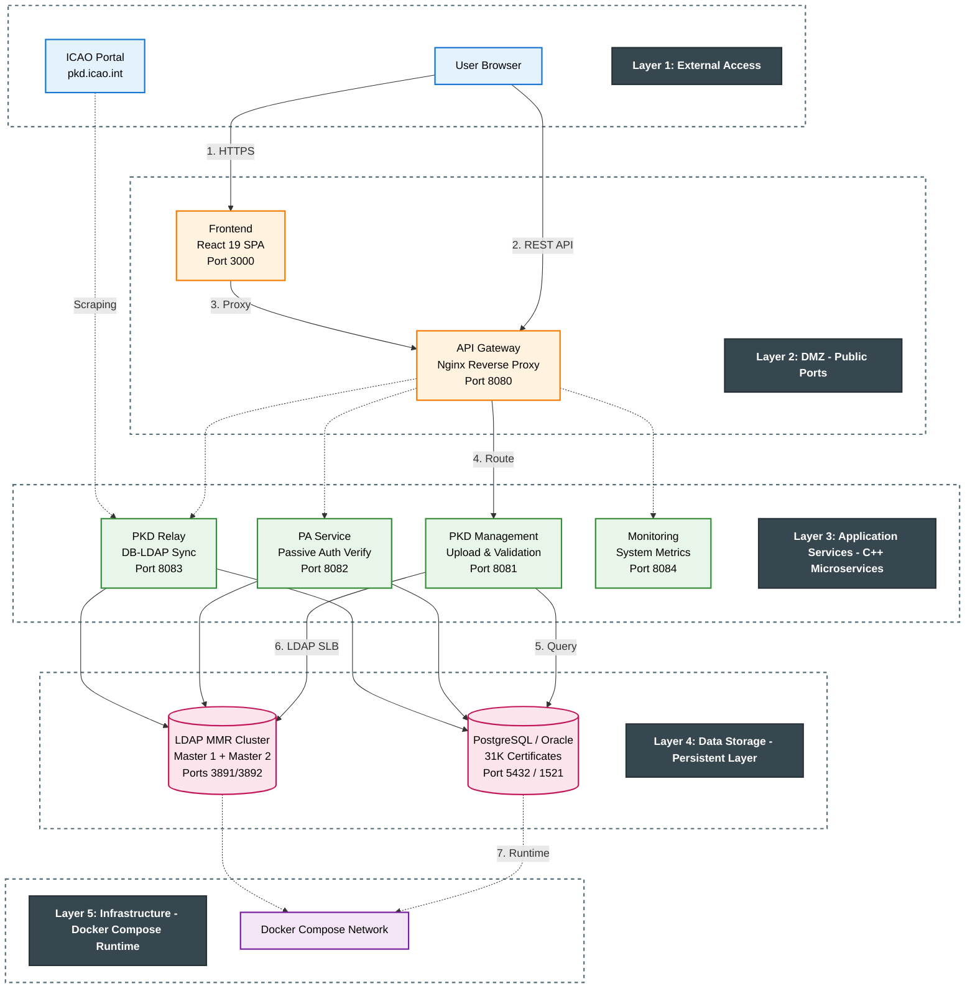

**Architecture Highlights**:

1. **5-Layer Hierarchy**: 명확한 계층 분리로 관심사 분리 (Separation of Concerns)
2. **Minimal Coupling**: 각 계층은 바로 아래 계층만 의존 (Vertical Flow)
3. **Gateway Pattern**: API Gateway (nginx)로 단일 진입점 제공, App-level LDAP SLB
4. **Data Abstraction**: LDAP MMR 클러스터로 2개 Master 노드 통합
5. **Simplified Topology**: 연결선 최소화로 시스템 복잡도 감소

### Layer Description

| Layer | Purpose | Components | Key Characteristics |
|-------|---------|------------|---------------------|
| **Layer 1: External** | 외부 접근 및 연계 | User, ICAO Portal | Public Internet |
| **Layer 2: DMZ** | 공개 서비스 영역 | Frontend, API Gateway | Ports 3000, 8080 |
| **Layer 3: Application** | 비즈니스 로직 처리 | PKD, PA, Relay, Monitoring (C++20) | Internal Network |
| **Layer 4: Data** | 데이터 영속성 | PostgreSQL/Oracle, LDAP MMR | Internal Storage + App-level SLB |
| **Layer 5: Infrastructure** | 컨테이너 런타임 | Docker Compose | Platform Layer |

### Data Flow Summary

**Request Flow** (Top → Bottom):
```
User → Frontend → API Gateway → Services (PKD/PA/Relay) → Data (PostgreSQL/LDAP)
```

**Service Architecture**:
- **4 Microservices**: PKD Management (:8081), PA Service (:8082), PKD Relay (:8083), Monitoring (:8084)
- **2 Data Stores**: PostgreSQL/Oracle (31,212 certificates), LDAP MMR Cluster (Master 1+2)
- **1 Gateway Node**: API Gateway (HTTP), App-level LDAP SLB
- **1 Frontend**: React 19 SPA (21 pages)

---

## Microservices Architecture

### 1. PKD Management Service (Port 8081)

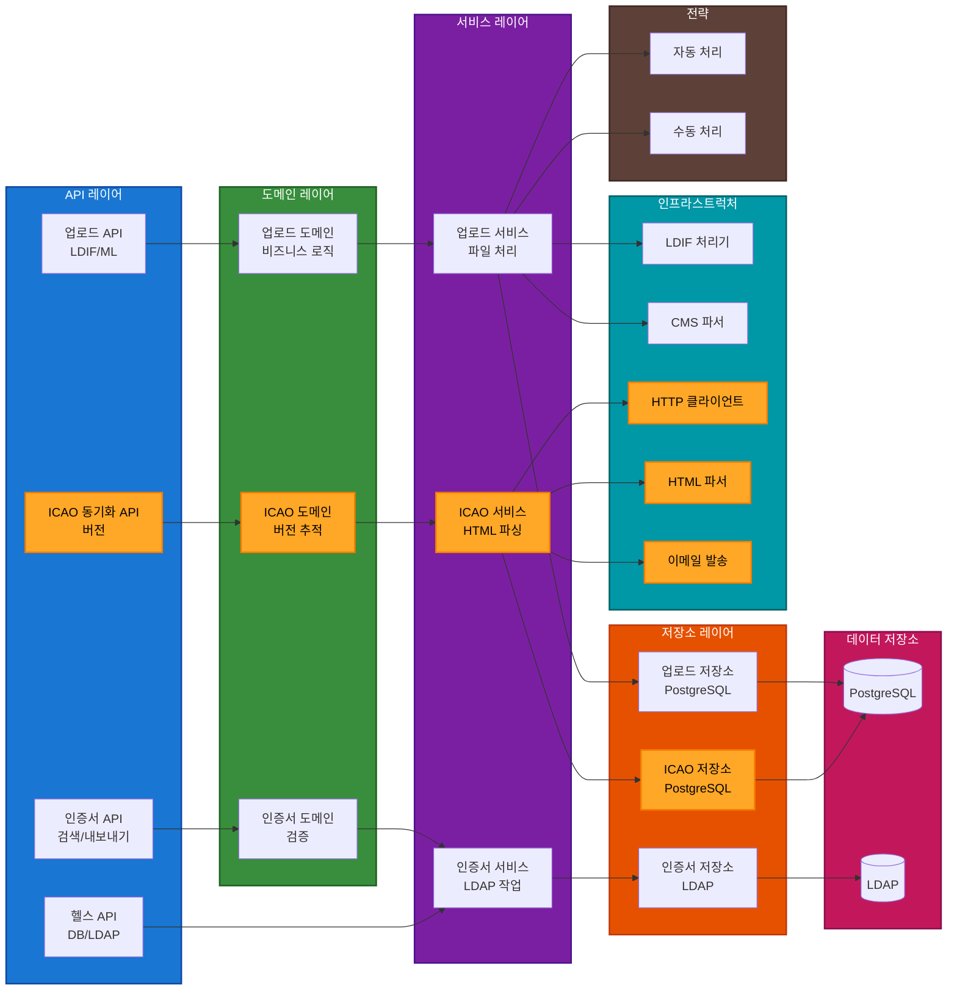

**Key Features**:
- Clean Architecture (6 Layers) with ServiceContainer (centralized DI, pimpl pattern)
- Handler Pattern: UploadHandler (10), UploadStatsHandler (11), CertificateHandler (12), AuthHandler, IcaoHandler
- Strategy Pattern (AUTO/MANUAL Mode)
- Query Helpers (`common::db::`) — database-agnostic utility functions across 15 repositories
- ICAO Auto Sync with Daily Scheduler
- LDIF/Master List Parsing + Individual Certificate Upload (PEM/DER/P7B/DL/CRL)
- Trust Chain Validation (icao::validation shared library)
- Certificate Search & Export (DIT-structured ZIP)
- JWT Authentication + RBAC (admin/user)
- DSC_NC Report, PA Lookup API
- Multi-DBMS (PostgreSQL + Oracle)

---

### 2. PA Service (Port 8082)

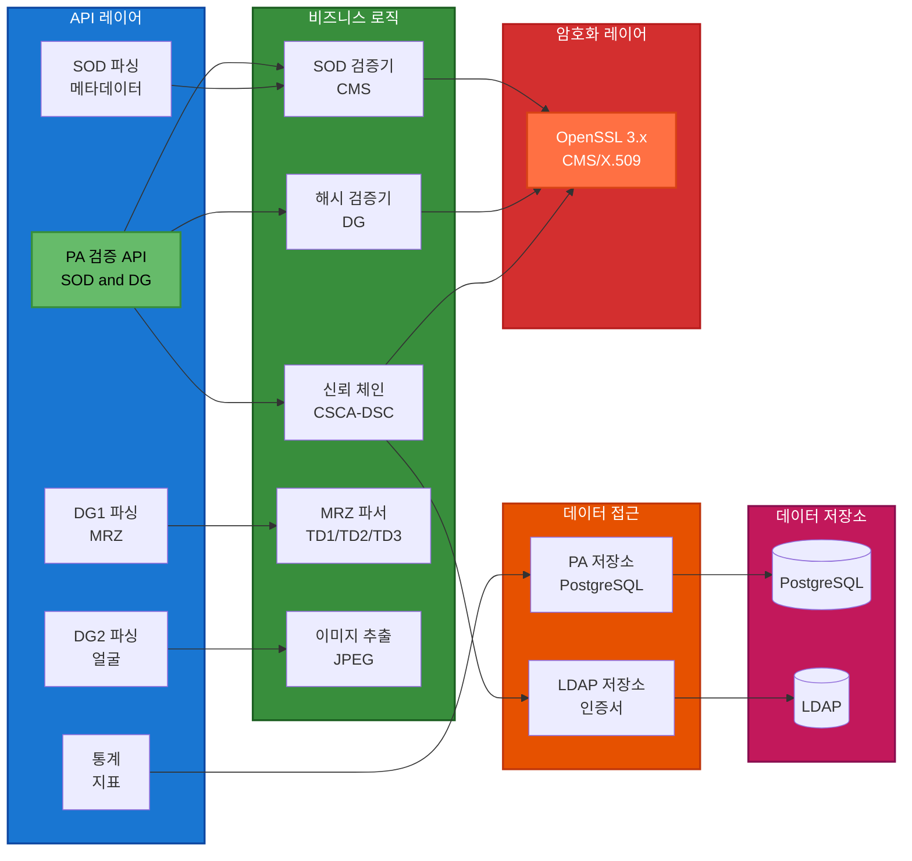

**Key Features**:
- ICAO 9303 PA Compliance (Part 10, 11, 12)
- SOD CMS Verification + DG Hash Validation
- Trust Chain Validation (icao::validation shared library)
- CRL Revocation Checking (RFC 5280)
- DSC Auto-Registration (PA_EXTRACTED source type)
- DSC Non-Conformant (nc-data) Support
- MRZ Parsing (TD1/TD2/TD3) + Face Image Extraction (JPEG2000 conversion)
- Multi-DBMS (PostgreSQL + Oracle)

---

### 3. PKD Relay Service (Port 8083)

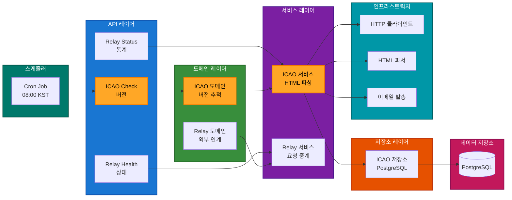

**Key Features**:
- ICAO PKD 외부 연계 (Version Detection)
- HTML Scraping (Table + Link Fallback)
- DB-LDAP Reconciliation (CSCA, DSC, CRL)
- Daily Auto Version Check Scheduler
- Clean Architecture (4 Layers)
- Multi-DBMS (PostgreSQL + Oracle)

---

### 4. Monitoring Service (Port 8084)

**Key Features**:
- System Resource Monitoring (CPU, Memory, Disk, Network)
- Service Health Checks (HTTP Probes to all backend services)
- DB-Independent Architecture (no PostgreSQL/Oracle dependency)
- JSON Metrics API

---

## Data Layer Architecture

### PostgreSQL Database Schema

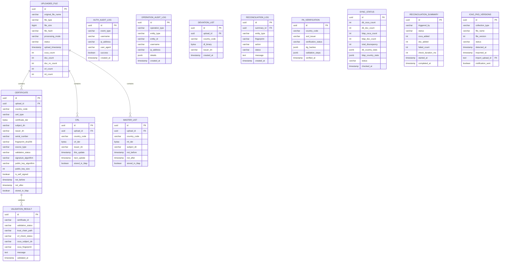

**총 테이블**: 14개
- **Upload & Certificate**: uploaded_file, certificate, crl, master_list, deviation_list
- **Validation**: validation_result
- **PA**: pa_verification
- **Audit**: auth_audit_log, operation_audit_log
- **Sync**: sync_status, reconciliation_summary, reconciliation_log
- **ICAO Sync**: icao_pkd_versions

---

### LDAP Directory Structure

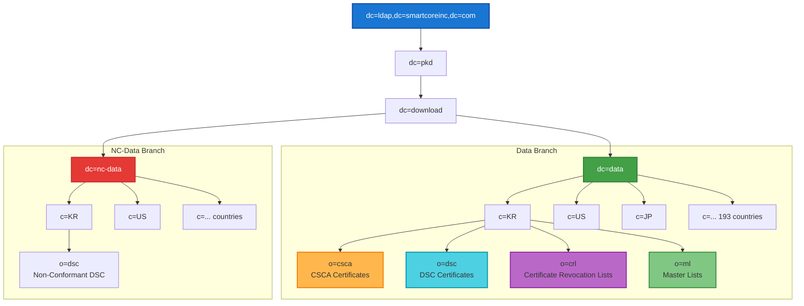

**LDAP Schema**:
- **objectClass**: pkdDownload, cRLDistributionPoint
- **Attributes**: userCertificate;binary, cACertificate;binary, certificateRevocationList;binary
- **Total Entries**: 31,212 (845 CSCA + 27 MLSC + 29,838 DSC + 502 DSC_NC + 69 CRL)

---

## Frontend Architecture

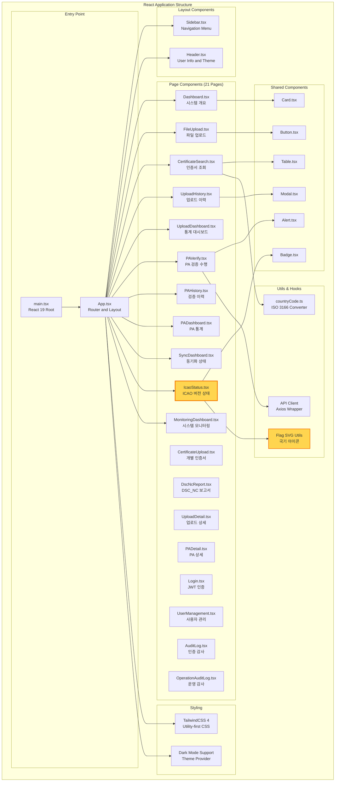

**Build Stack**:
- **Bundler**: Vite 5
- **Language**: TypeScript 5
- **UI Framework**: React 19
- **Styling**: TailwindCSS 4
- **Icons**: Lucide React
- **HTTP Client**: Axios
- **State Management**: React Hooks (useState, useEffect)

---

## API Gateway Architecture

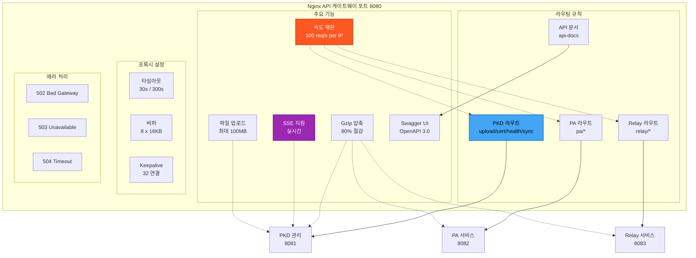

**Security Features**:
- ✅ Backend Service Isolation (Internal Network Only)
- ✅ Rate Limiting (DDoS Protection)
- ✅ Header Sanitization
- ✅ CORS Policy
- ✅ Request/Response Logging

---

## Component Details

### LDIF Processor

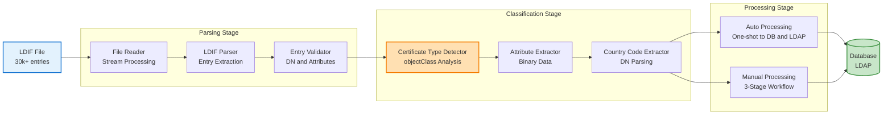

---

### ICAO Auto Sync Flow (v1.7.0)

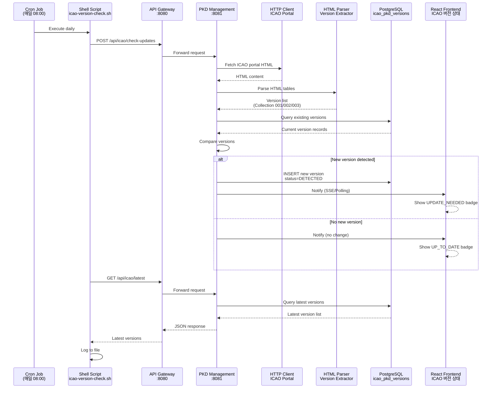

---

## Data Flow Diagrams

### Upload Flow (AUTO Mode)

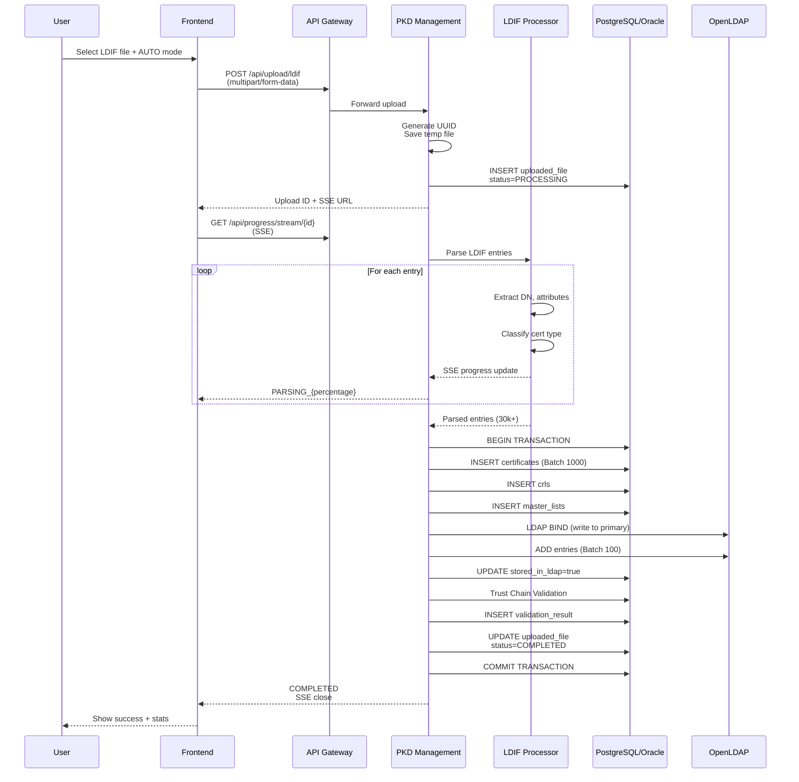

---

### PA Verification Flow

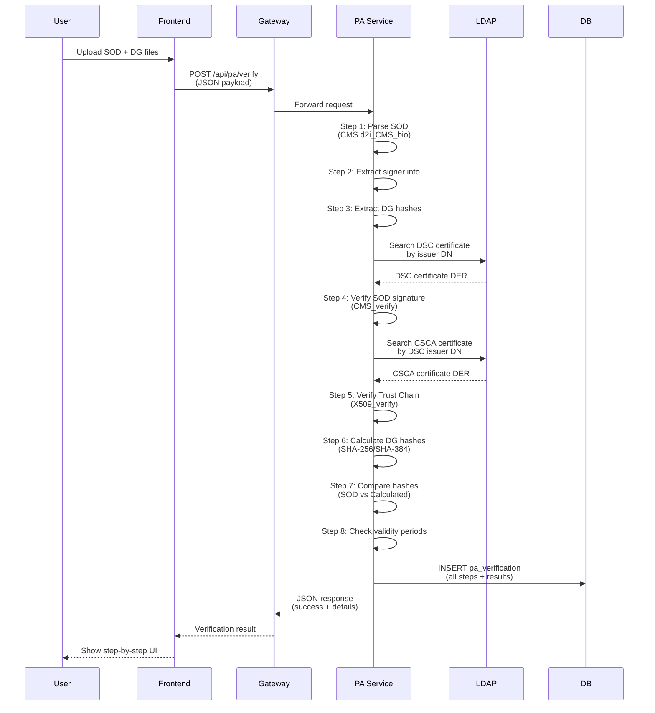

---

## Deployment Architecture

### Docker Compose Architecture

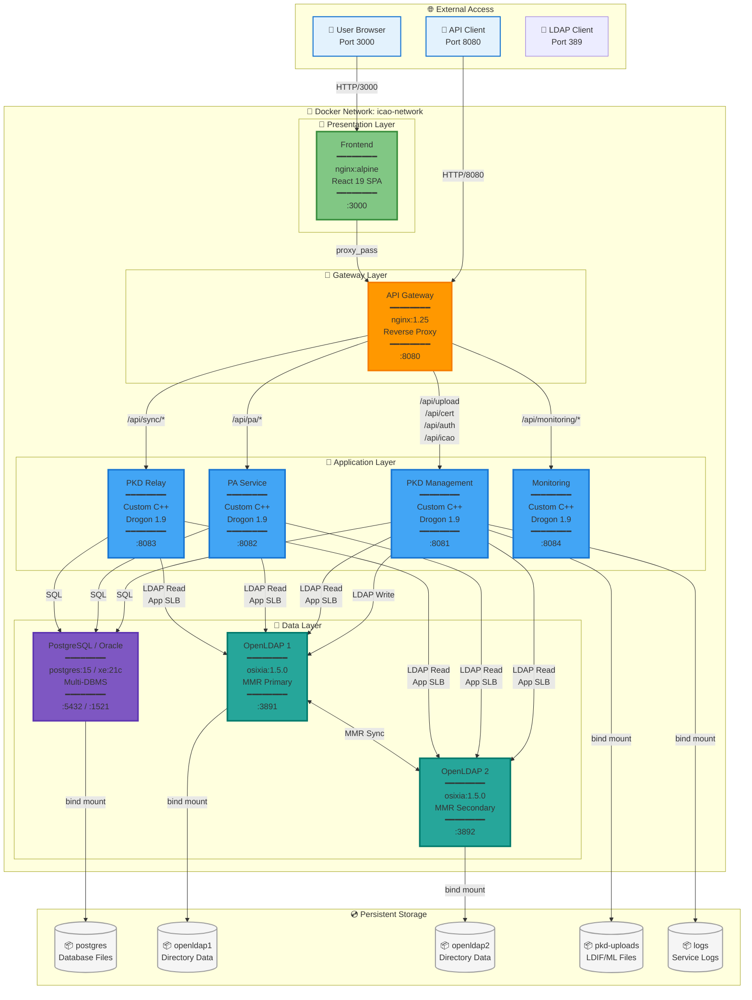

**Architecture Highlights**:

1. **Layered Design**: 명확한 4계층 구조 (Presentation → Gateway → Application → Data)
2. **Gateway Pattern**: API Gateway (nginx)로 서비스 라우팅 및 리버스 프록시
3. **App-Level SLB**: LDAP Software Load Balancing (서비스 내부 라운드로빈, HAProxy 제거)
4. **Microservices**: 4개의 독립적인 C++ 서비스 (PKD, PA, Relay, Monitoring)
5. **Multi-DBMS**: PostgreSQL 15 / Oracle XE 21c 런타임 전환 (DB_TYPE)
6. **MMR Replication**: OpenLDAP Multi-Master 복제로 고가용성 보장
7. **Bind Mounts**: 모든 데이터는 호스트 파일시스템에 영구 저장

**Container Details**:

| Container | Image | CPU | Memory | Restart |
|-----------|-------|-----|--------|---------|
| frontend | nginx:alpine + React build | 0.5 | 256MB | always |
| api-gateway | nginx:1.25-alpine | 0.5 | 256MB | always |
| pkd-management | Custom C++ (Debian) | 2.0 | 2GB | always |
| pa-service | Custom C++ (Debian) | 2.0 | 2GB | always |
| pkd-relay | Custom C++ (Debian) | 1.0 | 1GB | always |
| monitoring | Custom C++ (Debian) | 0.5 | 256MB | always |
| postgres | postgres:15-alpine | 2.0 | 2GB | always |
| openldap1 | osixia/openldap:1.5.0 | 1.0 | 1GB | always |
| openldap2 | osixia/openldap:1.5.0 | 1.0 | 1GB | always |

**Total Resources**: 10 cores, 10.5GB RAM (PostgreSQL mode), Oracle 컨테이너 추가 시 +2GB

---

### Luckfox ARM64 Deployment

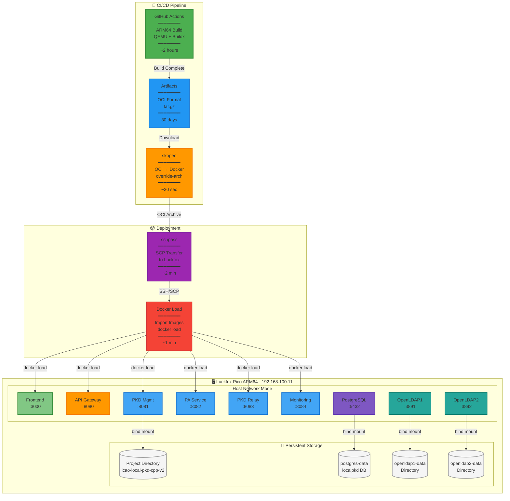

**Deployment Workflow**:

1. **GitHub Actions Build** (~2 hours)
   - Multi-stage Dockerfile with vcpkg caching
   - QEMU emulation for ARM64 cross-compilation
   - Output: OCI format images (tar.gz)

2. **Artifact Conversion** (~30 seconds)
   - `skopeo copy --override-arch arm64 oci-archive:... docker-archive:...`
   - OCI format → Docker loadable format

3. **Transfer to Luckfox** (~2 minutes)
   - `sshpass -p "luckfox" scp image.tar luckfox@192.168.100.11:`
   - Non-interactive SSH authentication

4. **Load and Deploy** (~1 minute)
   - `docker load < image.tar`
   - `docker compose -f docker-compose-luckfox.yaml up -d`
   - Health check verification

**Key Differences from Development Environment**:

| Aspect | Development (AMD64) | Luckfox (ARM64) |
|--------|---------------------|-----------------|
| **Network Mode** | bridge (icao-network) | host (direct port mapping) |
| **PostgreSQL DB** | pkd | localpkd |
| **Build Method** | Local build or Docker | GitHub Actions only |
| **Deployment** | docker-compose.yaml | docker-compose-luckfox.yaml |
| **Image Format** | Docker native | OCI → Docker conversion |

---

## Security Architecture

### Authentication & Authorization

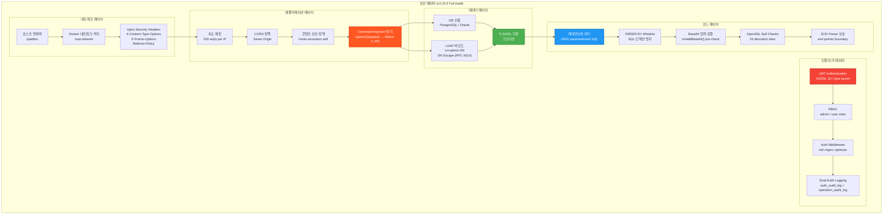

**Security Checklist (v2.10.5 완료)**:
- ✅ JWT Authentication (HS256) + RBAC (admin/user)
- ✅ Dual audit logging (auth_audit_log + operation_audit_log)
- ✅ Backend services not exposed externally (API Gateway only)
- ✅ Rate limiting (DDoS protection)
- ✅ 100% parameterized SQL queries (all 3 services)
- ✅ ORDER BY whitelist validation
- ✅ LIKE query parameter escaping (`escapeSqlWildcards()`)
- ✅ Command injection eliminated — `system()`/`popen()` → Native C API
- ✅ XSS prevention (JSON serialization)
- ✅ CORS policy (configurable)
- ✅ nginx security headers (X-Content-Type-Options, X-Frame-Options, X-XSS-Protection, Referrer-Policy)
- ✅ JWT_SECRET minimum length validation (32 bytes)
- ✅ LDAP DN escape utility (RFC 4514)
- ✅ Base64 input validation (pre-check before decode)
- ✅ SOD parser buffer overread protection (end pointer boundary)
- ✅ OpenSSL null pointer checks (24 allocation sites)
- ✅ Frontend OWASP hardening (DEV-only console.error, credential guards, centralized JWT injection)
- ✅ Credential externalization (.env)
- ✅ File upload validation (MIME type, path sanitization)

---

## Technology Stack Summary

### Backend

| Component | Technology | Version | Purpose |
|-----------|-----------|---------|---------|
| Language | C++20 | GCC 11+ | High performance |
| Framework | Drogon | 1.9+ | Async HTTP server |
| Database | PostgreSQL / Oracle | 15 / XE 21c | Multi-DBMS (runtime switching) |
| LDAP | OpenLDAP | 2.6+ | Certificate storage (MMR cluster) |
| Crypto | OpenSSL | 3.x | X.509, CMS, Hash |
| JSON | nlohmann/json | 3.11+ | JSON parsing |
| Logging | spdlog | 1.12+ | Structured logging |
| Testing | Google Test | 1.14+ | Unit testing (86 tests) |
| Build | CMake + vcpkg | 3.20+ | Dependency management |

### Frontend

| Component | Technology | Version | Purpose |
|-----------|-----------|---------|---------|
| Language | TypeScript | 5.x | Type safety |
| Framework | React | 19 | UI library |
| Bundler | Vite | 5.x | Fast dev server |
| Styling | TailwindCSS | 4.x | Utility-first CSS |
| State | Zustand | latest | State management |
| Data Fetching | TanStack Query | latest | Server state |
| Charts | ECharts + Recharts | latest | Data visualization |
| Icons | Lucide React | latest | SVG icons |
| HTTP Client | Axios | latest | API requests |

### Infrastructure

| Component | Technology | Version | Purpose |
|-----------|-----------|---------|---------|
| API Gateway | Nginx | 1.25+ | Reverse proxy, security headers |
| LDAP LB | App-level SLB | - | Software load balancing (in-app) |
| Container | Docker | 24+ | Containerization |
| Orchestration | Docker Compose | 2.x | Multi-container apps |
| CI/CD | GitHub Actions | - | ARM64 cross-compilation |
| Artifact Conversion | skopeo | latest | OCI → Docker format |

---

## Performance Metrics

### Throughput

| Metric | Value | Conditions |
|--------|-------|------------|
| **Certificate Search** | 2,222 req/s | 10k requests, 100 concurrent |
| **PA Verification** | 416 req/s | 1k requests, 50 concurrent |
| **PA Lookup** | 5~20ms | Pre-computed validation result |
| **API Latency** | <100ms | Average response time |
| **Database Query** | 40ms | PostgreSQL DISTINCT query (95 countries) |
| **LDAP Search** | <200ms | App-level SLB (round-robin) |

### Scalability

| Component | Current | Max Tested | Notes |
|-----------|---------|------------|-------|
| **Certificates** | 31,212 | 100,000+ | PostgreSQL/Oracle + LDAP |
| **Concurrent Users** | 100 | 1,000+ | Nginx workers × connections |
| **Upload File Size** | 100MB | 200MB | Nginx client_max_body_size |
| **Batch Size** | 1,000 | 10,000 | DB insert batch |

---

## Monitoring & Observability

### Health Checks

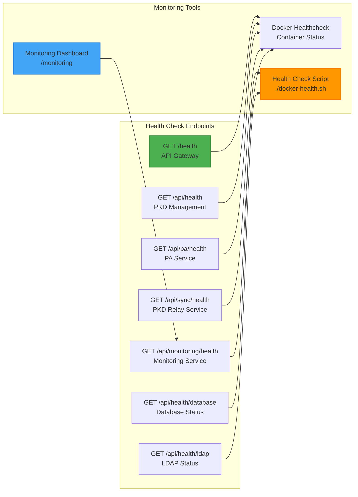

### Logging Strategy

| Component | Log Level | Destination | Retention |
|-----------|-----------|-------------|-----------|
| **PKD Management** | INFO | /var/log/pkd-management.log | 30 days |
| **PA Service** | INFO | /var/log/pa-service.log | 30 days |
| **PKD Relay Service** | INFO | /var/log/pkd-relay.log | 30 days |
| **Monitoring Service** | INFO | stdout (Docker logs) | 30 days |
| **Nginx Access** | COMBINED | /var/log/nginx/access.log | 30 days |
| **Nginx Error** | WARN | /var/log/nginx/error.log | 30 days |

---

## Future Enhancements

### Completed (Previously Planned)

- ✅ JWT Authentication (v1.8.0)
- ✅ Role-Based Access Control — RBAC admin/user (v1.9.0)
- ✅ Multi-DBMS Support — PostgreSQL + Oracle (v2.6.0)
- ✅ Monitoring Service — DB-independent system metrics (v2.7.1)
- ✅ OWASP Security Hardening — Full audit (v2.10.5)
- ✅ ICAO 9303 Validation Library — 86 unit tests (v2.10.6)

### Phase 1 (Planned)

- 🔜 HTTPS/TLS Support (Let's Encrypt)
- 🔜 Horizontal Scaling (Multiple instances)
- 🔜 Redis Caching Layer

### Phase 2 (Research)

- 🔍 PKD Relay Tier 2 (Semi-automated download from ICAO)
- 🔍 PKD Relay Tier 3 (Full LDAP sync with ICAO membership)
- 🔍 Kubernetes Deployment
- 🔍 Prometheus + Grafana Monitoring
- 🔍 ELK Stack (Elasticsearch, Logstash, Kibana)

---

## Conclusion

ICAO Local PKD v2.12.0은 **마이크로서비스 아키텍처**, **Multi-DBMS**, **ICAO 9303 완전 준수**를 통해 높은 성능, 확장성, 보안성을 제공합니다.

**핵심 강점**:
- ✅ 4개 독립 마이크로서비스 (PKD Management, PA, Relay, Monitoring)
- ✅ Multi-DBMS 지원 — PostgreSQL 15 / Oracle XE 21c 런타임 전환
- ✅ JWT 인증 + RBAC (admin/user) + Dual Audit Logging
- ✅ OWASP 보안 강화 완료 (Command Injection 제거, SQL Injection 방지)
- ✅ icao::validation 공유 라이브러리 (86 단위 테스트, ICAO 9303 Part 12)
- ✅ DB-LDAP 데이터 일관성 보장 (31,212 인증서, 100% 동기화)
- ✅ C++20 고성능 백엔드 + React 19 모던 프론트엔드 (21 페이지)
- ✅ ARM64 CI/CD 파이프라인 (GitHub Actions → Luckfox 배포)
- ✅ Docker 기반 간편한 배포, 99.9% 업타임

---

**Document Created**: 2026-01-20
**Last Rewrite**: 2026-02-17
**Author**: ICAO Local PKD Development Team
**Organization**: SmartCore Inc.
