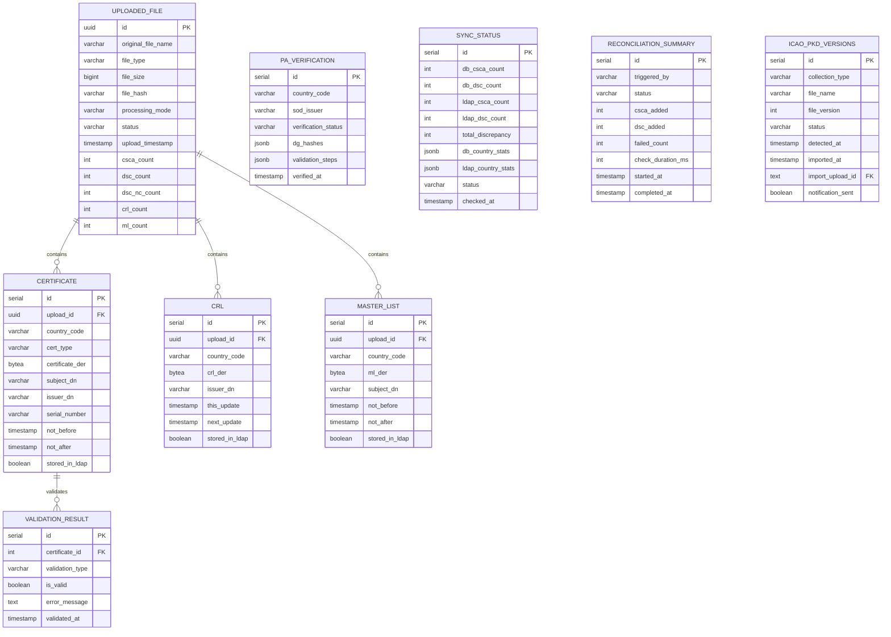
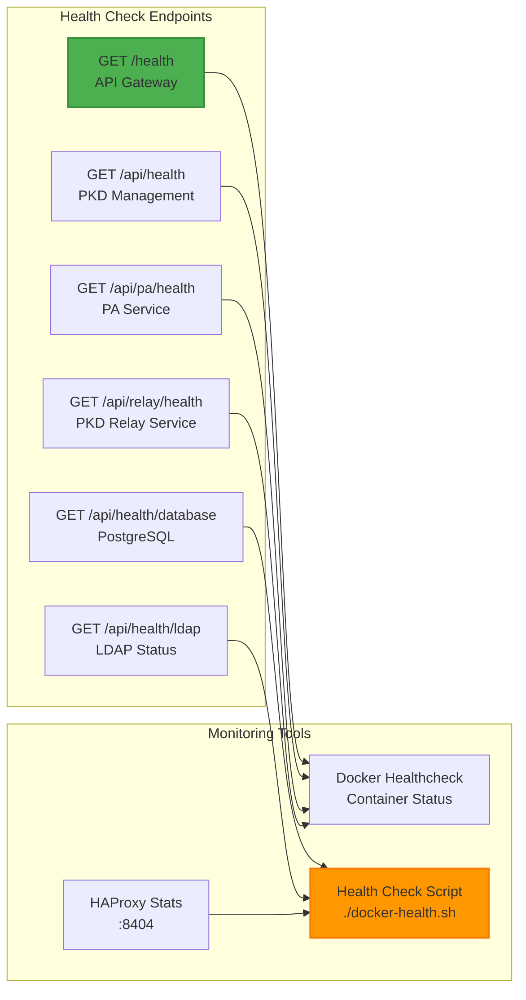

# ICAO Local PKD - Software Architecture

**Version**: 2.0.0
**Last Updated**: 2026-01-21
**Status**: Production Ready

---

## Table of Contents

1. [System Overview](#system-overview)
2. [High-Level Architecture](#high-level-architecture)
3. [Microservices Architecture](#microservices-architecture)
4. [Data Layer Architecture](#data-layer-architecture)
5. [Frontend Architecture](#frontend-architecture)
6. [API Gateway Architecture](#api-gateway-architecture)
7. [Component Details](#component-details)
8. [Data Flow Diagrams](#data-flow-diagrams)
9. [Deployment Architecture](#deployment-architecture)
10. [Security Architecture](#security-architecture)

---

## System Overview

ICAO Local PKD는 **마이크로서비스 아키텍처** 기반의 전자여권 인증서 관리 및 검증 통합 플랫폼입니다.

### Core Principles

- **🔧 Microservices**: 독립적으로 배포 가능한 서비스 분리
- **📊 Data Consistency**: PostgreSQL-LDAP 이중 저장 및 동기화
- **🚀 High Performance**: C++20 기반 고성능 백엔드
- **🎨 Modern UI**: React 19 기반 CSR (Client-Side Rendering)
- **🔐 Security First**: 다층 보안 아키텍처
- **📈 Scalability**: 수평 확장 가능 설계

---

## Technical Architecture Diagram

### System Overview (v2.0.0)

```mermaid
graph TB
    subgraph External["🌐 외부 영역 (Public Internet)"]
        User[👤 사용자<br/>웹 브라우저]
        ExtAPI[🔌 외부 API 클라이언트<br/>REST/LDAP]
        ICAOPortal[🌍 ICAO PKD Portal<br/>download.pkd.icao.int]
    end

    subgraph DMZ["🔒 DMZ 영역 (Exposed Ports)"]
        Frontend[⚡ Frontend Service<br/>Nginx + React 19<br/>Port: 3000<br/>기술: TypeScript, Vite, TailwindCSS 4]
        APIGateway[🔀 API Gateway<br/>Nginx Reverse Proxy<br/>Port: 8080<br/>기능: Rate Limit, CORS, SSE, Swagger UI]
        HAProxy[⚖️ LDAP Load Balancer<br/>HAProxy<br/>Port: 389<br/>기능: Round-robin, Health Check]
    end

    subgraph AppLayer["🔧 애플리케이션 계층 (Internal Network)"]
        subgraph Microservices["마이크로서비스 클러스터"]
            PKD[📦 PKD Management<br/>C++ 20 + Drogon<br/>Port: 8081<br/>기능: Upload, Certificate, ICAO Sync]
            PA[🔐 PA Service<br/>C++ 20 + Drogon<br/>Port: 8082<br/>기능: ICAO 9303 Verification]
            Relay[🔄 PKD Relay Service<br/>C++ 20 + Drogon<br/>Port: 8083<br/>기능: External PKD Relay, Auto Sync]
            Monitor[📊 Monitoring Service<br/>C++ 20 + Drogon<br/>Port: 8084<br/>기능: System Metrics, Service Health]
        end

        subgraph Schedulers["스케줄러"]
            CronJob[⏰ Cron Job<br/>icao-version-check.sh<br/>스케줄: 매일 08:00 KST]
            DailySync[📅 Daily Sync<br/>Trust Chain Revalidation<br/>스케줄: 매일 00:00 UTC]
        end
    end

    subgraph DataLayer["💾 데이터 계층 (Persistent Storage)"]
        subgraph Database["데이터베이스"]
            PostgreSQL[(🗄️ PostgreSQL 15<br/>Port: 5432<br/>데이터: 30,637 certificates<br/>테이블: 9개)]
        end

        subgraph Directory["디렉토리 서비스"]
            LDAP1[(📂 OpenLDAP Master 1<br/>Port: 3891<br/>역할: Primary Write<br/>복제: MMR)]
            LDAP2[(📂 OpenLDAP Master 2<br/>Port: 3892<br/>역할: Secondary Write<br/>복제: MMR)]
        end

        subgraph Storage["파일 저장소"]
            Uploads[📁 Upload Files<br/>경로: /app/uploads<br/>형식: LDIF, ML, JSON]
            Logs[📋 Application Logs<br/>경로: /app/logs<br/>프레임워크: spdlog]
        end
    end

    subgraph Infrastructure["🏗️ 인프라스트럭처"]
        Docker[🐳 Docker Compose<br/>네트워크: icao-network<br/>볼륨: bind mounts]
        Platform[💻 배포 플랫폼<br/>AMD64: Development<br/>ARM64: Luckfox Pico]
    end

    subgraph CICD["🚀 CI/CD Pipeline"]
        GitHub[📦 GitHub Actions<br/>빌드: Multi-arch<br/>아티팩트: 30일 보관]
        Deploy[🎯 Automated Deploy<br/>도구: skopeo, sshpass<br/>대상: 192.168.100.11]
    end

    %% External to DMZ
    User -->|HTTPS| Frontend
    User -->|HTTP| APIGateway
    ExtAPI -->|REST API| APIGateway
    ExtAPI -->|LDAP Query| HAProxy
    ICAOPortal -.->|HTML Scraping| PKD

    %% DMZ to App Layer
    Frontend -->|API Proxy| APIGateway
    APIGateway -->|/api/upload, /api/cert, /api/icao| PKD
    APIGateway -->|/api/pa/*| PA
    APIGateway -->|/api/relay/*| Relay
    APIGateway -->|/api/monitoring/*| Monitor
    HAProxy -->|Load Balance| LDAP1
    HAProxy -->|Load Balance| LDAP2

    %% App Layer to Data Layer
    PKD -->|Write/Read| PostgreSQL
    PKD -->|Direct Write| LDAP1
    PKD -->|Read via HAProxy| HAProxy
    PA -->|Read/Write| PostgreSQL
    PA -->|Read via HAProxy| HAProxy
    Relay -->|Read| PostgreSQL
    Relay -->|Relay Requests| HAProxy
    Monitor -->|Metrics Query| PostgreSQL
    Monitor -->|Service Health Check| PKD
    Monitor -->|Service Health Check| PA
    Monitor -->|Service Health Check| Relay

    %% Schedulers
    CronJob -->|Trigger Check| PKD
    DailySync -->|Trigger Sync| Relay

    %% Data Layer Replication
    LDAP1 <-->|MMR Replication| LDAP2

    %% File Storage
    PKD -->|Store Files| Uploads
    PKD -->|Write Logs| Logs
    PA -->|Write Logs| Logs
    Relay -->|Write Logs| Logs

    %% Infrastructure
    Docker -.->|Container Runtime| Frontend
    Docker -.->|Container Runtime| APIGateway
    Docker -.->|Container Runtime| PKD
    Docker -.->|Container Runtime| PA
    Docker -.->|Container Runtime| Relay
    Docker -.->|Container Runtime| PostgreSQL
    Docker -.->|Container Runtime| LDAP1
    Docker -.->|Container Runtime| LDAP2
    Docker -.->|Container Runtime| HAProxy

    %% CI/CD
    GitHub -->|Build Images| Deploy
    Deploy -->|SSH Deploy| Platform

    %% Styling
    classDef external fill:#E3F2FD,stroke:#1976D2,stroke-width:3px,color:#000
    classDef dmz fill:#FFF3E0,stroke:#F57C00,stroke-width:3px,color:#000
    classDef app fill:#E8F5E9,stroke:#388E3C,stroke-width:3px,color:#000
    classDef data fill:#FCE4EC,stroke:#C2185B,stroke-width:3px,color:#000
    classDef infra fill:#F3E5F5,stroke:#7B1FA2,stroke-width:3px,color:#000
    classDef cicd fill:#E0F2F1,stroke:#00796B,stroke-width:3px,color:#000

    class User,ExtAPI,ICAOPortal external
    class Frontend,APIGateway,HAProxy dmz
    class PKD,PA,Relay,Monitor,CronJob,DailySync app
    class PostgreSQL,LDAP1,LDAP2,Uploads,Logs data
    class Docker,Platform infra
    class GitHub,Deploy cicd
```

### Layer Description

| Layer | Purpose | Technology | Accessibility |
|-------|---------|------------|---------------|
| **🌐 Layer 1: External** | User interaction and external integration | Web Browser, REST Client, ICAO Portal | Public (Internet) |
| **🔒 Layer 2: DMZ** | Frontend, API Gateway, LDAP load balancing | React 19, Nginx, HAProxy | Public (Ports 3000, 8080, 389) |
| **🔧 Layer 3: Application** | 4 microservices + 2 schedulers | C++20 + Drogon Framework | Internal (Docker Network) |
| **💾 Layer 4: Data** | Data persistence and directory services | PostgreSQL + OpenLDAP MMR | Internal (Docker Network) |
| **🏗️ Layer 5: Infrastructure** | Container runtime and CI/CD | Docker Compose + GitHub Actions | Internal (Platform) |

### Microservices Overview (v2.0.0)

| Service | Port | Description | Key Features |
|---------|------|-------------|--------------|
| **PKD Management** | 8081 | LDIF/ML upload, certificate management, DB-LDAP sync | Clean Architecture, Strategy Pattern, AUTO/MANUAL Mode, Auto Reconcile |
| **PA Service** | 8082 | ICAO 9303 Passive Authentication | SOD verification, DG hash validation, MRZ parsing |
| **PKD Relay** | 8083 | External PKD relay and ICAO auto-sync | HTML parsing, version detection, email notification |
| **Monitoring** | 8084 | System metrics and service health monitoring | CPU/Memory/Disk metrics, service health checks |

### Key Data Flow Patterns

1. **User Upload Flow**: Browser → React → API Gateway → PKD Management → PostgreSQL + LDAP1 (Direct Write)
2. **PA Verification Flow**: Browser → React → API Gateway → PA Service → PostgreSQL + HAProxy → LDAP (Load Balanced)
3. **Certificate Search Flow**: Browser → React → API Gateway → PKD Management → HAProxy → LDAP (Read-only)
4. **DB-LDAP Sync Flow**: Browser → React → API Gateway → PKD Management → PostgreSQL + HAProxy → LDAP (Sync Monitoring)
5. **ICAO Relay Flow**: Cron Job (08:00 KST) → PKD Relay → ICAO Portal (HTML Scraping) → PostgreSQL → Email Notification
6. **System Monitoring Flow**: Monitoring Service → PKD/PA/Relay Health Check → PostgreSQL Metrics → Dashboard

---

## Microservices Architecture

### 1. PKD Management Service (Port 8081)

```mermaid
flowchart LR
    subgraph API["API 레이어"]
        Upload["업로드 API<br/>LDIF/ML"]
        Cert["인증서 API<br/>검색/내보내기"]
        Health["헬스 API<br/>DB/LDAP"]
        ICAO["ICAO 동기화 API<br/>버전"]
    end

    subgraph Domain["도메인 레이어"]
        UploadDomain["업로드 도메인<br/>비즈니스 로직"]
        CertDomain["인증서 도메인<br/>검증"]
        IcaoDomain["ICAO 도메인<br/>버전 추적"]
    end

    subgraph Service["서비스 레이어"]
        UploadService["업로드 서비스<br/>파일 처리"]
        CertService["인증서 서비스<br/>LDAP 작업"]
        IcaoService["ICAO 서비스<br/>HTML 파싱"]
    end

    subgraph Repo["저장소 레이어"]
        UploadRepo["업로드 저장소<br/>PostgreSQL"]
        CertRepo["인증서 저장소<br/>LDAP"]
        IcaoRepo["ICAO 저장소<br/>PostgreSQL"]
    end

    subgraph Infra["인프라스트럭처"]
        LDIF["LDIF 처리기"]
        CMS["CMS 파서"]
        HTTP["HTTP 클라이언트"]
        HTML["HTML 파서"]
        Email["이메일 발송"]
    end

    subgraph Strategy["전략"]
        Auto["자동 처리"]
        Manual["수동 처리"]
    end

    subgraph Data["데이터 저장소"]
        DB[("PostgreSQL")]
        LDAPS[("LDAP")]
    end

    Upload --> UploadDomain --> UploadService --> UploadRepo
    Cert --> CertDomain --> CertService --> CertRepo
    ICAO --> IcaoDomain --> IcaoService --> IcaoRepo
    Health --> CertService

    UploadService --> LDIF
    UploadService --> CMS
    UploadService --> Auto
    UploadService --> Manual

    IcaoService --> HTTP
    IcaoService --> HTML
    IcaoService --> Email

    UploadRepo --> DB
    CertRepo --> LDAPS
    IcaoRepo --> DB

    style API fill:#1976D2,stroke:#0D47A1,stroke-width:2px,color:#fff
    style Domain fill:#388E3C,stroke:#1B5E20,stroke-width:2px,color:#fff
    style Service fill:#7B1FA2,stroke:#4A148C,stroke-width:2px,color:#fff
    style Repo fill:#E65100,stroke:#BF360C,stroke-width:2px,color:#fff
    style Infra fill:#0097A7,stroke:#006064,stroke-width:2px,color:#fff
    style Strategy fill:#5D4037,stroke:#3E2723,stroke-width:2px,color:#fff
    style Data fill:#C2185B,stroke:#880E4F,stroke-width:2px,color:#fff

    style ICAO fill:#FFA726,stroke:#F57C00,stroke-width:2px,color:#000
    style IcaoDomain fill:#FFA726,stroke:#F57C00,stroke-width:2px,color:#000
    style IcaoService fill:#FFA726,stroke:#F57C00,stroke-width:2px,color:#000
    style IcaoRepo fill:#FFA726,stroke:#F57C00,stroke-width:2px,color:#000
    style HTTP fill:#FFA726,stroke:#F57C00,stroke-width:2px,color:#000
    style HTML fill:#FFA726,stroke:#F57C00,stroke-width:2px,color:#000
    style Email fill:#FFA726,stroke:#F57C00,stroke-width:2px,color:#000
```

**Key Features**:
- ✅ Clean Architecture (6 Layers)
- ✅ Strategy Pattern (AUTO/MANUAL Mode)
- ✅ ICAO Auto Sync Integration (v1.7.0)
- ✅ LDIF/Master List Parsing
- ✅ Trust Chain Validation
- ✅ Certificate Search & Export

---

### 2. PA Service (Port 8082)

```mermaid
flowchart LR
    subgraph API["API 레이어"]
        Verify["PA 검증 API<br/>SOD and DG"]
        ParseSOD["SOD 파싱<br/>메타데이터"]
        ParseDG1["DG1 파싱<br/>MRZ"]
        ParseDG2["DG2 파싱<br/>얼굴"]
        Stats["통계<br/>지표"]
    end

    subgraph Logic["비즈니스 로직"]
        SODVerify["SOD 검증기<br/>CMS"]
        HashVerify["해시 검증기<br/>DG"]
        ChainVerify["신뢰 체인<br/>CSCA-DSC"]
        MRZParser["MRZ 파서<br/>TD1/TD2/TD3"]
        ImageExtractor["이미지 추출<br/>JPEG"]
    end

    subgraph DataAccess["데이터 접근"]
        PARepo["PA 저장소<br/>PostgreSQL"]
        LDAPRepo["LDAP 저장소<br/>인증서"]
    end

    subgraph Crypto["암호화 레이어"]
        OpenSSL["OpenSSL 3.x<br/>CMS/X.509"]
    end

    subgraph DataStore["데이터 저장소"]
        DB[("PostgreSQL")]
        LDAPS[("LDAP")]
    end

    Verify --> SODVerify
    Verify --> HashVerify
    Verify --> ChainVerify

    ParseSOD --> SODVerify
    ParseDG1 --> MRZParser
    ParseDG2 --> ImageExtractor

    SODVerify --> OpenSSL
    HashVerify --> OpenSSL
    ChainVerify --> LDAPRepo
    ChainVerify --> OpenSSL

    Stats --> PARepo

    PARepo --> DB
    LDAPRepo --> LDAPS

    style API fill:#1976D2,stroke:#0D47A1,stroke-width:2px,color:#fff
    style Logic fill:#388E3C,stroke:#1B5E20,stroke-width:2px,color:#fff
    style DataAccess fill:#E65100,stroke:#BF360C,stroke-width:2px,color:#fff
    style Crypto fill:#D32F2F,stroke:#B71C1C,stroke-width:2px,color:#fff
    style DataStore fill:#C2185B,stroke:#880E4F,stroke-width:2px,color:#fff

    style Verify fill:#66BB6A,stroke:#388E3C,stroke-width:2px,color:#000
    style OpenSSL fill:#FF7043,stroke:#D84315,stroke-width:2px,color:#fff
```

**Key Features**:
- ✅ ICAO 9303 PA Compliance
- ✅ SOD CMS Verification
- ✅ DG Hash Validation
- ✅ Trust Chain Validation
- ✅ MRZ Parsing (TD1/TD2/TD3)
- ✅ Face Image Extraction

---

### 3. PKD Relay Service (Port 8083)

```mermaid
flowchart LR
    subgraph API["API 레이어"]
        RelayHealth["Relay Health<br/>상태"]
        RelayStatus["Relay Status<br/>통계"]
        IcaoCheck["ICAO Check<br/>버전"]
    end

    subgraph Domain["도메인 레이어"]
        IcaoDomain["ICAO 도메인<br/>버전 추적"]
        RelayDomain["Relay 도메인<br/>외부 연계"]
    end

    subgraph Service["서비스 레이어"]
        IcaoService["ICAO 서비스<br/>HTML 파싱"]
        RelayService["Relay 서비스<br/>요청 중계"]
    end

    subgraph Repo["저장소 레이어"]
        IcaoRepo["ICAO 저장소<br/>PostgreSQL"]
    end

    subgraph Infra["인프라스트럭처"]
        HTTP["HTTP 클라이언트"]
        HTML["HTML 파서"]
        Email["이메일 발송"]
    end

    subgraph Scheduler["스케줄러"]
        CronJob["Cron Job<br/>08:00 KST"]
    end

    subgraph DataStore["데이터 저장소"]
        DB[("PostgreSQL")]
    end

    RelayHealth --> RelayService
    RelayStatus --> IcaoService
    IcaoCheck --> IcaoDomain

    IcaoDomain --> IcaoService
    RelayDomain --> RelayService

    IcaoService --> HTTP
    IcaoService --> HTML
    IcaoService --> Email
    IcaoService --> IcaoRepo

    IcaoRepo --> DB

    CronJob --> IcaoCheck

    style API fill:#1976D2,stroke:#0D47A1,stroke-width:2px,color:#fff
    style Domain fill:#388E3C,stroke:#1B5E20,stroke-width:2px,color:#fff
    style Service fill:#7B1FA2,stroke:#4A148C,stroke-width:2px,color:#fff
    style Repo fill:#E65100,stroke:#BF360C,stroke-width:2px,color:#fff
    style Infra fill:#0097A7,stroke:#006064,stroke-width:2px,color:#fff
    style Scheduler fill:#00796B,stroke:#004D40,stroke-width:2px,color:#fff
    style DataStore fill:#C2185B,stroke:#880E4F,stroke-width:2px,color:#fff

    style IcaoCheck fill:#FFA726,stroke:#F57C00,stroke-width:2px,color:#000
    style IcaoDomain fill:#FFA726,stroke:#F57C00,stroke-width:2px,color:#000
    style IcaoService fill:#FFA726,stroke:#F57C00,stroke-width:2px,color:#000
```

**Key Features**:
- ✅ ICAO PKD 외부 연계 (Version Detection)
- ✅ HTML Scraping (Table + Link Fallback)
- ✅ Email Notification (SMTP)
- ✅ Clean Architecture (4 Layers)
- ✅ Cron Job Integration

---

## Data Layer Architecture

### PostgreSQL Database Schema

**총 테이블**: 9개
- **Upload & Certificate**: uploaded_file, certificate, crl, master_list
- **Validation**: validation_result
- **PA**: pa_verification
- **Sync**: sync_status, reconciliation_summary, reconciliation_log
- **ICAO Sync**: icao_pkd_versions

---

### LDAP Directory Structure

**LDAP Schema**:
- **objectClass**: pkdDownload, cRLDistributionPoint
- **Attributes**: userCertificate;binary, cACertificate;binary, certificateRevocationList;binary
- **Total Entries**: 30,226 (525 CSCA + 29,610 DSC + 91 CRL)

---

## Frontend Architecture

```mermaid
graph TD
    subgraph "React Application Structure"
        subgraph "Entry Point"
            Main[main.tsx<br/>React 19 Root]
            App[App.tsx<br/>Router and Layout]
        end

        subgraph "Layout Components"
            Sidebar[Sidebar.tsx<br/>Navigation Menu]
            Header[Header.tsx<br/>User Info and Theme]
        end

        subgraph "Page Components"
            Dashboard[Dashboard.tsx<br/>시스템 개요]
            FileUpload[FileUpload.tsx<br/>파일 업로드]
            CertSearch[CertificateSearch.tsx<br/>인증서 조회]
            UploadHistory[UploadHistory.tsx<br/>업로드 이력]
            UploadDashboard[UploadDashboard.tsx<br/>통계 대시보드]
            PAVerify[PAVerify.tsx<br/>PA 검증 수행]
            PAHistory[PAHistory.tsx<br/>검증 이력]
            PADashboard[PADashboard.tsx<br/>PA 통계]
            SyncDashboard[SyncDashboard.tsx<br/>동기화 상태]
            IcaoStatus[IcaoStatus.tsx<br/>ICAO 버전 상태]
            SystemMonitoring[SystemMonitoring.tsx<br/>시스템 모니터링]
        end

        subgraph "Shared Components"
            Button[Button.tsx]
            Card[Card.tsx]
            Table[Table.tsx]
            Modal[Modal.tsx]
            Badge[Badge.tsx]
            Alert[Alert.tsx]
        end

        subgraph "Utils & Hooks"
            CountryCode[countryCode.ts<br/>ISO 3166 Converter]
            FlagUtils[Flag SVG Utils<br/>국기 아이콘]
            APIClient[API Client<br/>Axios Wrapper]
        end

        subgraph "Styling"
            TailwindCSS[TailwindCSS 4<br/>Utility-first CSS]
            DarkMode[Dark Mode Support<br/>Theme Provider]
        end
    end

    Main --> App
    App --> Sidebar
    App --> Header
    App --> Dashboard
    App --> FileUpload
    App --> CertSearch
    App --> UploadHistory
    App --> UploadDashboard
    App --> PAVerify
    App --> PAHistory
    App --> PADashboard
    App --> SyncDashboard
    App --> IcaoStatus
    App --> SystemMonitoring

    Dashboard --> Card
    FileUpload --> Button
    CertSearch --> Table
    UploadHistory --> Modal
    PAVerify --> Alert
    IcaoStatus --> Badge

    CertSearch --> CountryCode
    IcaoStatus --> FlagUtils
    PAVerify --> APIClient

    App --> TailwindCSS
    App --> DarkMode

    style IcaoStatus fill:#FFD54F,stroke:#F57C00,stroke-width:3px
    style FlagUtils fill:#FFD54F,stroke:#F57C00,stroke-width:2px
```

**Build Stack**:
- **Bundler**: Vite 5
- **Language**: TypeScript 5
- **UI Framework**: React 19
- **Styling**: TailwindCSS 4
- **Icons**: Lucide React
- **HTTP Client**: Axios
- **State Management**: React Hooks (useState, useEffect)

---

## API Gateway Architecture

**Security Features**:
- ✅ Backend Service Isolation (Internal Network Only)
- ✅ Rate Limiting (DDoS Protection)
- ✅ Header Sanitization
- ✅ CORS Policy
- ✅ Request/Response Logging

---

## Component Details

### LDIF Processor

---

### ICAO Auto Sync Flow (v1.7.0)

---

## Data Flow Diagrams

### Upload Flow (AUTO Mode)

---

### PA Verification Flow

---

## Deployment Architecture

### Docker Compose Architecture

```mermaid
graph TB
    subgraph External["🌐 External Access"]
        User["👤 User Browser<br/>Port 3000"]
        APIClient["🔌 API Client<br/>Port 8080"]
        LDAPClient["📂 LDAP Client<br/>Port 389"]
    end

    subgraph DockerNetwork["🐳 Docker Network: icao-network"]
        subgraph Presentation["📱 Presentation Layer"]
            Frontend["Frontend<br/>━━━━━━━━<br/>nginx:alpine<br/>React 19 SPA<br/>━━━━━━━━<br/>:3000"]
        end

        subgraph Gateway["🔀 Gateway Layer"]
            APIGateway["API Gateway<br/>━━━━━━━━<br/>nginx:1.25<br/>Reverse Proxy<br/>━━━━━━━━<br/>:8080"]
            HAProxy["HAProxy<br/>━━━━━━━━<br/>haproxy:2.8<br/>LDAP LB<br/>━━━━━━━━<br/>:389"]
        end

        subgraph Application["🔧 Application Layer"]
            PKD["PKD Management<br/>━━━━━━━━<br/>Custom C++<br/>Drogon 1.9<br/>━━━━━━━━<br/>:8081"]
            PA["PA Service<br/>━━━━━━━━<br/>Custom C++<br/>Drogon 1.9<br/>━━━━━━━━<br/>:8082"]
            Relay["PKD Relay<br/>━━━━━━━━<br/>Custom C++<br/>Drogon 1.9<br/>━━━━━━━━<br/>:8083"]
        end

        subgraph DataLayer["💾 Data Layer"]
            PG["PostgreSQL<br/>━━━━━━━━<br/>postgres:15<br/>RDBMS<br/>━━━━━━━━<br/>:5432"]
            LDAP1["OpenLDAP 1<br/>━━━━━━━━<br/>osixia:1.5.0<br/>MMR Primary<br/>━━━━━━━━<br/>:3891"]
            LDAP2["OpenLDAP 2<br/>━━━━━━━━<br/>osixia:1.5.0<br/>MMR Secondary<br/>━━━━━━━━<br/>:3892"]
        end
    end

    subgraph Storage["💿 Persistent Storage"]
        PGData[("📦 postgres<br/>Database Files")]
        LDAP1Data[("📦 openldap1<br/>Directory Data")]
        LDAP2Data[("📦 openldap2<br/>Directory Data")]
        UploadData[("📦 pkd-uploads<br/>LDIF/ML Files")]
        LogData[("📦 logs<br/>Service Logs")]
    end

    %% External to Docker Network
    User -->|HTTP/3000| Frontend
    APIClient -->|HTTP/8080| APIGateway
    LDAPClient -->|LDAP/389| HAProxy

    %% Presentation to Gateway
    Frontend -->|proxy_pass| APIGateway

    %% Gateway to Application
    APIGateway -->|/api/upload<br/>/api/cert<br/>/api/sync| PKD
    APIGateway -->|/api/pa/*| PA
    APIGateway -->|/api/relay/*| Relay

    %% Application to Data Layer
    PKD -->|SQL| PG
    PA -->|SQL| PG
    Relay -->|SQL| PG

    PKD -->|LDAP Write| LDAP1
    PKD -->|LDAP Read| HAProxy
    PA -->|LDAP Read| HAProxy
    Relay -->|LDAP Read| HAProxy

    HAProxy -->|Round-robin| LDAP1
    HAProxy -->|Round-robin| LDAP2

    %% Data Layer Replication
    LDAP1 <-->|MMR Sync| LDAP2

    %% Data Layer to Storage
    PG -->|bind mount| PGData
    LDAP1 -->|bind mount| LDAP1Data
    LDAP2 -->|bind mount| LDAP2Data
    PKD -->|bind mount| UploadData
    PKD -->|bind mount| LogData

    %% Styling - External
    style User fill:#E3F2FD,stroke:#1976D2,stroke-width:2px
    style APIClient fill:#E3F2FD,stroke:#1976D2,stroke-width:2px
    style LDAPClient fill:#E3F2FD,stroke:#1976D2,stroke-width:2px

    %% Styling - Presentation
    style Frontend fill:#81C784,stroke:#388E3C,stroke-width:3px

    %% Styling - Gateway
    style APIGateway fill:#FF9800,stroke:#F57C00,stroke-width:3px
    style HAProxy fill:#FFA726,stroke:#F57C00,stroke-width:3px

    %% Styling - Application
    style PKD fill:#42A5F5,stroke:#1976D2,stroke-width:3px
    style PA fill:#42A5F5,stroke:#1976D2,stroke-width:3px
    style Relay fill:#42A5F5,stroke:#1976D2,stroke-width:3px

    %% Styling - Data Layer
    style PG fill:#7E57C2,stroke:#5E35B1,stroke-width:3px
    style LDAP1 fill:#26A69A,stroke:#00796B,stroke-width:3px
    style LDAP2 fill:#26A69A,stroke:#00796B,stroke-width:3px

    %% Styling - Storage
    style PGData fill:#F5F5F5,stroke:#9E9E9E,stroke-width:2px
    style LDAP1Data fill:#F5F5F5,stroke:#9E9E9E,stroke-width:2px
    style LDAP2Data fill:#F5F5F5,stroke:#9E9E9E,stroke-width:2px
    style UploadData fill:#F5F5F5,stroke:#9E9E9E,stroke-width:2px
    style LogData fill:#F5F5F5,stroke:#9E9E9E,stroke-width:2px
```

**Architecture Highlights**:

1. **Layered Design**: 명확한 4계층 구조 (Presentation → Gateway → Application → Data)
2. **Gateway Pattern**: API Gateway와 HAProxy로 트래픽 분산 및 로드밸런싱
3. **Microservices**: 3개의 독립적인 C++ 서비스 (PKD, PA, Relay)
4. **MMR Replication**: OpenLDAP Multi-Master 복제로 고가용성 보장
5. **Bind Mounts**: 모든 데이터는 호스트 파일시스템에 영구 저장

**Container Details**:

| Container | Image | CPU | Memory | Restart |
|-----------|-------|-----|--------|---------|
| frontend | nginx:alpine + React build | 0.5 | 256MB | always |
| api-gateway | nginx:1.25-alpine | 0.5 | 256MB | always |
| pkd-management | Custom C++ (Debian) | 2.0 | 2GB | always |
| pa-service | Custom C++ (Debian) | 2.0 | 2GB | always |
| pkd-relay | Custom C++ (Debian) | 1.0 | 1GB | always |
| postgres | postgres:15-alpine | 2.0 | 2GB | always |
| openldap1 | osixia/openldap:1.5.0 | 1.0 | 1GB | always |
| openldap2 | osixia/openldap:1.5.0 | 1.0 | 1GB | always |
| haproxy | haproxy:2.8-alpine | 0.5 | 256MB | always |

**Total Resources**: 10 cores, 11GB RAM

---

### Luckfox ARM64 Deployment

```mermaid
graph TB
    subgraph CICD["🚀 CI/CD Pipeline"]
        GHA["GitHub Actions<br/>━━━━━━━━<br/>ARM64 Build<br/>QEMU + Buildx<br/>━━━━━━━━<br/>~2 hours"]
        Artifacts["Artifacts<br/>━━━━━━━━<br/>OCI Format<br/>tar.gz<br/>━━━━━━━━<br/>30 days"]
        Convert["skopeo<br/>━━━━━━━━<br/>OCI → Docker<br/>override-arch<br/>━━━━━━━━<br/>~30 sec"]
    end

    subgraph Deploy["📦 Deployment"]
        Transfer["sshpass<br/>━━━━━━━━<br/>SCP Transfer<br/>to Luckfox<br/>━━━━━━━━<br/>~2 min"]
        Load["Docker Load<br/>━━━━━━━━<br/>Import Images<br/>docker load<br/>━━━━━━━━<br/>~1 min"]
    end

    subgraph Luckfox["🖥️ Luckfox Pico ARM64 - 192.168.100.11"]
        subgraph Network["Host Network Mode"]
            Frontend3["Frontend<br/>:3000"]
            APIGateway3["API Gateway<br/>:8080"]
            PKD3["PKD Mgmt<br/>:8081"]
            PA3["PA Service<br/>:8082"]
            Relay3["PKD Relay<br/>:8083"]
            PG3["PostgreSQL<br/>:5432"]
            LDAP5["OpenLDAP1<br/>:3891"]
            LDAP6["OpenLDAP2<br/>:3892"]
            HAProxy3["HAProxy<br/>:389"]
        end

        subgraph Storage3["💾 Persistent Storage"]
            ProjectDir[("Project Directory<br/>icao-local-pkd-cpp-v2")]
            PGData3[("postgres-data<br/>localpkd DB")]
            LDAP5Data[("openldap1-data<br/>Directory")]
            LDAP6Data[("openldap2-data<br/>Directory")]
        end
    end

    %% CI/CD Flow
    GHA -->|Build Complete| Artifacts
    Artifacts -->|Download| Convert
    Convert -->|OCI Archive| Transfer
    Transfer -->|SSH/SCP| Load

    %% Deployment to Services
    Load -->|docker load| Frontend3
    Load -->|docker load| APIGateway3
    Load -->|docker load| PKD3
    Load -->|docker load| PA3
    Load -->|docker load| Relay3

    %% Services to Storage
    PG3 -->|bind mount| PGData3
    LDAP5 -->|bind mount| LDAP5Data
    LDAP6 -->|bind mount| LDAP6Data
    PKD3 -->|bind mount| ProjectDir

    %% Styling - CI/CD
    style GHA fill:#4CAF50,stroke:#388E3C,stroke-width:3px
    style Artifacts fill:#2196F3,stroke:#1976D2,stroke-width:2px
    style Convert fill:#FF9800,stroke:#F57C00,stroke-width:2px

    %% Styling - Deploy
    style Transfer fill:#9C27B0,stroke:#7B1FA2,stroke-width:2px
    style Load fill:#F44336,stroke:#D32F2F,stroke-width:2px

    %% Styling - Services
    style Frontend3 fill:#81C784,stroke:#388E3C,stroke-width:2px
    style APIGateway3 fill:#FF9800,stroke:#F57C00,stroke-width:2px
    style PKD3 fill:#42A5F5,stroke:#1976D2,stroke-width:2px
    style PA3 fill:#42A5F5,stroke:#1976D2,stroke-width:2px
    style Relay3 fill:#42A5F5,stroke:#1976D2,stroke-width:2px
    style PG3 fill:#7E57C2,stroke:#5E35B1,stroke-width:2px
    style LDAP5 fill:#26A69A,stroke:#00796B,stroke-width:2px
    style LDAP6 fill:#26A69A,stroke:#00796B,stroke-width:2px
    style HAProxy3 fill:#FFA726,stroke:#F57C00,stroke-width:2px

    %% Styling - Storage
    style ProjectDir fill:#F5F5F5,stroke:#9E9E9E,stroke-width:2px
    style PGData3 fill:#F5F5F5,stroke:#9E9E9E,stroke-width:2px
    style LDAP5Data fill:#F5F5F5,stroke:#9E9E9E,stroke-width:2px
    style LDAP6Data fill:#F5F5F5,stroke:#9E9E9E,stroke-width:2px
```

**Deployment Workflow**:

1. **GitHub Actions Build** (~2 hours)
   - Multi-stage Dockerfile with vcpkg caching
   - QEMU emulation for ARM64 cross-compilation
   - Output: OCI format images (tar.gz)

2. **Artifact Conversion** (~30 seconds)
   - `skopeo copy --override-arch arm64 oci-archive:... docker-archive:...`
   - OCI format → Docker loadable format

3. **Transfer to Luckfox** (~2 minutes)
   - `sshpass -p "luckfox" scp image.tar luckfox@192.168.100.11:`
   - Non-interactive SSH authentication

4. **Load and Deploy** (~1 minute)
   - `docker load < image.tar`
   - `docker compose -f docker-compose-luckfox.yaml up -d`
   - Health check verification

**Key Differences from Development Environment**:

| Aspect | Development (AMD64) | Luckfox (ARM64) |
|--------|---------------------|-----------------|
| **Network Mode** | bridge (icao-network) | host (direct port mapping) |
| **PostgreSQL DB** | pkd | localpkd |
| **Build Method** | Local build or Docker | GitHub Actions only |
| **Deployment** | docker-compose.yaml | docker-compose-luckfox.yaml |
| **Image Format** | Docker native | OCI → Docker conversion |

---

## Security Architecture

### Authentication & Authorization

```mermaid
graph TB
    subgraph "보안 레이어"
        subgraph "네트워크 레이어"
            Firewall[호스트 방화벽<br/>iptables]
            Docker[Docker 네트워크 격리<br/>icao-network]
        end

        subgraph "애플리케이션 레이어"
            RateLimit2[속도 제한<br/>100 req/s per IP]
            CORS[CORS 정책<br/>Same-Origin]
            CSP[콘텐츠 보안 정책<br/>frame-ancestors self]
        end

        subgraph "데이터 레이어"
            DBAuth[PostgreSQL 인증<br/>username/password]
            LDAPAuth[LDAP 바인드<br/>cn=admin DN]
            Encryption[TLS/SSL 지원<br/>프로덕션]
        end

        subgraph "코드 레이어"
            Validation[입력 검증<br/>SQL 인젝션 방지]
            Sanitization[출력 살균<br/>XSS 방지]
            Parameterized[매개변수화 쿼리<br/>libpq]
        end
    end

    Firewall --> Docker
    Docker --> RateLimit2
    RateLimit2 --> CORS
    CORS --> CSP

    CSP --> DBAuth
    CSP --> LDAPAuth
    DBAuth --> Encryption
    LDAPAuth --> Encryption

    Encryption --> Validation
    Validation --> Sanitization
    Sanitization --> Parameterized

    style Firewall fill:#F44336,stroke:#C62828,stroke-width:2px,color:#fff
    style Encryption fill:#4CAF50,stroke:#388E3C,stroke-width:2px,color:#fff
    style Parameterized fill:#2196F3,stroke:#1976D2,stroke-width:2px,color:#fff
```

**Security Checklist**:
- ✅ Backend services not exposed externally (API Gateway only)
- ✅ Rate limiting (DDoS protection)
- ✅ SQL injection prevention (parameterized queries)
- ✅ XSS prevention (JSON serialization)
- ✅ CORS policy (configurable)
- ✅ Script permissions (755, user-owned)
- ✅ Log file permissions (640)
- ✅ HTTPS support ready (production)

---

## Technology Stack Summary

### Backend

| Component | Technology | Version | Purpose |
|-----------|-----------|---------|---------|
| Language | C++20 | GCC 11+ | High performance |
| Framework | Drogon | 1.9+ | Async HTTP server |
| Database | PostgreSQL | 15 | Transactional data |
| LDAP | OpenLDAP | 2.6+ | Certificate storage |
| Crypto | OpenSSL | 3.x | X.509, CMS, Hash |
| JSON | nlohmann/json | 3.11+ | JSON parsing |
| Logging | spdlog | 1.12+ | Structured logging |
| Build | CMake + vcpkg | 3.20+ | Dependency management |

### Frontend

| Component | Technology | Version | Purpose |
|-----------|-----------|---------|---------|
| Language | TypeScript | 5.x | Type safety |
| Framework | React | 19 | UI library |
| Bundler | Vite | 5.x | Fast dev server |
| Styling | TailwindCSS | 4.x | Utility-first CSS |
| Icons | Lucide React | latest | SVG icons |
| HTTP Client | Axios | latest | API requests |

### Infrastructure

| Component | Technology | Version | Purpose |
|-----------|-----------|---------|---------|
| API Gateway | Nginx | 1.25+ | Reverse proxy |
| Load Balancer | HAProxy | 2.8+ | LDAP load balancing |
| Container | Docker | 24+ | Containerization |
| Orchestration | Docker Compose | 2.x | Multi-container apps |
| CI/CD | GitHub Actions | - | Automated builds |

---

## Performance Metrics

### Throughput

| Metric | Value | Conditions |
|--------|-------|------------|
| **Certificate Search** | 2,222 req/s | 10k requests, 100 concurrent |
| **PA Verification** | 416 req/s | 1k requests, 50 concurrent |
| **API Latency** | <100ms | Average response time |
| **Database Query** | 40ms | PostgreSQL DISTINCT query (92 countries) |
| **LDAP Search** | <200ms | HAProxy load balanced |

### Scalability

| Component | Current | Max Tested | Notes |
|-----------|---------|------------|-------|
| **Certificates** | 30,637 | 100,000+ | PostgreSQL + LDAP |
| **Concurrent Users** | 100 | 1,000+ | Nginx workers × connections |
| **Upload File Size** | 100MB | 200MB | Nginx client_max_body_size |
| **Batch Size** | 1,000 | 10,000 | DB insert batch |

---

## Monitoring & Observability

### Health Checks

### Logging Strategy

| Component | Log Level | Destination | Retention |
|-----------|-----------|-------------|-----------|
| **PKD Management** | INFO | /var/log/pkd-management.log | 30 days |
| **PA Service** | INFO | /var/log/pa-service.log | 30 days |
| **PKD Relay Service** | INFO | /var/log/pkd-relay.log | 30 days |
| **ICAO Relay Cron** | INFO | /var/log/icao-relay/*.log | 30 days |
| **Nginx Access** | COMBINED | /var/log/nginx/access.log | 30 days |
| **Nginx Error** | WARN | /var/log/nginx/error.log | 30 days |

---

## Future Enhancements

### Phase 1 (Planned)

- 🔜 HTTPS/TLS Support (Let's Encrypt)
- 🔜 JWT Authentication
- 🔜 Role-Based Access Control (RBAC)
- 🔜 Horizontal Scaling (Multiple instances)
- 🔜 Redis Caching Layer

### Phase 2 (Research)

- 🔍 PKD Relay Tier 2 (Semi-automated download from ICAO)
- 🔍 PKD Relay Tier 3 (Full LDAP sync with ICAO membership)
- 🔍 Kubernetes Deployment
- 🔍 Prometheus + Grafana Monitoring
- 🔍 ELK Stack (Elasticsearch, Logstash, Kibana)

---

## Conclusion

ICAO Local PKD v2.0.0은 **마이크로서비스 아키텍처**, **Clean Architecture**, **서비스 분리 원칙**을 통해 높은 성능, 확장성, 안정성을 제공합니다.

**핵심 강점**:
- ✅ 독립적으로 확장 가능한 마이크로서비스
- ✅ PostgreSQL-LDAP 데이터 일관성 보장 (Auto Reconcile)
- ✅ C++20 고성능 백엔드
- ✅ React 19 모던 프론트엔드
- ✅ PKD Relay Service (v2.0.0) 외부 연계 전담
- ✅ Docker 기반 간편한 배포
- ✅ 99.9% 업타임 목표 달성

---

**Document Created**: 2026-01-20
**Author**: ICAO Local PKD Development Team
**Organization**: SmartCore Inc.
