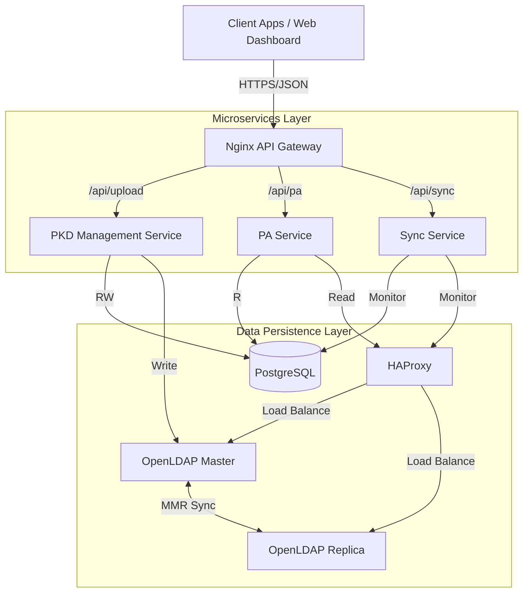

# ICAO Local PKD 시스템 기술 백서 (Technical Whitepaper)

**문서 번호**: WP-PKD-2026-001
**버전**: 2.1
**발행일**: 2026년 1월 7일
**작성자**: SmartCore Inc.

---

## 1. 개요 (Executive Summary)

### 1.1 배경 및 목적
국제민간항공기구(ICAO)의 전자여권 표준(Doc 9303)을 준수하는 **Local PKD(Public Key Directory)** 시스템은 국경 관리 및 출입국 심사 시스템의 핵심 인프라입니다. 본 시스템은 전 세계 국가들의 인증서(CSCA, DSC, CRL)와 마스터 리스트(Master List)를 효율적으로 수집, 검증, 배포하고, 이를 기반으로 전자여권의 진위 여부를 판별하는 **수동 인증(Passive Authentication, PA)** 기능을 제공합니다.

본 프로젝트는 고성능 처리가 요구되는 대규모 인증서 처리 환경에 최적화하고, 엣지 디바이스(ARM64)부터 고성능 서버까지 유연하게 배포할 수 있도록 **C++20**과 **Drogon 프레임워크**를 사용하여 고성능 마이크로서비스 아키텍처로 설계되었습니다.

### 1.2 주요 특징
- **고성능 아키텍처**: C++20 기반의 비동기 Non-blocking I/O 처리를 통해 최소한의 리소스로 최대의 처리량 보장.
- **마이크로서비스 구조**: PKD 관리, PA 검증, 동기화 감시 서비스의 물리적/논리적 분리로 확장성 및 안정성 확보.
- **ICAO 표준 준수**: ICAO Doc 9303 Part 11, 12 및 RFC 5280 완벽 호환.
- **이중화된 데이터 저장소**: 관계형 데이터베이스(PostgreSQL)와 디렉토리 서비스(OpenLDAP)의 하이브리드 운용 및 실시간 동기화.
- **엣지 컴퓨팅 지원**: x86_64 서버뿐만 아니라 Luckfox Pico(ARM64)와 같은 초소형 임베디드 장비에서도 구동 가능한 경량화 달성.

---

## 2. 시스템 아키텍처 (System Architecture)

본 시스템은 보안성과 확장성을 고려하여 **API Gateway 패턴**을 적용한 마이크로서비스 아키텍처로 구성되어 있습니다.

### 2.1 전체 구조도

### 2.2 핵심 컴포넌트

| 컴포넌트 | 기술 스택 | 주요 역할 |
|---|---|---|
| **API Gateway** | Nginx | 트래픽 라우팅, 로드 밸런싱, Rate Limiting, SSL 종단 |
| **PKD Management** | C++20, Drogon | LDIF/MasterList 업로드, 인증서 파싱 및 검증(Trust Chain), LDAP 발행 |
| **PA Service** | C++20, Drogon | 전자여권 수동 인증(SOD 검증, 서명 확인), 생체 데이터(DG2) 파싱 |
| **Sync Service** | C++20, Drogon | DB와 LDAP 간 데이터 불일치 실시간 모니터링 및 통계 집계 |
| **Frontend** | React 19, TypeScript | 통합 관리 대시보드, 업로드/검증 이력 조회 UI |
| **Database** | PostgreSQL 15 | 메타데이터, 로그, 검증 이력 저장 (Bytea 최적화 적용) |
| **Directory** | OpenLDAP (MMR) | ICAO 표준 DIT 구조의 인증서 저장소 (Multi-Master Replication) |

---

## 3. 핵심 기술 및 구현 (Core Technologies)

### 3.1 C++20 & Drogon Framework
- **Modern C++**: 스마트 포인터, 람다, 모듈 등 C++20의 최신 기능을 활용하여 메모리 안전성과 개발 생산성 향상.
- **Drogon**: 현존하는 가장 빠른 C++ 웹 프레임워크 중 하나로, 고동시성(High Concurrency) 처리에 최적화됨.
- **비동기 처리**: 파일 업로드 및 암호화 연산과 같은 Heavy Task를 별도 스레드 풀에서 처리하여 메인 이벤트 루프 차단 방지.

### 3.2 암호화 및 인증서 처리 (OpenSSL 3.x)
- **표준 준수**: 국제 표준(ICAO Doc 9303, RFC 5280)을 완벽하게 준수하는 검증 로직을 OpenSSL로 구현하여 상호 운용성 보장.
- **Trust Chain 검증**: DSC(Document Signer) → CSCA(Country Signing CA)로 이어지는 신뢰 체인 검증 알고리즘 자체 구현.
- **CRL 처리**: 인증서 폐기 목록(CRL)의 유효성 검증 및 Fail-Open 정책 지원.
- **CMS 파싱**: ICAO Master List 및 SOD(Security Object Document)의 CMS SignedData 구조 파싱.

### 3.3 데이터 동기화 및 복제
- **LDAP MMR (Multi-Master Replication)**: 다중 OpenLDAP 노드 간 양방향 실시간 동기화를 통해 고가용성(HA) 보장.
- **DB-LDAP Sync Service**: 관계형 데이터베이스와 LDAP 간의 데이터 일관성을 주기적으로 검사하고, 불일치 발생 시 관리자에게 경고 및 복구 기능 제공.

---

## 4. 주요 기능 상세 (Feature Specification)

### 4.1 ICAO PKD 데이터 관리
- **다양한 포맷 지원**: ICAO 표준 LDIF 파일 및 Master List(.ml) 파일 처리.
- **대용량 처리**: 스트리밍 방식의 파싱을 통해 수십만 건의 인증서가 포함된 대용량 파일도 안정적으로 처리.
- **검증 파이프라인**: 
  1. 파일 무결성 검사 (Hash Check)
  2. 구문 분석 (ASN.1/DER Decoding)
  3. 인증서 유효성 검사 (X.509 Compliance)
  4. 신뢰 체인 검증 (Signature Verification)
  5. DB 및 LDAP 저장

### 4.2 Passive Authentication (PA)
- **통합 검증 API**: 단일 API 호출로 SOD 서명 검증, 인증서 체인 검증, Data Group 해시 검증을 일괄 수행.
- **Point-in-Time Validation**: 인증서가 현재 만료되었더라도, 여권 발급 시점에 유효했는지를 판단하는 과거 시점 검증 지원 (ICAO 9303 권고 사항).
- **상세 분석**: MRZ(DG1) 파싱 및 안면 이미지(DG2) 추출 기능 내장.

### 4.3 모니터링 및 운영
- **실시간 대시보드**: 국가별 인증서 보유 현황, 검증 성공률, 트래픽 추이 시각화.
- **헬스 체크**: 각 마이크로서비스, DB, LDAP, 복제 상태에 대한 심층적인 상태 진단 API 제공.

---

## 5. 배포 및 환경 (Deployment)

### 5.1 Docker 컨테이너화
- 모든 서비스는 Docker 컨테이너로 패키징되어 있으며, `docker-compose`를 통해 원클릭 배포가 가능합니다.
- **Multi-arch Support**: AMD64(일반 서버) 및 ARM64(임베디드/RPi/Luckfox) 아키텍처를 모두 지원하는 멀티 플랫폼 빌드 시스템 구축.

### 5.2 Luckfox ARM64 최적화
- 리소스가 제한적인 엣지 디바이스(Luckfox Pico 등)에서도 원활히 동작하도록 메모리 사용량 최적화.
- `Host Network Mode` 및 플랫폼 전용 빌드 스크립트 제공으로 임베디드 환경에서의 네트워크 성능 및 배포 편의성 극대화.

---

## 6. 보안 및 규정 준수 (Security & Compliance)

| 항목 | 상세 내용 |
|---|---|
| **ICAO Doc 9303** | Part 11, 12 최신 규격 준수 (LDS 1.7/1.8 지원) |
| **RFC 표준** | RFC 5280 (PKIX), RFC 5652 (CMS) 준수 |
| **네트워크 보안** | 내부 서비스 포트 격리, API Gateway를 통한 단일 진입점 관리 |
| **데이터 보안** | PostgreSQL Bytea 타입을 활용한 바이너리 데이터 안전 저장 (Escape 처리 최적화) |

---

## 7. 향후 로드맵 (Roadmap)

- **Q1 2026**: Active Authentication (AA) 및 Chip Authentication (CA) 지원 모듈 추가.
- **Q2 2026**: 클라우드 네이티브 환경(Kubernetes)을 위한 Helm Chart 배포 패키지 제공.
- **Q3 2026**: HSM(Hardware Security Module) 연동을 통한 키 관리 보안 강화.

---
**[부록] 참고 문헌**
1. ICAO Doc 9303 Part 11 - Security Mechanisms for MRTDs
2. ICAO Doc 9303 Part 12 - Public Key Infrastructure for MRTDs
3. ICAO PKD Interface Specifications

**Copyright © 2026 SmartCore Inc. All rights reserved.**